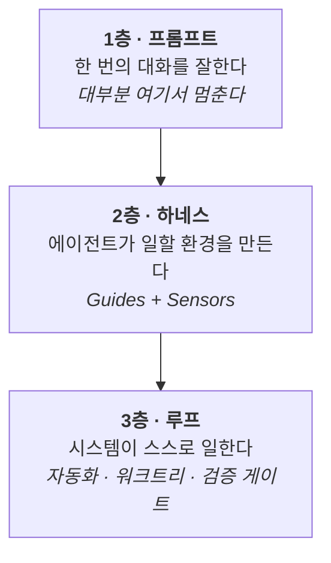

# 바이브 코딩 스터디 — 하네스 엔지니어링과 루프 엔지니어링

> AI 코딩 에이전트를 **잘 쓰는 법**이 아니라, 에이전트가 **일할 환경을 설계하는 법**을 배우는 자료입니다.
> 코드는 읽을 줄 알지만 AI 에이전트는 처음인 분들을 위해, 혼자서도 끝까지 따라올 수 있게 만들었습니다.

📖 **[학습 사이트 바로 가기](https://Hyeokjinoh.github.io/vibecoding-study/)**

---

## 왜 이 자료인가

대부분의 사람은 **프롬프트를 잘 쓰는 단계**에서 멈춥니다.
그래서 "바이브 코딩"은 종종 운에 기대는 작업으로 취급받습니다.

실제 가치는 그 위 두 층에 있습니다.



- **하네스(harness)** 는 에이전트에서 모델을 뺀 나머지 전부입니다.
  행동하기 전에 방향을 주는 **Guides**(CLAUDE.md, 규칙, 스킬)와
  행동한 뒤에 되돌리는 **Sensors**(테스트, 린터, 훅, 리뷰 에이전트)로 나뉩니다.
- **루프 엔지니어링** 은 프롬프트를 반복하는 대신 **반복하는 시스템을 설계**하는 것입니다.

## 이 저장소 자체가 교보재입니다

이 자료는 하네스로 **만들어졌습니다.** 설명만 하는 것이 아니라 실물이 들어 있습니다.

| 파일 | 자료에서 다루는 개념 |
|---|---|
| [`.claude/agents/collector.md`](.claude/agents/collector.md) | 자료 수집 전담 에이전트 |
| [`.claude/agents/writer.md`](.claude/agents/writer.md) | 집필 전담. **웹 도구를 의도적으로 뺐습니다** — 근거 없는 서술을 구조적으로 차단 |
| [`.claude/agents/verifier.md`](.claude/agents/verifier.md) | 검증 전담. maker/checker 분리 |
| [`.claude/commands/new-chapter.md`](.claude/commands/new-chapter.md) | 세 에이전트를 엮은 워크플로 |
| [`CLAUDE.md`](CLAUDE.md) · [`AGENTS.md`](AGENTS.md) | Guides. 도구 중립 표준과의 연결(`@AGENTS.md`) |
| [`scripts/check-docs.sh`](scripts/check-docs.sh) | 결정적(computational) Sensor |
| [`.github/workflows/verify.yml`](.github/workflows/verify.yml) | 주간 스케줄로 도는 작은 루프 |
| [`docs/_facts/`](docs/_facts/) | 집필의 근거가 된 원자료. 모든 주장을 추적할 수 있습니다 |
| [`seed/todo-cli/`](seed/todo-cli/) | 실습용 시드 코드. **버그가 일부러 들어 있습니다** |

## 목차

| 장 | 내용 |
|---|---|
| [0. 준비](docs/00-setup.md) | 설치, 권한 모드, 3계층 지도 |
| [1. 스티어링과 계획 모드](docs/01-steering.md) | 한 세션을 잘 끌고 가는 법 |
| [2. 컨텍스트 엔지니어링](docs/02-context.md) | 에이전트가 헛짓하는 진짜 이유 |
| [3. Guides](docs/03-guides.md) | CLAUDE.md, 규칙, 스킬 — 행동 전에 방향 주기 |
| [4. Sensors](docs/04-sensors.md) | 테스트·훅·CI — 행동 후에 되돌리기 |
| [5. 서브에이전트](docs/05-subagents.md) | maker/checker 분리, 병렬 실행 |
| [6. 루프 엔지니어링](docs/06-loops.md) | 자율 루프와 **쓰면 안 될 때** |
| [7. 최신 기법 지도](docs/07-frontier.md) | AGENTS.md, Skills, 샌드박싱, Evals + 과장 경보 |

## 시작하기

```bash
git clone https://github.com/Hyeokjinoh/vibecoding-study.git
cd vibecoding-study
pip install pytest
python -m pytest seed/todo-cli/tests -q   # 실패하는 것이 정상입니다
```

테스트가 실패하는 것을 확인했다면 [0장](docs/00-setup.md)부터 시작하세요.
그 실패가 여러분의 첫 번째 센서입니다.

## 자료의 신뢰성

- 모든 챕터 상단에 **검증일과 도구 버전**을 적었습니다. AI 도구 자료는 빨리 낡습니다.
- 모든 기술적 주장은 [`docs/_facts/`](docs/_facts/) 의 원자료에 근거하며, 출처 URL 을 추적할 수 있습니다.
- CI 가 매주 문서의 링크 생존과 예제 유효성을 검사합니다.
- 사실과 필자 견해를 시각적으로 분리했습니다 (`💭 필자 견해` 블록).

## 라이선스와 고지

- 문서(`docs/`): [CC BY 4.0](LICENSE-docs) · 코드: [MIT](LICENSE)
- 이 저장소는 **외부 자료의 본문을 복제하지 않습니다.** 참조 방식과 각 자료의 라이선스는 [`SOURCES.md`](SOURCES.md) 에 정리했습니다.
- Claude, Anthropic 은 Anthropic PBC 의 상표입니다.
  **이 저장소는 Anthropic PBC 와 제휴 관계가 없는 비공식 개인 학습 자료입니다.**

사실 오류나 저작권 우려를 발견하시면 [이슈](https://github.com/Hyeokjinoh/vibecoding-study/issues)를 열어 주세요.
