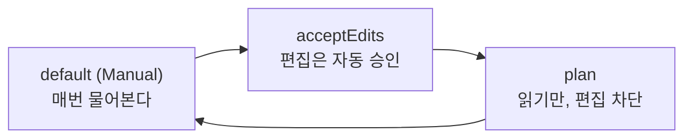
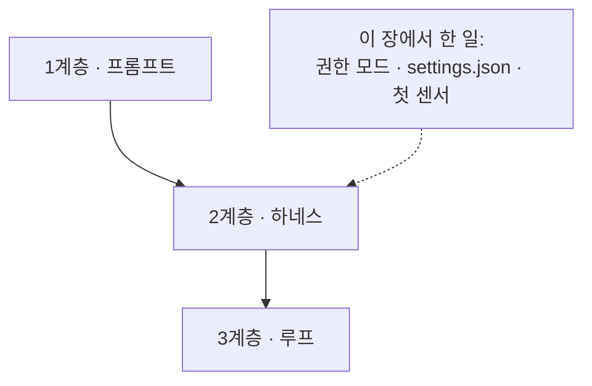

# 0. 준비 — 환경과 권한 모델

> **검증일**: 2026-08-28 · **Claude Code**: v2.1.247

## 한 줄 요약

에이전트를 켜는 것보다 **에이전트가 무엇을 할 수 있는지 정하는 것**이 먼저다.
이 장에서는 설치, 권한 모드, 설정 파일 우선순위를 잡고, 첫 번째 센서를 직접 실패시켜 본다.

---

## 0.1 설치와 인증

### 설치 — npm 이 아니라 네이티브 인스톨러

Claude Code 의 권장 설치 방법은 **네이티브 인스톨러**다. npm 전역 설치를 먼저 떠올렸다면 그 습관을 접자.

```bash
# macOS / Linux / WSL
curl -fsSL https://claude.ai/install.sh | bash

# Homebrew (macOS)
brew install --cask claude-code
```

Windows PowerShell 은 `irm https://claude.ai/install.ps1 | iex`, WinGet 은
`winget install Anthropic.ClaudeCode` 를 쓴다. Debian/Fedora/RHEL/Alpine 은 apt·dnf·apk 로도 받을 수 있다.

여기서 한 가지가 갈린다. **네이티브 설치본은 백그라운드에서 스스로 업데이트되지만,
Homebrew 나 WinGet 으로 받은 것은 자동 업데이트되지 않는다.**
패키지 매니저로 설치했다면 갱신은 내 몫이다(`brew upgrade claude-code`).
문서와 실제 동작이 어긋나는 사고는 대개 여기서 시작된다.

설치가 됐는지는 버전으로 확인한다. 버전 번호 뒤에 `(Claude Code)` 가 함께 찍힌다.

```bash
claude --version
```

### 인증

프로젝트 폴더에서 `claude` 를 처음 실행하면 로그인 프롬프트가 뜬다.
한 번 로그인하면 자격 증명이 저장되므로 매번 다시 하지 않아도 된다.
계정을 바꾸거나 다시 인증하려면 세션 안에서 `/login` 을 친다.

환경변수 `ANTHROPIC_API_KEY` 가 설정되어 있으면 로그인 프롬프트를 건너뛰고 키 사용 승인만 묻는다.
CI 처럼 사람이 없는 환경에서 쓰는 경로가 이쪽이다.

지원되는 계정은 Claude Pro/Max/Team/Enterprise 구독(권장),
Claude Console(선불 크레딧, 최초 로그인 시 "Claude Code" 워크스페이스가 자동으로 만들어진다),
Amazon Bedrock · Google Cloud Agent Platform · Microsoft Foundry,
그리고 기업 SSO 를 쓰는 자체 호스팅 게이트웨이다.

설정이 의도대로 읽혔는지는 `claude doctor` 또는 세션 안에서 `/doctor`, `/config` 로 확인한다.

### 알아 둘 기본 명령

| 명령 | 하는 일 |
|---|---|
| `claude` | 대화형 세션을 시작한다 |
| `claude "task"` | 초기 프롬프트를 주면서 대화형 세션을 시작한다 |
| `claude -p "query"` | 한 번 답하고 종료한다(비대화형). 스크립트·CI 용 |
| `claude -c` | 가장 최근 대화를 이어서 연다 |
| `claude -r` | 이전 대화 목록에서 골라 재개한다 |
| `/clear` | 세션 안에서 대화 컨텍스트를 비운다 |
| `/resume` | 세션 안에서 다른 대화로 옮겨 간다 |
| `/help` | 사용 가능한 명령을 보여준다 |
| `/exit` | 세션을 끝낸다 (Ctrl+D 두 번도 같다) |

`-p` 와 `/clear` 는 뒤 장에서 계속 나온다. `-p` 는 에이전트를 파이프라인의 한 단계로 만드는 입구이고,
`/clear` 는 컨텍스트를 자원으로 다루는 가장 싼 수단이다.

---

## 0.2 권한 모드 — 신입이 처음부터 살아야 할 곳

Claude Code 는 "이 도구를 써도 되는가"를 **권한 모드(permission mode)** 로 관리한다.
세션 중에는 `Shift+Tab` 을 눌러 모드를 순환시키고, 시작할 때 고정하려면 `--permission-mode` 를 쓴다.

### 먼저 확인할 것 — 내 세션은 어떤 모드로 시작하는가

이걸 모르고 시작하면 나머지가 전부 어긋난다.

- **첫 세션**은 모든 변경 전에 승인을 묻는다. 처음 켰을 때 자꾸 물어보는 건 정상이다.
- **첫 세션 이후**, Pro/Max/Team 플랜의 대화형 터미널 세션은 **`auto` 모드로 시작한다.**
  auto 모드에서는 사람 대신 분류기가 행동을 검토하고, 대부분의 파일 편집과 명령 실행이 승인 없이 진행된다.
- 그 외 플랜은 **Manual 모드**로 시작한다.
- 설정 파일이나 조직 정책이 이 시작 모드를 바꿀 수 있고, `Shift+Tab` 으로 세션 중 언제든 전환할 수 있다.

즉 **기본값은 자동 승인 쪽으로 기울어 있다.** 처음 며칠 물어보던 게 어느 날 조용해졌다면
내가 뭔가 바꾼 게 아니라 원래 그렇게 설계된 것이다.
남의 코드베이스에 처음 붙을 때는 가만히 두면 안 되고, **내가 직접 계획 모드로 낮춰야 한다.**



기본 순환은 `default` → `acceptEdits` → `plan` → 다시 `default` 다.
`auto` 모드에서 시작했다면 첫 번째 `Shift+Tab` 이 `default`(Manual)로 내려 주고, 그다음부터 위 순환을 돈다.

현재 어떤 모드인지는 상태 표시줄 문구로 확인한다:
`⏵⏵ auto mode on`, `⏸ manual mode on`, `⏵⏵ accept edits on`, `⏸ plan mode on`.
세션을 열자마자 이 줄부터 읽는 습관을 들이자.

**계획 모드(plan mode)** 는 에이전트가 파일을 읽고 탐색용 명령만 실행하면서 계획을 제안하고,
승인하기 전까지 편집을 막는 모드다. 들어가는 방법은 세 가지다.

```bash
claude --permission-mode plan   # 시작할 때부터 계획 모드
```

세션 안에서는 `Shift+Tab` 을 눌러 `⏸ plan mode on` 이 뜰 때까지 돌리거나,
프롬프트 하나만 계획 모드로 돌리려면 앞에 `/plan` 을 붙인다.
빠져나올 때는 다시 `Shift+Tab`. 제안된 계획을 에디터에서 열어 보려면 `Ctrl+G` 다.

계획 모드를 기본값으로 고정하려면 `.claude/settings.json` 에 이렇게 쓴다.

```json
{ "permissions": { "defaultMode": "plan" } }
```

> 💭 **필자 견해**
> 신입이라면 한동안 계획 모드에서만 살기를 권한다. 이건 기본값이 아니라 **내가 매번 내려야 하는 선택**이다.
> 위에서 봤듯 시작 모드는 오히려 자동 승인 쪽이므로, 아무것도 안 하면 반대로 간다.
> 계획 모드를 권하는 이유는 안전이 아니라 학습이다.
> 편집이 막혀 있으면 에이전트가 "무엇을 어떤 순서로 하려 했는지"를 먼저 읽게 되고,
> 그 계획이 엉뚱하다는 것을 코드가 바뀌기 **전에** 발견하게 된다.
> 자동 승인부터 시작하면 매번 결과 diff부터 읽게 되는데, 그건 가장 비싼 학습 방법이다.

---

## 0.3 `.claude/settings.json` — 5단계 우선순위와 평가 순서

설정은 한 곳에 있지 않다. 다섯 군데에서 읽히고, **위쪽이 아래쪽을 덮어쓴다.**

| 순위 | 위치 | 범위 |
|---|---|---|
| 1 (가장 셈) | 관리형 설정 `managed-settings.json` | 조직 전체 |
| 2 | `claude --settings <파일 또는 JSON>` | 이번 세션 |
| 3 | `.claude/settings.local.json` | 나 + 이 프로젝트 (git 제외) |
| 4 | `.claude/settings.json` | 팀 전체 (커밋) |
| 5 | `~/.claude/settings.json` | 나 + 모든 프로젝트 |

같은 키는 높은 층이 이긴다. 다만 리스트 값을 갖는 키(권한 배열 등)는 덮어쓰기가 아니라
층끼리 **합쳐진다**. 그래서 조직이 걸어 둔 `deny` 를 개인 설정으로 지울 수 없다.

권한 규칙은 `allow` / `ask` / `deny` 세 종류이고, 평가 순서는 **deny → ask → allow** 다.
먼저 걸리는 규칙이 이기며, 더 구체적인 규칙이라고 순서를 앞당기지 않는다.
넓은 `deny` 는 좁은 `allow` 를 언제나 이긴다.

규칙 문법은 `Tool` 또는 `Tool(지정자)` 다. 지정자는 정확한 명령(`Bash(npm run build)`),
접두사 와일드카드(`Bash(git diff *)`, `*` 앞의 공백에 주의), 경로(`Read(./.env)`),
도메인(`WebFetch(domain:example.com)`) 형태를 쓴다.
지금 살아 있는 규칙과 그 출처 파일은 `/permissions` 로 확인한다.

### 이 저장소의 실제 설정 읽어 보기

이 저장소의 `.claude/settings.json` 은 이렇게 되어 있다.

```json
{
  "$schema": "https://json.schemastore.org/claude-code-settings.json",
  "permissions": {
    "allow": [
      "Read",
      "Grep",
      "Glob",
      "Bash(python -m pytest:*)",
      "Bash(git status)",
      "Bash(git diff:*)",
      "Bash(git log:*)",
      "Bash(./scripts/check-docs.sh)"
    ],
    "ask": [
      "Bash(git push:*)",
      "Bash(gh:*)"
    ],
    "deny": [
      "Read(./.env)",
      "Read(./**/.env)",
      "Read(./**/*.pem)",
      "Bash(curl:*)",
      "Bash(rm -rf:*)"
    ]
  }
}
```

읽는 법은 이렇다. 읽기·검색과 테스트 실행, 문서 검증 스크립트는 **묻지 않고 통과**시킨다.
확인이 자주 필요한 일을 매번 물으면 사람이 승인 버튼만 누르는 기계가 되기 때문이다.
반대로 원격에 흔적을 남기는 `git push` 와 `gh` 는 항상 묻는다.
그리고 비밀 파일 읽기, 임의 네트워크 호출, 재귀 삭제는 아예 막는다.

`deny` 에 `Bash(curl:*)` 이 있다는 점을 눈여겨보자. 이 저장소에서 집필 에이전트는
웹에 나갈 수 없어야 한다. 그 원칙을 프롬프트로 부탁하는 대신 설정으로 못 박은 것이다.
문서로 부탁하는 것은 추론적(inferential) 통제이고, 이렇게 막는 것은 결정적(computational) 통제다.

---

## 0.4 `/init`, `/memory`, `/context`

세 슬래시 명령은 "에이전트가 무엇을 알고 시작하는가"를 다룬다.

**`/init`** — 코드베이스를 분석해 시작용 `CLAUDE.md` 를 만들어 준다.
이미 파일이 있으면 덮어쓰지 않고 개선안을 제안한다.
Cursor(`.cursor/rules/`, `.cursorrules`) 나 Copilot(`.github/copilot-instructions.md`) 규칙이 있으면 그것도 읽는다.

**`/memory`** — 사용자 범위와 프로젝트 범위의 `CLAUDE.md`, `CLAUDE.local.md` 등 기억 파일 위치를
나열하고, 고른 파일을 에디터로 열어 준다(없으면 만들어 준다). 자동 메모리 on/off 도 여기서 한다.

**`/context`** — 이번 세션에 **실제로 어떤 기억 파일이 로드됐는지** 보여준다.
"규칙을 썼는데 안 지킨다" 싶을 때 가장 먼저 볼 곳이다. 안 지킨 게 아니라 안 읽혔을 때가 많다.

참고로 `CLAUDE.md` 는 시스템 프롬프트 뒤에 사용자 메시지로 전달되는 **컨텍스트**이지
강제되는 설정이 아니다. 반드시 지켜져야 하는 것은 문서가 아니라 훅(hook)으로 만든다.
이 구분이 3장과 4장의 핵심이다.

---

## 0.5 첫 번째 센서 만나기

이 저장소를 클론하고 실습용 시드 코드의 테스트를 돌려 보자.

```bash
git clone https://github.com/Hyeokjinoh/vibecoding-study.git
cd vibecoding-study
pip install pytest          # 없으면 센서가 돌지 않는다
python -m pytest seed/todo-cli/tests -q
```

> ⚠️ **`pip install pytest` 를 건너뛰지 말 것.**
> pytest 가 없으면 테스트가 실패하는 게 아니라 **검사 자체가 실행되지 않는다.**
> 이 저장소의 검증 스크립트는 그 둘을 구분해서 `pytest 가 설치되어 있지 않아
> 시드 테스트를 검사할 수 없다` 고 따로 알려 준다. 왜 이렇게까지 구분하는지는
> [4장 4.9절](04-sensors.md)에서 실제 사고 사례와 함께 다룬다.

**테스트는 실패한다. 그게 정상이다.** `seed/todo-cli/` 에는 의도적으로 결함을 넣어 두었고,
이 저장소의 검증 스크립트는 오히려 이 테스트가 **전부 통과하면** 실패로 판정한다.
실습 재료가 사라졌다는 뜻이기 때문이다. 시키기 전에는 고치지 말자.

여기서 봐야 할 것은 버그가 아니라 **출력의 모양**이다.
실패한 테스트 이름, 파일과 줄 번호, 기대값과 실제값이 짧고 결정적으로 찍힌다.
사람이 읽으려고 만든 형식이 아니라 **에이전트가 읽고 스스로 고치기 위한 신호**다.
이것이 이 자료에서 말하는 센서(Sensor)의 가장 단순한 형태다.

같은 원리의 조금 더 큰 센서도 이미 돌아가고 있다.

```bash
./scripts/check-docs.sh
```

필수 섹션 누락, 외부 이미지, 낡은 문서 URL, 짝이 안 맞는 코드 블록을 검사하고
마지막에 `VERDICT: PASS` 또는 `VERDICT: FAIL` 한 줄을 남긴다.
이 스크립트는 CI(`.github/workflows/verify.yml`)에서도 그대로 실행된다.

---

## 0.6 3계층 지도 다시 보기



이 장에서 만진 것은 전부 2계층이다. 권한 모드로 에이전트가 할 수 있는 일의 범위를 정했고,
`settings.json` 으로 그 범위를 팀 전체에 고정했고, 실패하는 테스트로 첫 센서를 확인했다.
아직 프롬프트를 잘 쓰는 법은 한 줄도 배우지 않았다는 점이 중요하다.

---

## 직접 해보기

0. **먼저 pytest 를 설치한다.** 이 한 줄을 빠뜨리면 이후 실습의 센서가 전부 헛돈다.
   ```bash
   pip install pytest
   python -m pytest --version   # 버전이 찍히면 준비 완료
   ```
1. 저장소를 클론하고 시드 테스트를 돌려 실패를 눈으로 확인한다.
   ```bash
   git clone https://github.com/Hyeokjinoh/vibecoding-study.git
   cd vibecoding-study
   python -m pytest seed/todo-cli/tests -q
   ```
2. 설치를 확인하고, 그냥 `claude` 로 열었을 때 상태 표시줄이 어떤 모드로 시작하는지 먼저 읽는다.
   ```bash
   claude --version
   claude
   ```
3. 이번엔 계획 모드로 시작해 상태 표시줄이 `⏸ plan mode on` 인지 확인하고,
   `Shift+Tab` 을 눌러 가며 `default` → `acceptEdits` → `plan` 순환을 직접 본다.
   ```bash
   claude --permission-mode plan
   ```
4. `/permissions` 를 실행해, 3절에서 읽은 규칙들이 어느 파일에서 왔다고 표시되는지 본다.
5. `/context` 를 실행해 이 프로젝트의 `CLAUDE.md` 가 실제로 로드됐는지 확인한다.
6. 문서 센서를 직접 돌려 판정 한 줄을 확인한다.
   ```bash
   ./scripts/check-docs.sh
   ```

---

## ✅ 자가 점검

- [ ] 내 플랜의 세션이 어떤 모드로 시작하는지 말할 수 있고, `Shift+Tab` 으로 `default` / `acceptEdits` / `plan` 을 순환시키며 상태 표시줄 문구를 구분할 수 있다.
- [ ] 설정 파일 5단계 중 어느 것이 더 세고, 권한이 **deny → ask → allow** 순으로 평가된다는 것을 설명할 수 있다.
- [ ] 이 저장소의 `.claude/settings.json` 에서 `git push` 가 `ask` 인 이유와 `curl` 이 `deny` 인 이유를 각각 한 문장으로 말할 수 있다.
- [ ] `/init`, `/memory`, `/context` 가 각각 무엇을 하는지 구분할 수 있다.
- [ ] 시드 테스트가 실패하는 것이 왜 정상이며, 그 출력이 왜 "센서"인지 설명할 수 있다.
- [ ] `python -m pytest --version` 이 정상 출력되고, **"테스트가 실패한 것"과 "검사가 실행되지 않은 것"** 의 차이를 말할 수 있다.

---

## 📎 출처

- 설치, 인증, 기본 명령, 세션 시작 모드: <https://code.claude.com/docs/en/quickstart>
- 인증 방식과 지원 계정: <https://code.claude.com/docs/en/authentication>
- 권한 모드와 계획 모드: <https://code.claude.com/docs/en/permission-modes>
- 설정 파일 우선순위: <https://code.claude.com/docs/en/settings>
- 권한 규칙 평가 순서와 문법: <https://code.claude.com/docs/en/permissions>
- `CLAUDE.md`, `/init`, `/memory`, `/context`: <https://code.claude.com/docs/en/memory>
- 훅(결정적 통제): <https://code.claude.com/docs/en/hooks>
- 하네스 / Guides·Sensors / Computational·Inferential 구분: <https://martinfowler.com/articles/harness-engineering.html>
- 검증 가능한 것만 통과시킨다는 원칙: <https://code.claude.com/docs/en/best-practices>

이 문서는 Anthropic PBC 와 제휴하거나 승인받은 관계가 없는 비공식 학습 자료다.
라이선스와 인용 원칙은 [SOURCES.md](https://github.com/Hyeokjinoh/vibecoding-study/blob/main/SOURCES.md) 를 참고한다.
