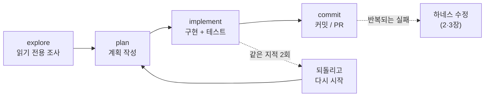

# 1. 스티어링과 계획 모드

> **검증일**: 2026-08-28 · **Claude Code**: v2.1.247

## 한 줄 요약

에이전트 작업은 완벽한 프롬프트를 한 방에 던지는 일이 아닙니다. 달리는 동안 계속 방향을 잡아 주는 **조종(steering)** 에 가깝습니다.

---

## 1.1 "한 방에 되는 프롬프트"는 왜 함정인가

처음엔 다들 프롬프트 문장부터 붙잡습니다. 더 길게, 더 자세히 쓰면 한 방에 될 것 같거든요.
저도 그랬습니다.

그런데 잘 안 됩니다. 왜 그럴까요?

에이전트는 우리가 시킨 걸 그대로 실행하는 기계가 아닙니다. 지시를 받고 → 계획을 세우고 →
도구를 써서 움직이고 → 그 결과를 보고 → 다시 판단합니다. 이 과정을 **여러 번** 돕니다.

중간에 사람이 확인하는 지점을 끼워 넣을 수 있다는 것도 이 루프의 설계 요소예요.
결국 출력 하나가 나오기까지 판단이 여러 번 개입합니다.
첫 문장 하나로 그 판단을 전부 붙잡아 둘 수는 없겠죠.

자율성이 높아질수록 오류는 쌓여서 커집니다.
그래서 샌드박스, 권한 범위 제한, 정지 조건을 필수 장치로 봅니다. 선택 사항이 아닙니다.
프롬프트를 다듬는 것보다, **어디서 끊고 어디서 확인할지**를 설계하는 쪽이 훨씬 효과가 큽니다.

> 💭 **필자 견해**
> 신입 때 "프롬프트 잘 쓰는 법"부터 파면 십중팔구 습관이 이상하게 붙습니다.
> 프롬프트는 핸들일 뿐이에요. 정작 배워야 하는 건 운전이고요.
> 이 장을 읽고 나면 프롬프트 템플릿 모으는 취미는 버려도 됩니다.

---

## 1.2 explore → plan → implement → commit

Anthropic 이 정리한 실무 흐름은 **조사 → 계획 → 구현 → 커밋** 네 단계입니다.
핵심은 조사·계획을 구현과 **분리**하는 데 있어요.
분리하지 않으면 어떻게 될까요? 에이전트가 엉뚱한 문제를 아주 빠르게 풀어 버립니다.



물론 항상 이 흐름이 필요한 건 아닙니다.
바꿀 내용을 한 문장으로 설명할 수 있다면 그냥 시키는 게 낫습니다.
여러 파일에 걸쳐 있거나 접근 방법 자체가 불확실할 때, 그때만 이 오버헤드가 값을 합니다.

큰 기능이라면 한 단계 더 나눠 봅시다.
에이전트가 나에게 질문을 던지게 해서 `SPEC.md` 를 먼저 쓰게 하고,
**세션을 새로 열어** 그 명세만 보고 구현하게 하는 방식입니다.

---

## 1.3 계획 모드(plan mode)가 막아 주는 것

계획 모드는 에이전트를 **쓰기 전에 멈추게** 만드는 장치입니다.
이 모드에서는 파일을 읽고 조사용 셸 명령을 돌려 계획을 제안하는 것까지만 됩니다.
내가 승인하기 전에는 편집이 막혀 있어요.

들어가는 방법은 세 가지입니다.

```bash
# 1) 세션 시작부터 계획 모드로
claude --permission-mode plan
```

세션 중이라면 `Shift+Tab` 을 상태 표시줄이 `⏸ plan mode on` 이 될 때까지 누릅니다.
한 번의 프롬프트에만 적용하고 싶으면 프롬프트 앞에 `/plan` 을 붙이면 되고요.
승인 없이 빠져나오려면 `Shift+Tab` 을 다시 누릅니다.

`Shift+Tab` 순환 순서는 알아 두면 편합니다.
`auto` 에서 처음 누르면 `default`("Manual")로 가고, 이후 `default` → `acceptEdits` → `plan` → 다시 `default` 로 돕니다.
선택적 모드(`bypassPermissions`, `auto`)는 활성화된 경우에만 `plan` 뒤에 끼어듭니다.

| 상태 표시줄 | 모드 |
|---|---|
| `⏸ manual mode on` | `default` (매번 물어봄) |
| `⏵⏵ accept edits on` | `acceptEdits` |
| `⏸ plan mode on` | `plan` |
| `⏵⏵ auto mode on` | `auto` |

제안된 계획이 마음에 들지 않나요? 그대로 승인하지 말고 `Ctrl+G` 를 눌러 보세요.
계획이 내 텍스트 편집기로 열립니다. **직접 고친 뒤** 승인할 수 있어요.
승인 프롬프트에서는 자동 모드로 진행, 편집을 하나씩 검토, 계획 계속하기 중에서 고르면 됩니다.

계획 모드를 기본값으로 굳히고 싶으면 `.claude/settings.json` 에 다음을 넣습니다.

```json
{
  "permissions": {
    "defaultMode": "plan"
  }
}
```

> 💭 **필자 견해**
> 계획 모드의 진짜 값어치는 "에이전트가 실수하는 걸 막는 것"이 아닙니다.
> **내가 문제를 제대로 이해했는지 확인하는 것**에 있어요.
> 계획을 읽다가 "어, 이 파일이 왜 여기 나와?" 싶으면 그건 대개 내 이해가 틀린 겁니다.

---

## 1.4 두 번 고쳐서 안 되면 방식을 바꿔라

같은 지적을 두 번 했는데도 안 고쳐졌다면, 세 번째 지적은 하지 마세요.
세션을 정리하고 프롬프트를 새로 써서 다시 시작하는 편이 낫습니다.
이걸 **두 번 규칙(two-correction rule)** 이라고 부릅니다.

이유는 단순합니다. 실패한 시도들이 그대로 컨텍스트에 남아 이후 판단을 오염시키거든요.
수정 이력으로 가득 찬 긴 세션보다, 더 나은 프롬프트로 시작한 깨끗한 세션이 거의 항상 이깁니다.
되돌리고 컨텍스트를 다시 세우는 비용이, 잘못된 맥락 위에 계속 이어 붙이는 비용보다 쌉니다.

중간에 개입하는 수단은 세 단계로 기억하면 됩니다.

- **`Esc`** — 진행 중인 작업을 즉시 끊습니다. 이상하다 싶은 순간 바로 누르세요.
- **`Esc` `Esc` 또는 `/rewind`** — 체크포인트로 되돌립니다.
- **초기화 후 재시작** — 범위를 좁혀 다시 지시합니다.

반복되는 수정은 사고가 아니라 **신호**입니다.
같은 것을 두 번 고쳤다면 프롬프트의 문제가 아니라 환경의 문제일 가능성이 높아요.
이 신호를 어떻게 다뤄야 하는지가 이 문서 전체의 주제입니다.

자주 나오는 실패 패턴에도 이름을 붙여 두면 알아채기 쉽습니다.
하나의 세션에 온갖 작업을 다 밀어 넣기, 같은 지적을 계속 반복하기,
CLAUDE.md 를 과하게 자세히 쓰기, 결과를 믿고 검증을 건너뛰기, 조사만 끝없이 하기.

---

## 직접 해보기

`seed/todo-cli` 의 테스트는 **지금 실패합니다.** 이게 첫 번째 실습 재료예요.
목표는 고치는 게 아닙니다. **계획 모드로 조사만 시켜 보는 경험**을 하는 겁니다.

**1단계.** 저장소 루트에서 실패를 눈으로 확인합니다.

```bash
python -m pytest seed/todo-cli/tests -q
```

**2단계.** 계획 모드로 세션을 엽니다.

```bash
claude --permission-mode plan
```

**3단계.** 아래 프롬프트를 **그대로** 입력합니다.

```text
seed/todo-cli 의 테스트가 왜 실패하는지 조사해 줘.
지금은 조사만 하고, 코드는 절대 고치지 마.

다음을 알려 줘:
1. 실패하는 테스트마다, 어느 파일 어느 줄의 어떤 동작 때문인지
2. 실패 원인들이 서로 다른 문제인지, 하나의 원인에서 갈라진 것인지
3. 고친다면 어떤 순서로 고칠지와 그 이유

각 항목마다 근거가 된 파일 경로를 함께 적어 줘.
```

**4단계.** 계획이 나오면 승인하지 말고 `Ctrl+G` 로 열어 봅니다.
계획 안에 "고치겠다"는 문장이 섞여 있으면 그 부분을 지운 뒤 저장하세요.
그리고 계획 모드를 유지한 채 `Shift+Tab` 으로 빠져나옵니다.

**5단계.** 이번엔 일부러 잘못된 지시를 해 봅시다.
"1번 원인만 고쳐 줘" 라고 시킨 뒤, 결과가 마음에 안 들면 `Esc` 로 끊고 `/rewind` 로 되돌립니다.
되돌린 지점에서 범위를 더 좁혀 다시 지시해 보세요. 이 감각이 바로 조종입니다.

> `seed/todo-cli` 의 결함은 학습 재료입니다. 시키지 않았는데 고쳐졌다면
> 계획 모드가 제대로 켜져 있지 않았다는 뜻이니 상태 표시줄을 다시 확인해 보세요.

---

## ✅ 자가 점검

- [ ] `Shift+Tab` 을 눌러 상태 표시줄이 `⏸ plan mode on` 으로 바뀌는 것을 확인했나요
- [ ] `Ctrl+G` 로 제안된 계획을 편집기에서 열어 직접 수정해 봤나요
- [ ] explore → plan → implement → commit 각 단계에서 무엇이 금지되는지 설명할 수 있나요
- [ ] 같은 지적을 두 번 한 상황에서, 세 번째 지적 대신 무엇을 해야 하는지 말할 수 있나요
- [ ] `Esc` 와 `/rewind` 의 차이를 알고 실제로 한 번씩 써 봤나요

---

## 다음 장 예고: 스티어링 루프

여기까지가 **한 세션을 잘 모는 법**이었습니다.
그런데 같은 실수가 세션마다 반복된다면? 매번 조종하는 건 답이 아니겠죠.

이때 사람의 일은 한 층 위로 올라갑니다.
출력물을 하나씩 고치는 대신, **반복되는 실패가 일어나기 어렵거나 아예 불가능해지도록 환경 자체를 고치는 것**입니다.
이걸 스티어링 루프(steering loop)라고 부릅니다.

출력을 고치면 그 수정은 일회용이지만, 환경을 고치면 수정이 영구적이고 팀 전체에 적용됩니다.
그 환경을 무엇으로 채울지 — 2장은 컨텍스트, 3장은 가이드(Guides)를 다룹니다.

---

## 📎 출처

- [Claude Code — Permission modes](https://code.claude.com/docs/en/permission-modes)
- [Claude Code — Best practices](https://code.claude.com/docs/en/best-practices)
- [Claude Code — Settings](https://code.claude.com/docs/en/settings)
- [Building effective agents — Anthropic](https://www.anthropic.com/engineering/building-effective-agents)
- [Harness Engineering for Coding Agent Users — Birgitta Böckeler](https://martinfowler.com/articles/harness-engineering.html)
