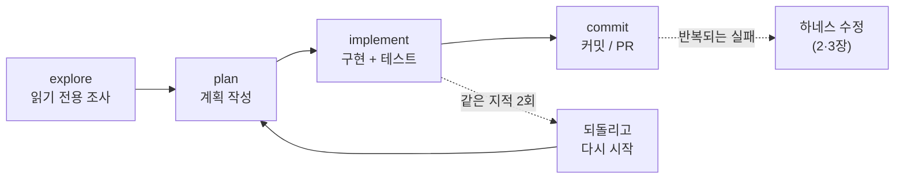

# 1. 스티어링과 계획 모드

> **검증일**: 2026-08-28 · **Claude Code**: v2.1.247

## 한 줄 요약

에이전트 작업은 완벽한 프롬프트를 한 번 던지는 일이 아니라, 달리는 동안 계속 방향을 잡아 주는 **조종(steering)** 이다.

---

## 1.1 "한 방에 되는 프롬프트"는 왜 함정인가

에이전트를 처음 쓰면 대부분 프롬프트 문장을 다듬는 데 시간을 쓴다.
더 길게, 더 자세히, 더 정확하게 쓰면 한 번에 원하는 결과가 나올 것 같기 때문이다.
하지만 에이전트는 명령을 실행하는 기계가 아니라 **환경을 읽고 스스로 다음 행동을 고르는 루프**다.

에이전트의 동작은 지시를 받고, 계획하고, 도구로 행동하고, 환경이 돌려주는 반응을 읽고, 다시 반복하는 흐름이다.
중간에 사람이 확인하는 지점을 둘 수 있다는 것도 이 루프의 설계 요소다.
즉 출력이 나오기까지 여러 번의 판단이 개입한다. 첫 문장 하나로 그 판단을 전부 고정할 수는 없다.

자율성이 높을수록 오류는 쌓여서 커진다.
그래서 샌드박스, 권한 범위 제한, 정지 조건은 선택이 아니라 필수 장치로 다뤄진다.
프롬프트를 다듬는 대신, **어디서 끊고 어디서 확인할지**를 설계하는 쪽이 훨씬 효과가 크다.

> 💭 **필자 견해**
> 신입 때 "프롬프트 잘 쓰는 법"부터 배우면 대개 잘못된 습관이 붙는다.
> 프롬프트는 조종간의 손잡이일 뿐이고, 실제로 배워야 하는 것은 운전이다.
> 이 장을 읽고 나면 프롬프트 템플릿을 모으는 취미는 버려도 된다.

---

## 1.2 explore → plan → implement → commit

Anthropic 이 정리한 실무 흐름은 **조사 → 계획 → 구현 → 커밋** 의 네 단계다.
핵심은 조사·계획 단계를 구현 단계와 **분리**하는 것이다.
분리하지 않으면 에이전트는 엉뚱한 문제를 아주 빠르게 풀어 버린다.



이 흐름은 항상 필요한 것은 아니다.
변경 내용을 한 문장으로 설명할 수 있으면 그냥 시키는 게 낫다.
여러 파일에 걸쳐 있거나 접근 방법 자체가 불확실할 때만 이 오버헤드가 값을 한다.

큰 기능이라면 한 단계 더 나눈다.
에이전트가 나에게 질문을 던지게 해서 `SPEC.md` 를 먼저 쓰게 하고,
**세션을 새로 열어** 그 명세만 보고 구현하게 하는 방식이다.

---

## 1.3 계획 모드(plan mode)가 막아 주는 것

계획 모드는 에이전트가 **쓰기 전에 멈추게** 만드는 장치다.
이 모드에서 에이전트는 파일을 읽고 조사용 셸 명령을 돌려 계획을 제안하지만,
내가 승인하기 전까지 편집은 차단된다.

들어가는 방법은 세 가지다.

```bash
# 1) 세션 시작부터 계획 모드로
claude --permission-mode plan
```

세션 중에는 `Shift+Tab` 을 상태 표시줄이 `⏸ plan mode on` 이 될 때까지 누른다.
한 번의 프롬프트에만 적용하고 싶으면 프롬프트 앞에 `/plan` 을 붙인다.
승인 없이 빠져나오려면 `Shift+Tab` 을 다시 누른다.

`Shift+Tab` 순환 순서는 알아 두면 편하다.
`auto` 에서 처음 누르면 `default`("Manual")로 가고, 이후 `default` → `acceptEdits` → `plan` → 다시 `default` 로 돈다.
선택적 모드(`bypassPermissions`, `auto`)는 활성화된 경우에만 `plan` 뒤에 끼어든다.

| 상태 표시줄 | 모드 |
|---|---|
| `⏸ manual mode on` | `default` (매번 물어봄) |
| `⏵⏵ accept edits on` | `acceptEdits` |
| `⏸ plan mode on` | `plan` |
| `⏵⏵ auto mode on` | `auto` |

제안된 계획이 마음에 들지 않으면 그대로 승인하지 말고 `Ctrl+G` 를 누른다.
계획이 내 텍스트 편집기로 열리고, **직접 고친 뒤** 승인할 수 있다.
승인 프롬프트에서는 자동 모드로 진행, 편집을 하나씩 검토, 계획 계속하기 중에서 고른다.

계획 모드를 기본값으로 굳히려면 `.claude/settings.json` 에 다음을 넣는다.

```json
{
  "permissions": {
    "defaultMode": "plan"
  }
}
```

> 💭 **필자 견해**
> 계획 모드의 진짜 값어치는 "에이전트가 실수하는 걸 막는 것"이 아니라
> **내가 문제를 제대로 이해했는지 확인하는 것**에 있다.
> 계획을 읽다가 "어, 이 파일이 왜 여기 나와?" 싶으면 그건 대개 내 이해가 틀린 것이다.

---

## 1.4 두 번 고쳐서 안 되면 방식을 바꿔라

같은 지적을 두 번 했는데도 고쳐지지 않으면, 세 번째 지적은 하지 않는다.
세션을 정리하고 프롬프트를 새로 써서 다시 시작하는 편이 낫다.
이것이 **두 번 규칙(two-correction rule)** 이다.

이유는 단순하다. 실패한 시도들이 그대로 컨텍스트에 남아 이후 판단을 오염시킨다.
수정 이력으로 가득 찬 긴 세션보다, 더 나은 프롬프트로 시작한 깨끗한 세션이 거의 항상 이긴다.
되돌리고 컨텍스트를 다시 세우는 비용이, 잘못된 맥락 위에 계속 이어 붙이는 비용보다 싸다.

중간 개입 수단은 세 단계로 기억하면 된다.

- **`Esc`** — 진행 중인 작업을 즉시 끊는다. 이상하다 싶은 순간 바로 누른다.
- **`Esc` `Esc` 또는 `/rewind`** — 체크포인트로 되돌린다.
- **초기화 후 재시작** — 범위를 좁혀 다시 지시한다.

반복되는 수정은 사고가 아니라 **신호**다.
같은 것을 두 번 고쳤다면 그건 프롬프트의 문제가 아니라 환경의 문제일 가능성이 높다.
이 신호를 어떻게 다뤄야 하는지가 이 문서 전체의 주제다.

자주 나오는 실패 패턴도 이름을 붙여 두면 알아채기 쉽다.
하나의 세션에 온갖 작업을 다 밀어 넣기, 같은 지적을 계속 반복하기,
CLAUDE.md 를 과하게 자세히 쓰기, 결과를 믿고 검증을 건너뛰기, 조사만 끝없이 하기.

---

## 직접 해보기

`seed/todo-cli` 의 테스트는 **지금 실패한다.** 이것이 첫 번째 실습 재료다.
목표는 고치는 것이 아니라, **계획 모드로 조사만 시키는 경험**을 하는 것이다.

**1단계.** 저장소 루트에서 실패를 눈으로 확인한다.

```bash
python -m pytest seed/todo-cli/tests -q
```

**2단계.** 계획 모드로 세션을 연다.

```bash
claude --permission-mode plan
```

**3단계.** 아래 프롬프트를 **그대로** 입력한다.

```text
seed/todo-cli 의 테스트가 왜 실패하는지 조사해 줘.
지금은 조사만 하고, 코드는 절대 고치지 마.

다음을 알려 줘:
1. 실패하는 테스트마다, 어느 파일 어느 줄의 어떤 동작 때문인지
2. 실패 원인들이 서로 다른 문제인지, 하나의 원인에서 갈라진 것인지
3. 고친다면 어떤 순서로 고칠지와 그 이유

각 항목마다 근거가 된 파일 경로를 함께 적어 줘.
```

**4단계.** 제안된 계획이 나오면 승인하지 말고 `Ctrl+G` 로 열어 본다.
계획 안에 "고치겠다"는 문장이 섞여 있으면 그 부분을 지운 뒤 저장한다.
그리고 계획 모드를 유지한 채 `Shift+Tab` 으로 빠져나온다.

**5단계.** 이번엔 일부러 잘못된 지시를 해 본다.
"1번 원인만 고쳐 줘" 라고 시킨 뒤, 결과가 마음에 안 들면 `Esc` 로 끊고 `/rewind` 로 되돌린다.
되돌린 지점에서 범위를 더 좁혀 다시 지시해 본다. 이 감각이 조종이다.

> `seed/todo-cli` 의 결함은 학습 재료다. 시키지 않았는데 고쳐졌다면
> 계획 모드가 제대로 켜져 있지 않았다는 뜻이니 상태 표시줄을 다시 확인한다.

---

## ✅ 자가 점검

- [ ] `Shift+Tab` 을 눌러 상태 표시줄이 `⏸ plan mode on` 으로 바뀌는 것을 확인했다
- [ ] `Ctrl+G` 로 제안된 계획을 편집기에서 열어 직접 수정해 봤다
- [ ] explore → plan → implement → commit 각 단계에서 무엇이 금지되는지 설명할 수 있다
- [ ] 같은 지적을 두 번 한 상황에서, 세 번째 지적 대신 무엇을 해야 하는지 말할 수 있다
- [ ] `Esc` 와 `/rewind` 의 차이를 알고 실제로 한 번씩 써 봤다

---

## 다음 장 예고: 스티어링 루프

여기까지는 **한 세션을 잘 모는 법**이었다.
하지만 같은 실수가 세션마다 반복된다면, 매번 조종하는 것은 답이 아니다.

이때 사람의 일은 한 층 위로 올라간다.
출력물을 하나씩 고치는 대신, **반복되는 실패가 일어나기 어렵거나 불가능해지도록 환경 자체를 고치는 것**이다.
이것을 스티어링 루프(steering loop)라고 부른다.

출력을 고치면 그 수정은 일회용이지만, 환경을 고치면 수정이 영구적이고 팀 전체에 적용된다.
그 환경을 무엇으로 채울지 — 2장은 컨텍스트, 3장은 가이드(Guides)를 다룬다.

---

## 📎 출처

- [Claude Code — Permission modes](https://code.claude.com/docs/en/permission-modes)
- [Claude Code — Best practices](https://code.claude.com/docs/en/best-practices)
- [Claude Code — Settings](https://code.claude.com/docs/en/settings)
- [Building effective agents — Anthropic](https://www.anthropic.com/engineering/building-effective-agents)
- [Harness Engineering for Coding Agent Users — Birgitta Böckeler](https://martinfowler.com/articles/harness-engineering.html)
