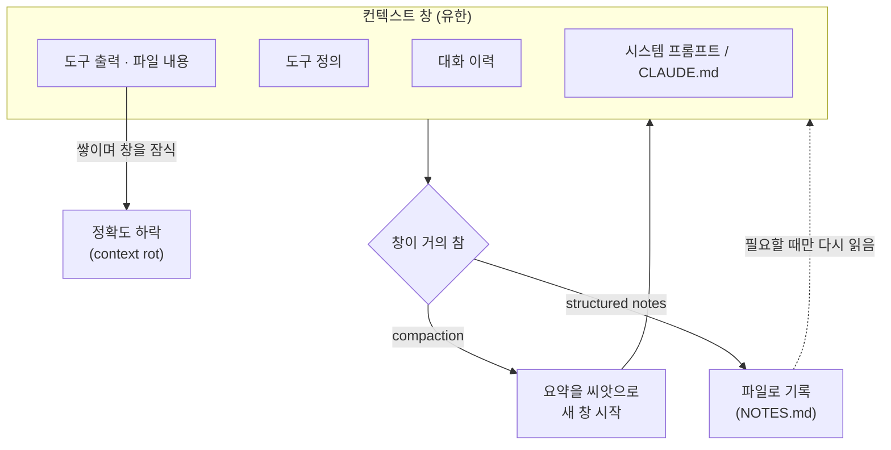

# 2. 컨텍스트 엔지니어링

> **검증일**: 2026-08-28 · **Claude Code**: v2.1.247

## 한 줄 요약

에이전트가 헛발질하는 이유는 대개 모델이 멍청해서가 아니라 **컨텍스트 창에 들어간 것이 잘못됐기** 때문이다.

---

## 2.1 컨텍스트는 유한한 자원이다

컨텍스트 창에는 지금까지 오간 모든 메시지, 읽은 파일 내용, 실행한 명령의 출력이 전부 쌓인다.
그리고 창이 차오를수록 성능은 **떨어진다**.
이걸 컨텍스트 부패(context rot)라고 부른다.

원인은 트랜스포머 구조 자체에 있다.
토큰이 n 개면 어텐션은 n² 쌍을 계산한다.
즉 토큰이 늘어날수록 개별 토큰이 받는 주의는 묽어지고, 수익은 체감한다.

그래서 설계 목표는 "가능한 한 많이 넣기"가 아니라 **신호가 높은 최소한의 토큰 집합**이다.
900줄짜리 CLAUDE.md 에서 7번 규칙이 조용히 무시되다가,
40줄로 줄이자 규칙이 지켜지기 시작하는 현상은 여기서 나온다.

프롬프트 엔지니어링과 컨텍스트 엔지니어링의 차이도 여기 있다.
프롬프트 엔지니어링은 한 번의 지시문을 잘 쓰는 일이다.
컨텍스트 엔지니어링은 **여러 턴이 이어지는 실행 내내** 창에 무엇을 남기고 무엇을 버릴지 관리하는 일이다.

에이전트 루프에서 내가 쓴 프롬프트는 창을 차지하는 것 중 아주 작은 조각이다.
나머지 — 시스템 프롬프트, 도구 정의, 검색해 온 자료, 대화 이력 — 를 다루는 쪽이 실제 지렛대다.



> 💭 **필자 견해**
> "컨텍스트 창이 200K 니까 다 넣어도 되겠지"는 신입이 가장 자주 하는 오판이다.
> 창 크기는 **저장 용량**이지 **주의력**이 아니다.
> 책상이 넓다고 책을 다 펼쳐 놓으면 오히려 아무것도 못 읽는 것과 같다.

---

## 2.2 시스템 프롬프트의 고도(altitude)

지시문을 쓸 때 정하기 어려운 것은 내용이 아니라 **추상화 수준**이다.
너무 구체적이면 조건 하나만 어긋나도 부서지고, 유지보수도 안 된다.
너무 추상적이면 에이전트가 행동을 바꿀 근거를 얻지 못한다.

이 사이의 적정 지점을 골디락스 구간(Goldilocks zone)이라고 부른다.
목표는 절차서가 아니라 **강한 휴리스틱**이다.

| 고도 | 예시 | 문제 |
|---|---|---|
| 너무 낮음 | "파일명이 `.test.ts` 로 끝나고 이름이 `should` 로 시작하면 …" | 조건이 어긋나면 즉시 무용지물 |
| 너무 높음 | "좋은 테스트를 작성하라" | 행동을 바꿀 신호가 없음 |
| 적정 | "테스트 하나에 동작 하나만. 우리가 소유한 코드는 목(mock) 하지 말 것. 관측 가능한 출력으로 단언할 것" | 새 상황에도 적용 가능 |

같은 기준을 CLAUDE.md 에도 적용한다.
CLAUDE.md 는 **모든 대화에서 비용을 치르는** 파일이므로, 부풀면 그 자체로 해롭다.
각 줄마다 "이 줄을 지우면 에이전트가 실수를 하는가?"를 물어보고, 아니면 지운다.

가끔만 필요한 규칙은 CLAUDE.md 가 아니라 스킬(Skill)로 옮긴다. 스킬은 필요할 때만 로드된다.
에이전트가 자꾸 어기는 규칙은 훅(hook)으로 바꾼다. 문서는 권고지만 훅은 결정적이다.
이 구분은 3장과 4장에서 본격적으로 다룬다.

---

## 2.3 다 퍼먹이지 말고, 필요할 때 찾게 하라

컨텍스트에는 **가벼운 식별자**만 남기고 실제 내용은 실행 시점에 도구로 불러오게 한다.
이것을 적시 검색(just-in-time retrieval)이라고 한다.
사람이 책을 통째로 외우지 않고 색인을 보고 찾아 읽는 방식과 같다.

구체적으로는 200개 파일을 붙여 넣는 대신
`rg` 같은 검색 도구와 저장소 지도를 주고, 필요한 6개만 직접 열게 하는 것이다.
창은 작게 유지되지만 접근 범위는 그대로다.

```bash
# 나쁜 예: 인증 모듈 전체를 미리 붙여 넣기
# 좋은 예: 경로만 주고 필요하면 읽게 하기
```

```text
인증 로직은 src/auth/ 아래에 있어. 먼저 디렉터리를 훑고,
토큰 갱신에 관련된 파일만 골라서 읽은 다음 흐름을 정리해 줘.
```

깊은 조사가 필요하면 서브에이전트(subagent)에게 맡긴다.
서브에이전트는 깨끗한 창에서 60개 파일을 뒤진 뒤 12줄 요약과 파일 경로 4개만 돌려준다.
탐색의 깊이와 본 창이 치르는 비용을 분리하는 것이 요점이다.

---

## 2.4 압축(compaction)과 구조화된 노트

창이 한계에 가까워지면 대화를 요약하고, 그 요약을 씨앗으로 새 창을 시작한다.
이것이 압축(compaction)이다.
기술의 핵심은 요약을 잘하는 게 아니라 **무엇을 살릴지 고르는 것**이다.

살려야 할 것: 아키텍처 결정, 아직 안 잡힌 버그, 핵심 구현 세부.
버려야 할 것: 중복된 도구 출력, 이미 해결된 시행착오.
이 기준을 CLAUDE.md 에 한 줄로 적어 두면 매번 지켜진다. 예: "압축할 때 수정한 파일 목록과 정확한 테스트 명령은 반드시 남길 것."

압축보다 오래가는 방법은 **파일에 적게 하는 것**이다.
에이전트가 컨텍스트 창 바깥의 파일에 지속적인 노트를 남기고 나중에 다시 읽는다.
컨텍스트 비용은 거의 0 이면서 압축과 세션 경계를 모두 넘어 살아남는다.

여러 시간짜리 마이그레이션이라면 `PROGRESS.md` 나 `NOTES.md` 에
끝낸 단계와 열린 질문을 계속 갱신하게 시킨다.
참고로 프로젝트 루트의 CLAUDE.md 는 `/compact` 이후 디스크에서 다시 읽혀 주입된다.

관련 없는 작업 사이에는 `/clear` 로 창을 비우고,
초점을 지정한 압축이 필요하면 `/compact Focus on the API changes` 처럼 범위를 준다.

길어진 세션이 비싸지는 이유는 구조적이다.
요청을 보낼 때마다 그때까지의 대화 전체가 같이 전송되기 때문에, 대화가 길수록 매 턴의 비용이 함께 오른다.
잠깐 쉬었다가 다시 말을 걸면 캐시 수명이 지나 전체 컨텍스트를 처음부터 다시 처리한다(캐시 미스).

그래서 **무관한 작업으로 넘어갈 때 `/clear` 를 누르는 습관**이 컨텍스트 위생의 기본이다.
비용을 아끼려는 게 아니라, 앞 작업의 잔재가 다음 작업의 판단을 흐리지 않게 하려는 것이다.
비용 절감은 그 습관을 지키면 따라오는 부수 효과다.

---

## 2.5 의도 부채(intent debt)

내 지시에 빈칸이 있으면 에이전트는 그 자리를 **자신 있는 추측**으로 메운다.
적어 두지 않은 팀 관례는 매 실행마다 다시 발명된다.
Addy Osmani 는 이것을 의도 부채(intent debt)라고 부른다.

부채라는 표현이 정확한 이유는, 갚지 않으면 이자가 붙기 때문이다.
"우리는 원시 SQL 대신 리포지터리를 쓴다" 같은 관례를 매번 말로 고쳐 주면,
그 비용은 세션 수만큼 곱해진다.

상환 수단은 스킬과 메모리 파일이다.
프로젝트 관례, 빌드 명령, 과거 결정을 한 번 적어 두면 매 실행마다 다시 읽힌다.
에이전트가 프로젝트를 처음부터 다시 유추하는 일이 사라진다.

> 출처: Addy Osmani, [Loop Engineering](https://addyosmani.com/blog/loop-engineering/).
> 용어와 개념만 참조했으며 본문은 옮기지 않았다.

린터가 잡지 못하는 종류의 지식도 있다.
"2년 전 라이선스 문제 때문에 이 라이브러리는 일부러 안 쓴다" 같은 것이다.
이런 것은 문서에 적히거나 사람 리뷰 게이트로 남아야 한다.

> 💭 **필자 견해**
> 의도 부채는 신입에게 특히 잔인하다.
> 팀 관례를 몸으로 아는 시니어는 에이전트가 틀린 걸 즉시 알아채지만,
> 신입은 그 추측이 관례인 줄 알고 그대로 배운다. 그래서 문서화가 학습 장치이기도 하다.

---

## 2.6 `/context` 와 `/usage` 로 지금 상태 보기

`/context` 는 **지금 무엇이 컨텍스트 공간을 차지하고 있는지**를 보여준다.
공식 문서는 MCP 서버가 만드는 오버헤드를 점검할 때 이 명령을 직접 권한다.
CLAUDE.md 를 분명히 썼는데 규칙이 안 지켜진다면, 먼저 무엇이 자리를 차지하고 있는지부터 본다.

`/usage` 는 묻는 질문이 다르다. 이쪽은 **얼마나 썼는가**, 즉 현재 세션의 토큰 사용량 통계다.
Pro·Max·Team·Enterprise 요금제에서는 스킬·서브에이전트·플러그인·MCP 서버별로 사용량을 귀속해 보여준다.
게다가 최근 사용량의 10% 이상을 차지한 동작 — 긴 컨텍스트, 캐시 미스 같은 것 — 에 플래그를 붙여 준다.

한 줄로 구분하면 이렇다.
`/context` 는 "지금 무엇이 자리를 차지하는가"이고, `/usage` 는 "그동안 얼마나 썼는가"다.
앞의 것은 공간을, 뒤의 것은 비용을 본다.

컨텍스트 사용량은 상태 표시줄에 상시 표시하도록 설정할 수도 있다.
매번 명령을 치는 대신 항상 눈에 두는 편이, 창이 차오르는 것을 미리 알아채는 데 유리하다.

| 명령 | 하는 일 |
|---|---|
| `/context` | 지금 무엇이 컨텍스트 공간을 차지하는지 확인 |
| `/usage` | 세션 토큰 사용량 통계 (요금제에 따라 귀속 내역·플래그 포함) |
| `/memory` | CLAUDE.md 등 메모리 파일 목록 확인·편집, 자동 메모리 토글 |
| `/clear` | 관련 없는 작업 사이에 창 비우기 |
| `/compact <초점>` | 초점을 지정해 압축 |

> 💭 **필자 견해**
> `/usage` 의 귀속 내역은 하네스를 튜닝할 때 특히 쓸모 있다.
> "이 MCP 서버가 내 컨텍스트의 몇 %를 먹고 있었다"는 숫자를 보면
> 무엇을 떼어낼지에 대한 논쟁이 취향 문제에서 측정 문제로 바뀐다.

---

## 직접 해보기

같은 요청을 **컨텍스트 조건만 바꿔** 두 번 시켜 보고, 무엇이 달라지는지 직접 본다.

**A. 맨 컨텍스트로 시키기**

새 세션을 열고(또는 `/clear` 후) 아래를 그대로 입력한다.

```text
seed/todo-cli 의 list 명령이 보여주는 번호와 done 명령이 받는 번호가
어긋날 수 있는지 판단해 줘. 코드는 고치지 말고 결론과 근거만 말해 줘.
```

**B. 관련 파일을 먼저 읽히고 시키기**

`/clear` 로 창을 비운 뒤, 먼저 읽을 것을 지정하고 같은 질문을 한다.

```text
먼저 이 파일들을 읽어 줘:
- seed/todo-cli/storage.py
- seed/todo-cli/todo.py
- seed/todo-cli/tests/test_storage.py

읽었으면, list 명령이 보여주는 번호와 done 명령이 받는 번호가
어긋날 수 있는지 판단해 줘. 코드는 고치지 말고 결론과 근거만 말해 줘.
```

**C. 비교해서 3줄로 적기**

아래 형식으로 노트를 남긴다. 노트는 `docs/` 가 아니라 개인 작업 파일에 적는다.

```text
1. A 와 B 의 결론이 같았나 / 달랐나:
2. B 가 인용한 구체적 근거(파일:줄) 중 A 에 없던 것:
3. A 가 추측으로 메운 부분(= 의도 부채가 드러난 지점):
```

**D. 확인 사살**

`/context` 를 실행해 지금 무엇이 컨텍스트 공간을 차지하고 있는지 본다.
파일을 여러 개 읽힌 B 쪽이 A 보다 얼마나 더 찼는지 비교한다.
이어서 `/usage` 로 이번 세션이 토큰을 얼마나 썼는지도 확인해 둔다.

---

## ✅ 자가 점검

- [ ] 컨텍스트 창이 커질수록 정확도가 떨어지는 이유를 어텐션 비용으로 설명할 수 있다
- [ ] 내 CLAUDE.md 의 각 줄에 "지우면 실수가 나는가?" 질문을 적용해 봤다
- [ ] 적시 검색과 "다 붙여 넣기"의 차이를 실습 A/B 로 직접 확인했다
- [ ] 압축 시 무엇을 살리고 무엇을 버릴지 기준을 한 문장으로 쓸 수 있다
- [ ] 의도 부채가 우리 프로젝트 어디에 쌓여 있는지 한 가지 이상 짚을 수 있다
- [ ] `/context` 와 `/usage` 가 각각 무엇을 답해 주는 명령인지 구분해 말할 수 있다

---

## 다음 장 예고: 하네스가 필요하다

이 장의 실습은 확실히 효과가 있었을 것이다.
문제는 **그 효과가 이번 세션에서 끝난다**는 점이다.

다음 세션에서도, 옆자리 동료의 세션에서도, 나는 같은 파일 목록을 손으로 다시 넣어야 한다.
컨텍스트를 매번 수동으로 채우는 방식은 지속 가능하지 않다.

그래서 필요한 것이 하네스(harness)다.
에이전트가 행동하기 **전에** 미리 적용되어 첫 시도의 성공률을 올리는 통제를 가이드(Guides)라고 부른다.
3장에서 CLAUDE.md, 규칙 파일, 스킬로 이 가이드를 만든다.

---

## 📎 출처

- [Effective context engineering for AI agents — Anthropic](https://www.anthropic.com/engineering/effective-context-engineering-for-ai-agents)
- [Claude Code — Best practices](https://code.claude.com/docs/en/best-practices)
- [Claude Code — Memory](https://code.claude.com/docs/en/memory)
- [Claude Code — Manage costs and context](https://code.claude.com/docs/en/costs)
- [Claude Code — Skills](https://code.claude.com/docs/en/skills)
- [Loop Engineering — Addy Osmani](https://addyosmani.com/blog/loop-engineering/)
- [Harness Engineering for Coding Agent Users — Birgitta Böckeler](https://martinfowler.com/articles/harness-engineering.html)
