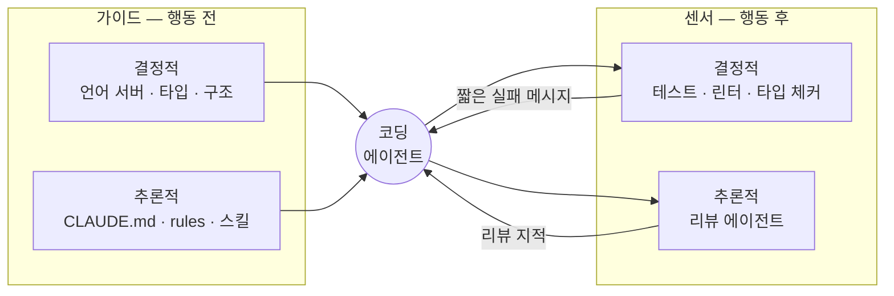
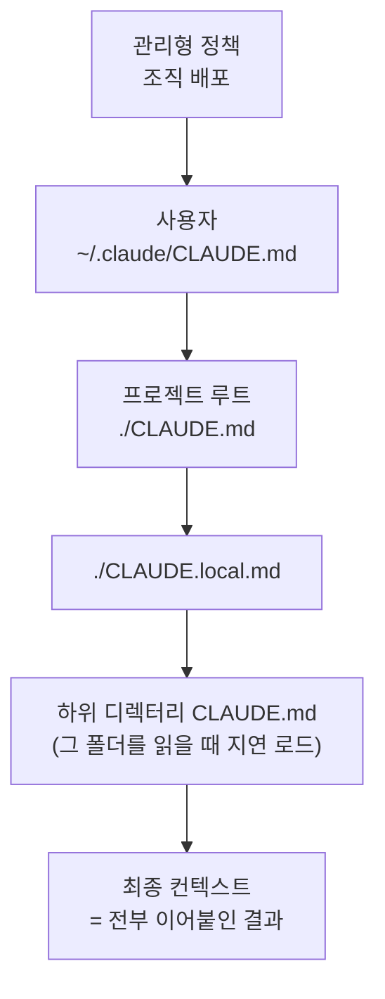

# 3. Guides — 행동하기 전에 방향을 준다

> **검증일**: 2026-08-28 · **Claude Code**: v2.1.247

## 한 줄 요약

가이드(Guides)는 에이전트가 **행동하기 전에** 방향을 잡아 주는 통제입니다. Claude Code 에서는 `CLAUDE.md`, `.claude/rules/`, 스킬(Agent Skills) 세 가지 모양으로 나타납니다. 그리고 셋 다 강제가 아니라 **부탁**이라는 한계까지 같이 알아 두셔야 합니다.

---

## 3.1 가이드란 무엇인가

앞 장에서 하네스(harness)를 두 방향으로 나눠 봤습니다. 행동 **전**에 거는 통제와 행동 **후**에 되돌리는 통제였죠. 앞쪽이 가이드(Guides), 뒤쪽이 센서(Sensors)입니다. 이 구분은 Birgitta Böckeler 가 "Harness Engineering for Coding Agent Users"(martinfowler.com)에서 제시한 분류를 따릅니다.

가이드의 목적은 간단합니다. **첫 시도가 맞을 확률을 올리는 것**이에요. 에이전트가 우리 팀 관례를 모르는 채로 코드를 쓰면 어떻게 될까요? 매번 같은 실수를 하고, 사람은 매번 같은 지적을 반복하게 됩니다. 그 지적을 한 번 문서로 굳혀 두면 그 실수는 애초에 안 생기고요.

센서만 있는 하네스를 한번 상상해 봅시다. 에이전트가 틀린 코드를 쓰고, 테스트가 잡고, 다시 고칩니다. 결과는 맞습니다. 그런데 매 세션 같은 왕복을 반복하죠. 반대로 가이드만 있으면 규칙이 지켜졌는지 아무도 확인하지 않습니다. Böckeler 의 요지는 둘 다 필요하다는 것입니다.

### 가이드와 센서 대비

| | **가이드 (Guides)** | **센서 (Sensors)** |
|---|---|---|
| 작동 시점 | 에이전트가 행동하기 **전** | 에이전트가 행동한 **후** |
| 제어 방식 | 피드포워드(feedforward) | 피드백(feedback) |
| 목적 | 첫 시도의 정확도를 올립니다 | 틀린 결과를 발견해 되돌립니다 |
| 비용 | 매 세션 컨텍스트를 차지합니다 | 실행 시간·CI 시간을 차지합니다 |
| 실패 모드 | 지켜졌는지 아무도 모릅니다 | 같은 실수를 매번 다시 잡습니다 |
| 대표 예 | `CLAUDE.md`, 스킬, 타입 스텁 | 테스트, 린터, 리뷰 에이전트 |

### 2×2 격자

가이드/센서 축 위에, 검사가 결정적인지 의미적인지를 묻는 축을 하나 더 얹어 봅시다. 그러면 격자가 나옵니다. 결정적 통제(computational)는 CPU 가 실행하고, 같은 입력이면 항상 같은 판정을 냅니다. 추론적 통제(inferential)는 모델의 판단에 기대죠. 그래서 느리고 흔들립니다. 대신 규칙으로 표현할 수 없는 것을 봅니다.

|  | **결정적 (Computational)** | **추론적 (Inferential)** |
|---|---|---|
| **가이드 (전)** | 언어 서버, 타입 스텁, 프로젝트의 일관된 디렉터리 구조 | `CLAUDE.md`, `.claude/rules/`, 스킬 |
| **센서 (후)** | 테스트, 린터, 타입 체커, `check-docs.sh` | 리뷰 서브에이전트, LLM 이 읽도록 쓴 린트 메시지 |

이 격자는 감사(audit)할 때 쓸모가 있습니다. 지금 우리 저장소의 통제를 네 칸에 배치해 보세요. **비어 있는 칸이 곧 하네스의 구멍**입니다. 이 장에서는 오른쪽 위 칸을 다루고, 아래 두 칸은 다음 장에서 다룹니다.



---

## 3.2 CLAUDE.md — 매 세션 자동으로 실리는 문서

`CLAUDE.md` 는 대화가 시작될 때 자동으로 컨텍스트에 실리는 프로젝트 문서입니다. 코드만 봐서는 알 수 없는 것들을 적는 자리예요. 빌드 명령, 테스트 실행 방법, 팀의 관례, 환경의 함정 같은 것들이요.

중요한 성질이 하나 있습니다. `CLAUDE.md` 는 시스템 프롬프트 뒤에 **사용자 메시지 형태로 전달**됩니다. 강제되는 설정이 아니라 그냥 문맥이라는 뜻이에요. 반드시 지켜져야 하는 것이라면 문서가 아니라 훅(hook)으로 내려야 합니다. 이 얘기는 4장에서 이어갈게요.

### 네 개의 스코프

파일은 네 층위로 나뉘고, **넓은 것부터 좁은 것 순서로** 로드됩니다. 뒤에 오는 내용일수록 모델에 더 가깝게 놓입니다.

| 순서 | 스코프 | 위치 | 성격 |
|---|---|---|---|
| 1 | 관리형 정책 | 조직이 배포 (macOS `/Library/Application Support/ClaudeCode/CLAUDE.md`) | 제외할 수 없습니다 |
| 2 | 사용자 | `~/.claude/CLAUDE.md` | 내 모든 프로젝트에 적용 |
| 3 | 프로젝트 | `./CLAUDE.md` 또는 `./.claude/CLAUDE.md` | 커밋해서 팀이 공유 |
| 4 | 개인 로컬 | `./CLAUDE.local.md` | 나만. gitignore 대상 |

핵심은 **덮어쓰기가 아니라 이어붙임**이라는 점입니다. 파일시스템 루트에서 현재 디렉터리까지 있는 모든 `CLAUDE.md` 와 `CLAUDE.local.md` 가 실행 시점에 전부 이어붙습니다. 같은 디렉터리 안에서는 `CLAUDE.md` 다음에 `CLAUDE.local.md` 가 붙고요.

현재 디렉터리보다 **아래**에 있는 파일은 좀 다르게 동작합니다. 시작할 때 실리지 않아요. Claude 가 그 디렉터리의 파일을 실제로 읽을 때 지연 로드됩니다. 모노레포에서 패키지별 규칙을 나눠 두면 필요한 것만 실린다는 뜻입니다.

모노레포에서 위쪽 조상 디렉터리의 `CLAUDE.md` 가 방해가 되나요? 그럴 땐 `claudeMdExcludes` 설정에 글롭 목록을 주면 건너뛸 수 있습니다. 단 관리형 정책 파일은 제외 대상이 아닙니다.



### `@경로` import

`CLAUDE.md` 안에 `@docs/git-instructions.md` 처럼 써 두면 그 파일을 컨텍스트로 끌어옵니다. 상대 경로는 **가져오는 파일 기준**으로 풀립니다. 가져온 파일이 또 다른 파일을 가져오는 재귀도 되고요. 최대 **4홉**까지입니다.

여기 함정이 하나 있습니다. import 는 컨텍스트를 **아껴 주지 못합니다.** 가져온 파일도 결국 실행 시점에 전부 로드되거든요. 파일을 쪼갠 만큼 컨텍스트가 줄어들 거라 기대하시면 안 됩니다. 실제로 줄이려면 뒤에 나올 경로 스코프 규칙이나 스킬을 써야 해요.

백틱 안이나 코드 블록 안의 `@` 경로는 import 로 취급되지 않습니다. 문서에서 경로를 예시로 보여 줄 때 요긴한 성질이죠. 그리고 프로젝트 파일의 import 가 작업 디렉터리 밖을 가리키면 최초 1회 승인 대화상자가 뜹니다.

`AGENTS.md` 를 쓰는 팀이라면 알아 두실 게 있습니다. Claude Code 가 읽는 파일 이름은 `CLAUDE.md` 예요. `CLAUDE.md` 에서 `@AGENTS.md` 로 가져오거나 심볼릭 링크를 걸어서 다리를 놓으시면 됩니다.

### `/init` 과 `/memory`

`/init` 은 코드베이스를 훑어서 초안 `CLAUDE.md` 를 만들어 줍니다. 이미 파일이 있으면 덮어쓰지 않고 개선안을 제안하고요. Cursor 의 `.cursor/rules/`·`.cursorrules` 와 Copilot 의 `.github/copilot-instructions.md` 도 함께 읽어 줍니다. 다른 도구를 쓰던 저장소에서 이사 올 때 편합니다.

`/memory` 는 사용자·프로젝트 스코프에 걸친 메모리 파일 목록을 보여 주고, 고른 파일을 편집기로 열어 줍니다(없으면 만들어 주고요). 이번 세션에 **실제로 무엇이 로드됐는지** 궁금하다면 `/context` 를 쓰세요. 규칙이 안 먹는 것 같을 때 제일 먼저 확인할 곳입니다.

---

## 3.3 무엇을 넣고 무엇을 빼는가

여기가 이 장에서 가장 중요한 절입니다. `CLAUDE.md` 를 늘리는 건 공짜가 아니에요. 이 파일의 비용은 **모든 대화에서** 지불됩니다. 그리고 컨텍스트가 길어질수록 모델의 정확도는 떨어집니다. 어텐션이 토큰 수의 제곱에 비례해 분산되기 때문이에요.

그래서 결과가 뒤집힙니다. 규칙을 900줄 적어 두면 7번 규칙이 조용히 무시됩니다. 40줄로 줄이면 다시 지켜지고요. **파일을 늘리는 행위가 규칙 준수율을 떨어뜨립니다.** 문서를 많이 쓸수록 통제가 강해질 거라는 직관은 여기서 어긋납니다.

### 판단 기준

한 줄을 넣을지 말지는 이 질문 하나로 정합니다.

> **이 줄을 지우면 에이전트가 실수를 하는가?**

답이 "아니오"면 뺍니다. 이 기준을 통과하는 건 대개 **매번 다시 설명하게 되는 것**들이에요. 두 번 이상 같은 지적을 하셨다면, 그건 문서에 들어갈 자격이 있습니다. 반대로 한 번도 지적한 적 없는 일반론은 자격이 없고요.

| 넣는다 | 뺀다 |
|---|---|
| "전체 스위트 대신 단일 테스트를 우선 실행한다" | "깨끗한 코드를 작성하라" |
| "이 저장소는 pnpm 을 쓴다. npm 을 쓰면 lockfile 이 깨진다" | 파일별 역할 설명 (코드를 읽으면 압니다) |
| "라이선스 문제로 X 라이브러리를 쓰지 않는다" | 언어 문법·표준 라이브러리 설명 |
| 로컬 환경의 함정, 재현 안 되는 셋업 절차 | 린터가 이미 잡는 스타일 규칙 |

오른쪽 마지막 항목을 눈여겨보세요. 린터가 잡는 걸 문서에도 적으면 컨텍스트만 쓰고 얻는 게 없습니다. **결정적 센서가 이미 커버하는 것은 추론적 가이드에 중복해서 넣지 않습니다.**

### 컨텍스트 예산 — 항상 로드 vs 필요할 때 로드

앞의 기준은 감각에 기대는 면이 있습니다. 다행히 더 기계적인 기준이 하나 있어요. **로드 시점**입니다.

`CLAUDE.md` 는 **세션 시작 시** 컨텍스트에 실립니다. 그래서 특정 워크플로에만 쓰이는 상세 지시를 여기 넣으면, 그 워크플로와 아무 상관 없는 작업을 할 때도 그 토큰을 **계속 지불합니다.** 배포 절차 30줄을 `CLAUDE.md` 에 적어 두면, 오타 하나 고치는 세션에서도 그 30줄이 실려요.

스킬은 다릅니다. **호출될 때만** 로드되거든요. 그래서 전문적인 지시를 스킬로 옮기면 기본 컨텍스트가 그만큼 작아집니다. 같은 내용이 같은 저장소에 있어도 어디에 두느냐에 따라 상시 비용이냐 조건부 비용이냐가 갈립니다.

공식 권장치도 명확합니다. **`CLAUDE.md` 는 200줄 이하로 유지하고, 필수적인 것만 넣습니다.** (4 MiB 를 넘는 파일은 아예 건너뜁니다.) 이 숫자를 예산 상한으로 놓고 아래 규칙을 적용해 보세요. 판단이 기계적으로 정리됩니다.

| 이 규칙은… | 어디에 두나 | 지불 시점 |
|---|---|---|
| 어떤 작업을 하든 필요하다 | `CLAUDE.md` | 매 세션 (상시) |
| 특정 경로를 건드릴 때만 필요하다 | `.claude/rules/` + `paths:` | 그 파일을 만질 때 |
| 특정 작업을 할 때만 필요하다 | 스킬 (`SKILL.md`) | 호출될 때 |
| 매번 반드시 일어나야 한다 | 훅 | 실행되지만 컨텍스트를 안 먹습니다 |

마지막 줄이 재미있습니다. 훅은 강제력만 센 게 아니라 **컨텍스트 예산 면에서도 유리해요.** 규칙을 문장으로 풀어 써서 모델에게 매번 읽히는 대신, 스크립트가 조용히 처리하니까요. 그래서 에이전트가 자꾸 어기는 규칙은 훅으로 올리는 게 두 배로 남는 거래입니다.

예산이 어디에 쓰이는지는 추측하지 말고 재 보세요. `/context` 는 지금 무엇이 컨텍스트를 차지하고 있는지 보여 줍니다. `/usage` 는 세션의 토큰 사용량 통계를 보여 주고, 플랜에 따라 스킬·서브에이전트·플러그인·MCP 서버별 귀속(attribution) 내역까지 보여 줍니다. 상태 표시줄에 컨텍스트 사용량을 상시 띄워 두는 설정도 있고요.

> 💭 **필자 견해**
>
> "짧게 쓰라"는 조언은 지키기 어렵습니다. 기준이 취향처럼 들리거든요. **로드 시점**으로 바꿔 물으면 다툼이 사라집니다. "이건 매 세션 실려야 하는가?"에 아니라고 답하는 순간 옮길 곳이 정해지니까요.

> 💭 **필자 견해**
>
> `CLAUDE.md` 는 위키가 아니라 **체크리스트**로 취급하는 편이 낫습니다. 새 규칙을 넣을 때마다 오래된 줄 하나를 지울 후보로 검토하면 파일이 저절로 관리돼요. 실제로 저는 챕터 하나를 쓸 때마다 이 저장소의 `CLAUDE.md` 를 다시 읽고, "이건 이제 훅으로 내려도 되겠다" 싶은 줄을 찾습니다.

---

## 3.4 `.claude/rules/` 와 경로 스코프

`CLAUDE.md` 하나에 모든 규칙을 담으면 앞 절의 비대화 문제를 피할 수 없습니다. `.claude/rules/*.md` 는 규칙을 주제별 파일로 쪼개 주는 장치예요. 하위 디렉터리까지 재귀적으로 탐색됩니다. `~/.claude/rules/` 는 사용자 스코프로 동작하며, 사용자 규칙이 프로젝트 규칙보다 먼저 로드됩니다.

진짜 이득은 `paths:` frontmatter 에 있습니다. 글롭 목록을 적어 두면 그 패턴에 맞는 파일을 Claude 가 건드릴 때만 규칙이 로드돼요. import 와 달리 **이건 실제로 컨텍스트를 아낍니다.**

`.claude/rules/api.md` 를 이렇게 써 봅시다.

```markdown
---
paths:
  - "src/api/**/*.ts"
---
모든 API 엔드포인트는 입력을 검증한다.
```

`paths` 가 없는 규칙 파일은 시작할 때 로드되고, 우선순위는 `.claude/CLAUDE.md` 와 같습니다.

정리하면 규칙은 세 등급으로 나뉩니다. **항상 필요한 것**은 `CLAUDE.md`, **특정 경로에서만 필요한 것**은 `paths:` 규칙, **특정 작업에서만 필요한 것**은 스킬이에요. 이 세 등급을 구분해 쓰는 것이 컨텍스트 예산 관리의 실무입니다.

---

## 3.5 Agent Skills — 필요할 때 불러오는 가이드

스킬은 `SKILL.md` 파일 하나에 담긴 지시 묶음입니다. 놓는 자리는 이렇습니다.

- 프로젝트: `.claude/skills/<skill-name>/SKILL.md`
- 개인: `~/.claude/skills/<skill-name>/SKILL.md`
- 플러그인: `<plugin>/skills/<skill-name>/SKILL.md`

이름이 겹치면 엔터프라이즈 > 개인 > 프로젝트 순으로 이깁니다. 그리고 이 셋 중 무엇이든 같은 이름의 번들 스킬을 덮어씁니다.

frontmatter 필드는 전부 선택이지만 `description` 은 사실상 필수예요. `name` 은 표시 이름이고, 생략하면 디렉터리 이름이 쓰입니다. 그 밖에 `when_to_use`, `argument-hint`, `allowed-tools`, `disallowed-tools`, `model`, `disable-model-invocation`, `user-invocable`, `paths` 같은 필드를 쓸 수 있고요.

### 점진적 공개 (progressive disclosure)

스킬의 핵심 설계는 이것입니다. 컨텍스트에 상주하는 건 스킬의 **설명뿐**이에요. 본문은 실제로 호출될 때만 로드됩니다. 그래서 긴 참고 자료를 스킬로 만들어 둬도, 쓰이기 전까지는 컨텍스트를 거의 쓰지 않습니다.

왜 전부 다 먹이지 않을까요? 3.3 절의 이유와 같습니다. 컨텍스트는 유한한 예산이고, 지금 안 쓰는 문서가 지금 쓰는 규칙의 준수율을 갉아먹으니까요. 스킬은 "목차만 들고 있다가 필요할 때 펼친다"는 전략을 구현한 것입니다.

여기서 실무적으로 중요한 제약이 나옵니다. 목록에 실리는 `description` + `when_to_use` 합계는 **1,536자에서 잘립니다.** 잘리면 Claude 가 그 스킬을 언제 써야 하는지 모르게 돼요. 그러니 **핵심 사용 사례를 맨 앞에 쓰세요.**

호출 주체도 고를 수 있습니다. 기본은 사람과 모델 둘 다예요. `disable-model-invocation: true` 면 사람만 부를 수 있고, 이 경우 설명조차 컨텍스트에 남지 않습니다. `user-invocable: false` 면 모델만 쓰고 `/` 메뉴에서는 숨습니다.

수명 특성도 하나 기억해 두세요. 한 번 호출된 `SKILL.md` 는 그 세션 내내 대화에 남고, 이후 턴에서 파일을 다시 읽지 않습니다. 스킬 파일을 고치셨다면 세션을 새로 시작해야 반영돼요.

본문에 백틱 느낌표 형식으로 셸 명령을 적어 두면, Claude 가 보기 전에 실행되고 그 출력으로 치환됩니다. `git diff HEAD` 같은 걸 넣어 두면 스킬이 항상 현재 상태를 들고 시작하게 되죠.

### 슬래시 커맨드는 스킬로 통합됐다

예전에 따로 있던 커스텀 슬래시 커맨드는 스킬로 흡수됐습니다. `.claude/commands/deploy.md` 와 `.claude/skills/deploy/SKILL.md` 는 **둘 다 `/deploy` 를 만들고 동작도 같아요.** 기존 `.claude/commands/` 파일도 계속 동작하니 급히 옮기실 필요는 없습니다.

스킬 쪽 형식이 나은 점은 두 가지입니다. 보조 파일을 둘 디렉터리가 생기고, frontmatter 가 더 풍부해요. 인자는 `$ARGUMENTS` 로 전부 받거나 `$0`, `$1` 처럼 위치로 받습니다. 한 메시지 앞머리에 커맨드를 여러 개 쌓아 부를 수도 있고요(첫 스킬 + 최대 5개).

배포처럼 위험한 커맨드에는 `disable-model-invocation: true` 를 붙이는 편이 안전합니다. 모델이 알아서 `/deploy` 를 쏘는 일을 구조적으로 막아 주거든요.

---

## 3.6 이 저장소를 읽어 보자

이 저장소의 루트 `CLAUDE.md` 자체가 교보재입니다. 실제로 무엇이 들어 있고 왜 들어 있는지 같이 뜯어봅시다.

첫 문단은 이 저장소가 학습 자료인 **동시에** 자료가 가르치는 하네스의 실물 예제라고 선언하고, `.claude/` 아래 설정을 지우거나 단순화하지 말라고 못박습니다. 이건 코드를 읽어서는 절대 알 수 없는 정보예요. 정리 좋아하는 에이전트가 "중복 설정을 정리했습니다"라며 교보재를 지우는 사고를 막아 줍니다.

그다음 저장소 구조 표에서는 `docs/_facts/` 를 "집필의 유일한 근거"로, `seed/todo-cli/` 를 "의도적으로 결함이 있다"로 표시합니다. 특히 뒤엣것이 결정적이에요. 실습용 버그를 만난 에이전트의 기본 반응은 고치는 것이니까요. 그래서 **고치지 말라**는 지시가 명시적으로 필요합니다. 규칙 4번이 "시키지 않으면 고치지 않는다"로 한 번 더 강조하고요.

"절대 규칙" 1번은 저작권 안전입니다. 문장을 옮기지 말고, 인용은 15단어 미만 정의구에 한하며, 외부 이미지 대신 Mermaid 로 그리라고 합니다. 2번은 근거 없는 서술 금지와 `<!-- NEED-FACT: 질문 -->` 표기법이에요. 둘 다 "매번 다시 설명하게 되는 것"의 전형이라 문서에 들어갈 자격이 있습니다.

문체 절도 마찬가지입니다. 독자 정의, 용어 병기 규칙, 한 문단 4줄 제한, 견해 블록 분리. 이걸 안 적으면 매 챕터마다 같은 지적을 하게 되거든요. 반대로 이 파일에 **없는** 것도 한번 보세요. 문법 설명도, 파일별 역할 나열도, "좋은 글을 써라" 같은 문장도 없습니다.

### "writer 에게 웹 도구를 주지 않는다"는 왜 가이드가 아닌가

규칙 3번에 이런 줄이 있습니다.

> 집필은 `writer` 에이전트가 한다. **writer 에게는 웹 도구를 주지 않는다.**

문장만 보면 가이드처럼 보이죠. 그런데 실제 강제력은 이 문장에 없습니다. `.claude/agents/writer.md` 의 frontmatter 에 있어요.

```yaml
tools: Read, Write, Edit, Grep, Glob
```

서브에이전트의 `tools` 필드는 허용 도구 목록이고, 생략하면 전부 상속합니다. 여기서는 명시했으니 writer 에게 웹 도구는 **존재하지 않습니다.** 지켜 달라는 부탁이 아니라, 어길 수 있는 경로 자체가 없는 상태인 거죠.

이 차이가 이 장 전체의 결론입니다. `CLAUDE.md` 의 문장은 모델이 읽고 따를 수도 있고, 긴 세션 끝에 잊을 수도 있습니다. 반면 `tools` 목록은 모델의 협조와 무관하게 도구 목록을 결정하고요. 앞엣것이 추론적 통제, 뒤엣것이 결정적 통제입니다.

그러면 `CLAUDE.md` 의 그 문장은 왜 남겨 뒀을까요? 대상이 다르기 때문입니다. `tools` 필드는 writer 를 구속하지만, `CLAUDE.md` 의 문장은 **이 저장소를 손대는 다음 사람과 다음 에이전트**에게 그 구속을 지우지 말라고 알려 줍니다. 강제 장치가 왜 있는지 적어 두는 것도 가이드의 일이에요.

> 💭 **필자 견해**
>
> 하네스를 설계할 때 저는 이 순서로 자문합니다. **"이걸 못 하게 만들 수 있나?"** → 안 되면 **"이걸 자동으로 잡을 수 있나?"** → 그것도 안 되면 그제야 문서에 적습니다. 문서부터 쓰기 시작하면 문서만 길어지고 아무것도 강제되지 않거든요.

---

## 3.7 가이드는 부탁이지 강제가 아니다

정리해 봅시다. 이 장에서 다룬 세 장치는 전부 **추론적 통제**입니다. 모델이 텍스트를 읽고 따라 줄 때만 작동해요.

| 장치 | 로드 시점 | 성격 | 강제력 |
|---|---|---|---|
| `CLAUDE.md` | 세션 시작 시 항상 | 추론적 | 없음 (권고) |
| `.claude/rules/` + `paths:` | 해당 경로를 건드릴 때 | 추론적 | 없음 (권고) |
| 스킬 | 호출될 때 | 추론적 | 없음 (권고) |
| 서브에이전트 `tools` | 에이전트 실행 시 | 결정적 | 있음 (구조적) |
| 훅 | 정해진 생애주기 시점 | 결정적 | 있음 (차단 가능) |

위 세 줄과 아래 두 줄 사이에 선이 그어져 있습니다. 위쪽은 아무리 굵은 글씨로 써도 무시될 수 있어요. **반드시 매번 일어나야 하는 일이라면 가이드가 아니라 훅으로 내려야 합니다.**

그래서 다음 장의 주제는 자연스럽게 정해집니다. 행동한 뒤에 되돌리는 통제 — 센서와 훅이에요.

---

## 직접 해보기

`seed/todo-cli/` 에 직접 `CLAUDE.md` 를 써 봅시다. 이 실습의 목표는 좋은 문서를 쓰는 게 아니라 **짧게 쓰는 감각**을 잡는 것입니다.

**1단계. 먼저 하네스 없이 시켜 봅니다.**

```bash
cd seed/todo-cli
python -m pytest tests -q
```

테스트가 실패합니다. 여기서 에이전트에게 "이 프로젝트를 살펴보고 개선해 줘"라고만 말해 보세요. 무엇을 하는지 관찰하고, **하지 않았으면 하는 행동을 목록으로 적습니다.** (예: 테스트 파일을 고친다, 결함을 마음대로 수정한다, 파일 구조를 바꾼다)

**2단계. 적은 목록을 `CLAUDE.md` 로 옮깁니다.**

`seed/todo-cli/CLAUDE.md` 를 만들고, 1단계에서 실제로 겪은 것만 적으세요. 겪지 않은 일반론은 적지 않습니다. 10줄을 넘기지 않고요. 뼈대는 이렇게 잡습니다.

- 이 코드가 무엇인지 한 줄
- 테스트 실행 명령
- 하지 말아야 할 것 (1단계 관찰 결과)
- 코드를 읽어서는 알 수 없는 사실

**3단계. `/context` 로 확인합니다.**

`seed/todo-cli` 에서 세션을 열고 `/context` 를 실행해서, 루트 `CLAUDE.md` 와 방금 만든 파일이 **둘 다** 로드되는지 보세요. 이어붙임을 눈으로 확인하는 단계입니다.

**4단계. 경로 스코프 규칙으로 쪼갭니다.**

테스트 파일에만 해당하는 규칙이 있다면 `.claude/rules/tests.md` 로 옮깁니다.

```markdown
---
paths:
  - "seed/todo-cli/tests/**/*.py"
---
이 디렉터리의 테스트는 실습 과제의 사양이다. 테스트를 고쳐서 통과시키지 않는다.
```

이제 `CLAUDE.md` 에서 해당 줄을 지우고, 테스트 파일을 건드릴 때만 규칙이 로드되는지 확인해 보세요.

**5단계. 스킬로 한 단계 더 내립니다.**

가끔만 필요한 절차(예: 새 하위 명령을 추가하는 방법)를 `.claude/skills/add-command/SKILL.md` 로 옮깁니다. `description` 첫 문장에 언제 쓰는 스킬인지를 반드시 적으세요.

**6단계. 다시 1단계를 반복합니다.**

같은 프롬프트를 새 세션에서 다시 줘 봅니다. 1단계에서 적은 "하지 않았으면 하는 행동" 중 몇 개가 사라졌는지 세어 보세요. **사라지지 않은 항목이 4장에서 훅으로 내릴 후보입니다.**

---

## ✅ 자가 점검

- [ ] 가이드와 센서의 차이를 시점(전/후)과 성격(피드포워드/피드백)으로 설명할 수 있다
- [ ] 여러 `CLAUDE.md` 가 덮어쓰기가 아니라 이어붙임으로 로드된다는 것을 알고, `/context` 로 확인할 수 있다
- [ ] `@경로` import 가 컨텍스트를 아껴 주지 않는 이유를 말할 수 있고, 최대 홉 수를 안다
- [ ] **로드 시점**(항상 / 경로별 / 호출 시)으로 규칙을 어디에 둘지 정할 수 있고, `CLAUDE.md` 권장 상한을 안다
- [ ] 스킬의 점진적 공개를 설명할 수 있고, 문서로 적는 것과 `tools`·훅으로 강제하는 것의 차이를 구분할 수 있다

---

## 📎 출처

- 메모리와 `CLAUDE.md` 로드 규칙, import, `/init`, `/memory`, `.claude/rules/` — <https://code.claude.com/docs/en/memory>
- Agent Skills, frontmatter, 점진적 공개, 슬래시 커맨드 통합 — <https://code.claude.com/docs/en/skills>
- 서브에이전트 `tools` 필드와 정의 위치 — <https://code.claude.com/docs/en/sub-agents>
- 설정 파일 계층과 권한 규칙 — <https://code.claude.com/docs/en/settings>
- `CLAUDE.md` 비대화의 해악, 훅과 문서의 역할 분담 — <https://code.claude.com/docs/en/best-practices>
- 로드 시점에 따른 컨텍스트 비용, `CLAUDE.md` 200줄 권장치, `/context`·`/usage` — <https://code.claude.com/docs/en/costs>
- 하네스 분류(Guides/Sensors, 결정적/추론적), 세 가지 규제 차원 — Birgitta Böckeler, "Harness Engineering for Coding Agent Users": <https://martinfowler.com/articles/harness-engineering.html>
- 컨텍스트 엔지니어링 — Anthropic Engineering: <https://www.anthropic.com/engineering/effective-context-engineering-for-ai-agents>

본문은 위 자료를 읽고 이해한 뒤 한국어로 새로 집필했다. 원문의 문장을 옮기지 않았다. 전체 참고 자료와 라이선스 고지는 저장소 루트의 `SOURCES.md` 를 참고할 것.
