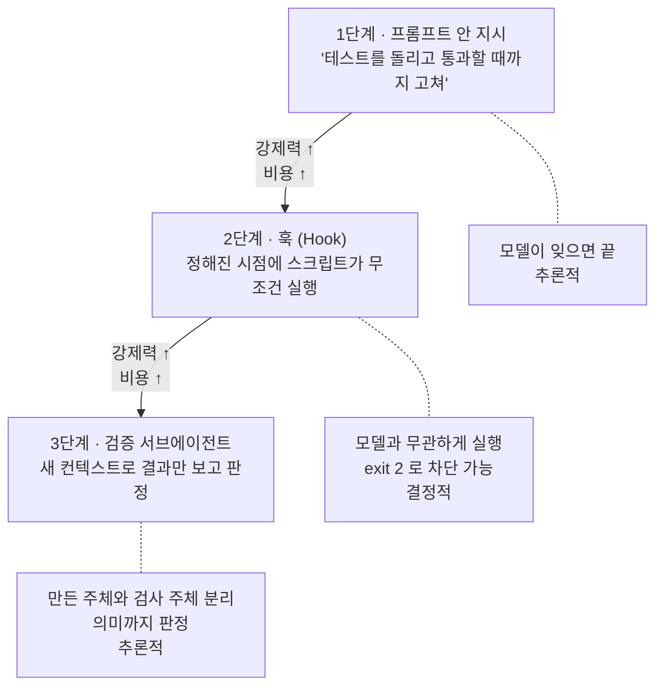
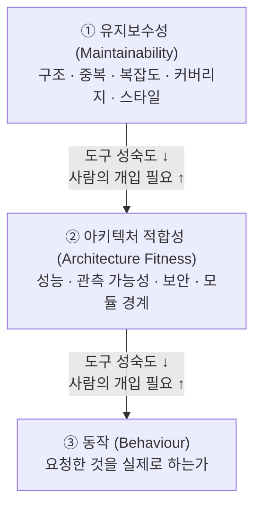

# 4. Sensors — 행동한 뒤에 되돌린다

> **검증일**: 2026-08-28 · **Claude Code**: v2.1.247

## 한 줄 요약

센서(Sensors)는 에이전트가 만든 결과를 관찰해 **에이전트 자신이 읽을 수 있는 신호**로 되돌려 주는 통제다. 핵심 조건은 하나다 — 사람이 눈으로 보는 검사는 센서가 아니다. **에이전트가 스스로 돌릴 수 있어야** 루프가 닫힌다.

---

## 4.1 센서란 무엇인가

3장의 가이드는 행동 **전**에 방향을 줬다. 센서는 행동 **후**에 결과를 측정해 신호를 돌려준다. 제어공학의 용어를 빌리면 앞엣것이 피드포워드, 뒤엣것이 피드백이다.

센서가 없으면 어떤 일이 벌어지는가. 가이드는 **검증되지 않은 가정**으로 남는다. `CLAUDE.md` 에 "테스트를 먼저 실행하라"고 적어 두었어도, 실제로 실행했는지 확인하는 장치가 없으면 그 규칙은 지켜졌는지 알 수 없는 상태로 영원히 방치된다.

그리고 더 실무적인 문제가 있다. 센서가 없으면 "다 된 것 같다"가 유일한 종료 신호가 된다. 그러면 **사람이 검증 루프 그 자체**가 된다. 에이전트를 붙여 놓고 사람이 결과를 하나하나 확인해야 한다면, 속도를 얻은 게 아니라 일의 종류만 바뀐 것이다.

### 결정적 센서와 추론적 센서

센서는 두 종류다. 이 구분이 이 장의 뼈대다.

| | **결정적 (Computational)** | **추론적 (Inferential)** |
|---|---|---|
| 실행 주체 | CPU | 모델(LLM) |
| 재현성 | 같은 입력 → 항상 같은 판정 | 매번 조금씩 다르다 |
| 속도·비용 | 밀리초~초, 거의 공짜 | 초~분, 토큰 비용 |
| 볼 수 있는 것 | 규칙으로 표현 가능한 것 | 의미·의도·"이거 과설계 아닌가" |
| 예 | 테스트, 린터, 타입 체커, 스키마 검증 | 리뷰 서브에이전트, LLM 이 읽도록 쓴 린트 메시지 |

결정적 센서는 싸고 믿을 만하다. 그래서 **매 편집, 매 커밋마다 돌릴 수 있고**, 하네스의 하중을 실제로 견디는 부분이 된다. 하네스를 새로 짤 때 여기부터 채우는 이유다.

추론적 센서는 규칙으로 표현할 수 없는 것을 본다. "이 테스트가 의미 있는 테스트인가", "요구사항 중 빠진 게 있나" 같은 판정은 계산으로 나오지 않는다. 대신 느리고 흔들리므로 **매 키 입력이 아니라 파이프라인에 예산을 잡아** 배치한다.

> 💭 **필자 견해**
>
> 추론적 센서를 처음 붙일 때 흔한 실수가 있다. 리뷰 에이전트에게 "문제를 찾아 줘"라고만 시키는 것이다. 문제를 찾으라고 하면 **항상 찾아온다.** 없어도 만들어 온다. 범위를 "정확성과 명시된 요구사항"으로 좁히지 않으면 과설계 제안만 잔뜩 쌓인다.

---

## 4.2 에이전트가 스스로 돌릴 수 있어야 센서다

이 절이 이 장에서 가장 중요하다. 검사가 아무리 정교해도, 사람이 화면을 보고 판단해야 한다면 그건 센서가 아니다. **에이전트의 루프 밖에 있는 검사**이기 때문이다.

기준은 이렇게 잡는다.

1. 에이전트가 **명령 하나로 실행**할 수 있는가
2. 결과가 **종료 코드나 텍스트**로 나오는가
3. 실패했을 때 **무엇을 고쳐야 하는지** 출력에 들어 있는가

셋 다 예라면 센서다. 하나라도 아니면 사람이 루프 안에 끼어 있는 것이다.

| 센서가 아니다 | 센서다 |
|---|---|
| "브라우저에서 열어 보고 확인" | 스크린샷을 기준 이미지와 diff 하는 스크립트 |
| "코드 리뷰에서 눈으로 확인" | 리뷰 서브에이전트가 diff 를 읽고 지적 목록을 반환 |
| "빌드가 잘 되는지 지켜본다" | 종료 코드를 반환하는 빌드 명령 |
| "성능이 괜찮은지 체감한다" | p95 지연이 임계값을 넘으면 실패하는 부하 테스트 |

오른쪽 항목들의 공통점은 **판정이 자동으로 나온다**는 것이다. 왼쪽에서 오른쪽으로 옮기는 작업이 하네스 엔지니어링의 상당 부분을 차지한다.

여기서 따라오는 원칙이 하나 더 있다. 에이전트에게 "됐습니다"를 받지 말고 **증거를 요구**하라. 실행한 명령과 그 출력을 함께 내놓게 하면, 검증했다고 주장만 하는 경우를 걸러낼 수 있다. Anthropic 의 실무 문서는 이 태도를 짧게 요약한다 — "If you can't verify it, don't ship it."(<https://code.claude.com/docs/en/best-practices>)

---

## 4.3 센서 출력은 LLM 이 읽을 것을 전제로 쓴다

센서의 출력은 사람이 아니라 **모델이 읽는다.** 그러면 좋은 출력의 기준이 달라진다. 짧고, 기계가 파싱할 수 있고, 무엇을 고칠지가 들어 있어야 한다.

400줄짜리 스택 트레이스는 나쁜 센서 출력이다. 컨텍스트를 잔뜩 먹고, 정작 신호는 그 안에 묻힌다. 컨텍스트가 유한한 예산이라는 점을 떠올리면 이건 그냥 낭비가 아니라 **다른 규칙의 준수율까지 떨어뜨리는 비용**이다.

**나쁜 예**

```text
Traceback (most recent call last):
  File "/usr/lib/python3.12/site-packages/_pytest/runner.py", line 341, in from_call
    result: Optional[TResult] = func()
  ... (380줄 생략) ...
AssertionError
```

무엇이 왜 틀렸는지가 없다. 에이전트는 이걸 받고 추측을 시작한다.

**좋은 예**

```text
FAILED tests/test_auth.py::test_refresh - AssertionError: expected 401, got 500
```

한 줄에 파일, 테스트 이름, 기대값, 실제값이 모두 들어 있다. 에이전트는 이걸 파싱해서 곧장 해당 파일로 간다. 사람의 개입 없이 고치고 다시 돌린다.

추론적 센서에서는 한 걸음 더 나갈 수 있다. 린트 메시지를 **모델에게 하는 지시문처럼** 쓰는 것이다.

```text
raw SQL 대신 repository.findBy... 를 쓸 것. 배경은 src/db/README.md 참고.
```

"금지된 패턴입니다" 로 끝내지 말고, 대신 무엇을 쓸지와 근거가 어디 있는지까지 담는다. 센서가 곧 가이드 역할을 겸하게 되는 지점이다.

> 💭 **필자 견해**
>
> 도구의 출력 형식을 설계하는 일을 사람 UI 만큼 진지하게 다루는 팀은 드물다. 그런데 에이전트를 붙이는 순간 **에러 메시지가 곧 인터페이스**가 된다. 나쁜 에러 메시지는 이제 불친절함의 문제가 아니라 **고장 난 센서**다.

---

## 4.4 강제 단계 사다리

같은 검사라도 어디에 붙이느냐에 따라 강제력이 다르다. 아래로 갈수록 세다.



**1단계 — 프롬프트 안 지시.** 가장 싸고 가장 약하다. 짧은 작업에는 충분하지만, 세션이 길어지면 조용히 잊힌다.

**2단계 — 훅.** 정해진 생애주기 시점에서 셸 명령이 실행된다. 모델이 협조하든 안 하든 실행된다. 그래서 **매번 반드시 일어나야 하는 일**은 여기에 둔다. 3장 마지막에 남겨 둔 "사라지지 않은 항목"들이 이 자리로 온다.

**3단계 — 검증 서브에이전트.** 새 컨텍스트에서 결과만 읽고 판정한다. 만든 주체와 검사하는 주체를 분리하는 maker/checker 구조다. 자기가 방금 쓴 코드에 대해서는 누구도(모델도) 좋은 심사위원이 아니라는 전제가 깔려 있다.

세 단계는 배타적이지 않다. 실제 하네스는 셋을 겹쳐 쓴다. 이 저장소도 그렇다 — `.claude/commands/verify.md` 는 결정적 스크립트와 추론적 검증 에이전트를 **둘 다** 돌리고 결과를 합쳐 보고한다.

---

## 4.5 Hooks 상세

훅(hook)은 Claude Code 가 정해진 생애주기 시점에서 실행하는 셸 명령이다(HTTP 호출, MCP 도구 호출, 프롬프트, 에이전트 형태도 가능하다). 핵심은 **모델이 무엇을 결정하든 상관없이 실행된다**는 점이다.

### 이벤트 종류

이벤트는 성격별로 묶어서 외우는 편이 쉽다.

| 묶음 | 이벤트 |
|---|---|
| 세션 | `SessionStart`, `SessionEnd`, `Setup` |
| 턴 | `UserPromptSubmit`, `UserPromptExpansion`, `Stop`, `StopFailure` |
| 도구 | `PreToolUse`, `PostToolUse`, `PostToolUseFailure`, `PermissionRequest`, `PermissionDenied`, `PostToolBatch` |
| 그 밖 | `Notification`, `SubagentStart`, `SubagentStop`, `TaskCreated`, `TaskCompleted`, `FileChanged`, `PreCompact`, `PostCompact` 등 |

센서 관점에서 자주 쓰는 것은 넷이다. **`PostToolUse`** 는 편집 직후 검사를 붙이는 자리, **`PreToolUse`** 는 위험한 동작을 미리 막는 자리, **`Stop`** 은 검사가 통과할 때까지 턴을 끝내지 못하게 하는 자리, **`SessionStart`** 는 세션 시작 시 필요한 맥락을 주입하는 자리다.

### 설정 모양

훅은 아무 설정 파일의 `hooks` 키 아래에 둔다(스킬·서브에이전트 frontmatter 나 플러그인의 `hooks/hooks.json` 도 가능하다). `.claude/settings.json` 기준으로 이렇게 생겼다.

```json
{
  "hooks": {
    "PostToolUse": [
      {
        "matcher": "Edit|Write",
        "hooks": [
          {
            "type": "command",
            "command": "${CLAUDE_PROJECT_DIR}/.claude/hooks/format.sh"
          }
        ]
      }
    ]
  }
}
```

구조는 `이벤트 이름 → 매처 그룹 배열 → 그 안의 훅 배열`이다. `${CLAUDE_PROJECT_DIR}` 같은 경로 자리표시자를 쓰면 어느 디렉터리에서 실행하든 경로가 맞는다. 명령·HTTP·MCP 도구 훅의 기본 타임아웃은 600초다.

전부 끄고 싶으면 `"disableAllHooks": true` 를 설정에 넣는다. 남의 저장소를 처음 열어 볼 때 알아 두면 좋은 스위치다.

### matcher 문법

- 정확한 이름: `Bash`
- 여러 개: `Edit|Write`
- 정규식(앵커 없는 JavaScript 정규식): `^Notebook`, `mcp__memory__.*`
- 전부: `"*"` 또는 생략

도구가 아닌 이벤트에서는 매처가 그 이벤트 고유의 값을 거른다. 예를 들어 `SessionStart` 는 `startup`, `resume`, `clear`, `compact`, `fork` 를 받는다. "새로 시작할 때만" 과 "컴팩션 직후에만" 을 구분해 걸 수 있다는 뜻이다.

### 종료 코드 — exit 2 가 차단이다

훅에서 반드시 외워야 할 것은 이것 하나다.

| 종료 코드 | 의미 |
|---|---|
| `0` | 성공. stdout 이 유효한 JSON 이면 JSON 으로, 아니면 평문으로 해석된다. `UserPromptSubmit` 과 `SessionStart` 에서는 Claude 에게 보이고, 그 밖에는 디버그 로그로만 남는다 |
| **`2`** | **차단 오류.** 차단을 지원하는 이벤트(`PreToolUse`, `UserPromptSubmit`, `Stop`, `PostToolBatch` 등)에서 해당 동작이 막힌다. JSON 으로 이 결정을 뒤집을 수 없다. 이유는 stderr 또는 JSON 의 결정 사유에서 온다 |
| 그 외 | 차단하지 않는 오류. 동작은 그대로 진행되며, 유효한 JSON 결정 필드는 존중된다 |

**차단하려면 stderr 에 이유를 쓰고 `exit 2`.** 이 한 줄이 "부탁"과 "강제"를 가르는 지점이다. 3장에서 본 `CLAUDE.md` 의 문장은 아무리 굵게 써도 무시될 수 있지만, `exit 2` 는 무시할 수 없다.

이유를 stderr 에 쓰는 것이 왜 중요한지도 짚고 넘어가자. 차단만 하고 이유를 안 주면 에이전트는 같은 시도를 반복한다. 4.3 절의 원칙이 여기서도 그대로 적용된다 — **짧고, 무엇을 고칠지가 들어 있어야 한다.**

더 세밀한 제어가 필요하면 stdout 으로 JSON 을 낸다. `hookSpecificOutput` 아래에 `hookEventName`, `permissionDecision`(`allow` / `deny` / `escalate`), `permissionDecisionReason`, `additionalContext`, `updatedInput`, `systemMessage` 같은 필드를 담는다.

훅으로 들어오는 입력은 stdin 에 JSON 으로 온다. `session_id`, `transcript_path`, `cwd`, `permission_mode`, `hook_event_name` 이 공통이고, 도구 이벤트에서는 `tool_name`, `tool_input`, `tool_use_id` 가 추가된다. 편집된 파일 경로가 필요하면 `tool_input` 에서 꺼낸다.

---

## 4.6 세 가지 규제 차원

무엇을 규제할 것인가로 하네스를 나누면 세 층이 나온다. Böckeler 의 분류이며, 뒤로 갈수록 **도구가 미성숙하다**는 점이 핵심이다.



**① 유지보수성 하네스.** 가장 성숙한 층이다. 기존 정적 분석 도구가 거의 그대로 넘어온다. 결정적으로는 복잡도·중복 게이트와 커버리지 하한선, 추론적으로는 의미적으로 중복된 헬퍼나 증상만 덮은 임시방편을 잡아내는 리뷰 에이전트다. 그래서 **시작하기 가장 싼 지점**이다. 한계는 분명하다 — 어떤 도구도 "엉뚱한 걸 만들었다"를 잡지 못한다.

**② 아키텍처 적합성 하네스.** 성능·관측 가능성·보안·모듈성 같은 횡단 품질을 **적합성 함수(fitness function)** 로 표현한다. "아직 아키텍처적으로 괜찮은가"를 실행 가능한 정의로 바꾸는 것이다. 예를 들어 결제 엔드포인트의 p95 지연이 200ms 를 넘으면 실패하는 부하 테스트(센서)에, 성능 예산을 적어 둔 스킬(가이드)을 짝지운다. 에이전트가 빠른 속도로 코드를 바꿀 때 이런 품질은 **조용히** 무너지므로, 신호로 만들어 두지 않으면 알 수가 없다.

**③ 동작 하네스.** Böckeler 가 가장 약하다고 말하는 층이다. 지금 할 수 있는 건 사람이 쓴 기능 명세(피드포워드)에, AI 가 생성한 테스트와 커버리지 수치(피드백)를 붙이는 정도다. 문제는 그 테스트를 **같은 부류의 모델이 썼다**는 점이다. 검사 대상과 검사 도구가 같은 편향을 공유한다. 그래서 사람의 확인이 아직 빠질 수 없다.

③에서 그나마 쓸 만한 방법이 승인된 픽스처(approved fixtures) 방식이다. 사람이 기대 출력을 한 번 승인해 두면, 이후 에이전트는 자기 실행 결과를 그 기준과 비교한다. 사람이 쓴 계약 테스트나 BDD 시나리오를 코딩 **전에** 확보하는 것도 같은 발상이다.

---

## 4.7 keep quality left — 검사를 어디에 둘 것인가

같은 검사라도 **언제 돌리느냐**가 효과를 가른다. 원칙은 "감당할 수 있는 가장 이른 단계에 둔다"이다.

사람에게 이 원칙은 "결함은 일찍 찾을수록 싸다"는 뜻이었다. 에이전트에게는 이유가 하나 더 붙는다. **이른 신호는 관련 맥락이 아직 컨텍스트 안에 있을 때 도착한다.** 그래서 에이전트가 스스로 고칠 수 있다. 30분 뒤 CI 에서 온 신호는 이미 컨텍스트에서 밀려난 코드에 대한 것이다.

| 단계 | 두는 검사 | 성격 |
|---|---|---|
| 편집 직후 / 커밋 전 | 포매터, 린터, 변경 파일 단위 테스트, 가벼운 리뷰 에이전트 | 빠르고 싸다 |
| CI | 전체 테스트, 뮤테이션 테스트, 본격 아키텍처 리뷰 에이전트 | 느리고 비싸다 |
| 지속 | 데드 코드·의존성 드리프트 스캔, SLO 알림, 운영 응답 품질 샘플링 | 시간 축으로 감시 |

Claude Code 안에서 "커밋 전"은 `PostToolUse` 훅이나 `Stop` 훅으로 구현된다. CI 는 이 저장소의 GitHub Actions 워크플로가 그 자리다. 다음 절에서 실물을 보자.

---

## 4.8 이 저장소를 읽어 보자

이 저장소의 센서는 두 개다. `scripts/check-docs.sh`(결정적)와 `.github/workflows/verify.yml`(둘을 배치하는 파이프라인). 각 검사가 어떤 종류의 센서인지 분류해 보자.

### `scripts/check-docs.sh`

스크립트 맨 위 주석이 설계 의도를 밝힌다 — 사람이 아니라 CI 와 에이전트가 읽는 것을 전제로, 짧고 기계가 읽기 좋은 출력을 낸다. 4.3 절의 원칙을 그대로 구현한 것이다. 출력은 `FAIL <무엇이 잘못됐는지>` 한 줄 형식이고, 마지막에 `VERDICT: PASS` 또는 `VERDICT: FAIL` 을 찍는다. 종료 코드도 함께 준다.

| 검사 | 무엇을 보나 | 분류 |
|---|---|---|
| 1. 챕터 필수 섹션 | 각 챕터에 4개 섹션과 검증일 메타가 있는가 | 결정적 · 유지보수성 |
| 2. 금지된 외부 이미지 | `docs/` 에 외부 URL 이미지 참조가 있는가 | 결정적 · **저작권 안전** |
| 3. 이전된 문서 URL | 구 `docs.claude.com` 경로를 쓰고 있는가 | 결정적 · 유지보수성 |
| 4. 코드 블록 짝 맞춤 | 백틱 펜스가 짝수 개인가 | 결정적 · 유지보수성 |
| 5. 시드 코드 테스트 | 실습용 결함이 **아직 살아 있는가** | 결정적 · 동작 |
| 6. 라이선스 고지 | `LICENSE`, `LICENSE-docs`, `SOURCES.md` 가 있는가 | 결정적 · 저작권 안전 |

5번이 재미있다. 보통 테스트는 통과해야 성공인데, 여기서는 **통과하면 실패**로 판정한다. `seed/todo-cli` 의 결함은 실습 재료이므로, 누군가(사람이든 에이전트든) 친절하게 고쳐 버리면 교보재가 사라진다. 센서는 "테스트가 초록불인가"가 아니라 **"우리가 지키려는 성질이 유지되는가"** 를 재는 것이다.

4번도 눈여겨볼 만하다. 백틱 개수를 세는 세 줄짜리 검사인데, 이게 없으면 문서 렌더링이 통째로 깨진다. **가장 값싼 결정적 센서가 가장 자주 값을 한다.**

### 인용 안전성 검사는 왜 FAIL 조건인가

이 저장소에서 인용 안전성은 다른 검사와 지위가 다르다. `SOURCES.md` 의 집필 원칙은 원문과 **연속 15단어 이상 일치**하는 문장을 별도 항목으로 검사하고, **하나라도 걸리면 전체 검증 실패**로 처리한다고 못박는다. `.claude/agents/verifier.md` 도 이 항목을 `LEGAL-RISK` 로 보고하며 "하나라도 있으면 전체 FAIL" 이라고 선언한다.

왜 다른가. 대부분의 결함은 **정도의 문제**다. 섹션이 하나 빠지면 문서가 조금 나쁘고, 고치면 원상복구된다. 저작권 침해는 다르다. 게시되는 순간 되돌릴 수 없는 종류의 손해가 발생하고, 정도가 아니라 **성립하느냐 아니냐**의 문제다.

이런 성격의 검사를 경고로 두면 반드시 무시된다. 경고 목록이 길어지면 사람은 스크롤해서 넘긴다. 그래서 되돌릴 수 없는 손해를 다루는 검사는 **경고가 아니라 게이트**여야 한다.

동시에 이 검사는 **결정적 센서와 추론적 센서를 겹쳐 쓴 예**이기도 하다. `check-docs.sh` 2번(외부 이미지 차단)은 결정적으로 명백한 위반을 막는다. 하지만 "번역투가 심해 원문 번역으로 의심되는 문단"은 정규식으로 잡을 수 없다. 그건 verifier 에이전트가 의미를 읽고 판정한다.

그리고 하나 더 — **집필한 주체가 검증하지 않는다.** writer 에이전트에게 웹 도구가 없는 것(3장)이 원문 복제를 구조적으로 막는 가이드였다면, 별도의 verifier 에이전트는 그 결과를 검사하는 센서다. 같은 규칙을 앞뒤로 두 번 거는 셈이다.

### `.github/workflows/verify.yml`

워크플로 주석 자체가 이 파일을 센서의 실물 예제라고 밝힌다. 두 잡으로 나뉜다.

**`structure` 잡**은 `check-docs.sh` 를 돌리고, 이어서 `.claude/settings.json` 을 포함한 저장소의 모든 JSON 을 실제로 파싱한다. 설정 파일이 문법적으로 유효한지를 사람이 아니라 파서가 판정한다. 실패하면 빌드가 깨진다 — **게이트**다.

**`links` 잡**은 문서의 모든 URL 에 요청을 보내 죽은 링크를 센다. 여기에 `continue-on-error: true` 가 붙어 있다. 외부 사이트가 잠깐 죽었다고 우리 빌드를 깨뜨리지 않겠다는 뜻이다. 실패해도 빌드는 통과한다 — **관측**이다.

이 대비가 센서 설계의 실전 감각을 보여 준다. **우리가 통제할 수 있는 것은 게이트로, 통제할 수 없는 것은 관측으로 둔다.** 통제할 수 없는 것을 게이트로 걸면 팀은 곧 그 검사를 끄게 된다.

트리거 설정도 4.7 절의 "지속" 단계에 해당한다. `push`, `pull_request` 외에 매주 월요일 `schedule` 이 걸려 있다. 아무도 커밋하지 않아도 문서는 낡는다. 링크는 죽고 문서는 이전된다. **시간 축으로 감시하는 센서**가 따로 필요한 이유다.

> 💭 **필자 견해**
>
> 검사를 처음 붙일 때는 전부 게이트로 걸고 싶어진다. 하지만 게이트 하나가 오탐을 몇 번 내면 팀은 그 검사를 끄거나 우회한다. **꺼진 게이트는 관측보다 못하다.** 새 검사는 관측으로 시작해서 오탐이 없다는 게 확인되면 게이트로 승격시키는 편이 오래 간다.

---

## 직접 해보기

### 실습 A. 실패하는 테스트를 센서로 삼기

`seed/todo-cli` 의 테스트는 지금 실패한다. 이걸 첫 센서로 써 본다.

**1단계. 신호를 먼저 눈으로 본다.**

```bash
python -m pytest seed/todo-cli/tests -q
```

어떤 테스트가 왜 실패하는지 출력을 읽는다. 4.3 절 기준으로 이 출력이 좋은 센서 출력인지 판단해 본다.

**2단계. 에이전트에게 지시한다.**

여기서 프롬프트가 중요하다. **테스트를 고치지 말고 통과시키라**고 명시해야 한다.

> `seed/todo-cli/tests` 의 테스트를 통과시켜라. 단 **테스트 파일은 절대 수정하지 않는다.** 테스트는 사양이다. 구현(`storage.py`)만 고친다. 끝나면 `python -m pytest seed/todo-cli/tests -q` 를 실행하고 그 출력을 그대로 보여 준다.

마지막 문장을 빼면 안 된다. **증거를 요구하는 부분**이다.

**3단계. 무슨 일이 일어났는지 확인한다.**

```bash
git diff --stat seed/todo-cli
```

`tests/` 아래 파일이 변경 목록에 있다면, 지시는 지켜지지 않았다. 이것이 3장의 결론 — **가이드는 부탁일 뿐**이라는 것 — 의 실물 증거다. 그러면 강제 단계 사다리를 한 칸 올라갈 차례다.

### 실습 B. PostToolUse 훅으로 자동 검사 붙이기

편집이 일어날 때마다 테스트가 자동으로 돌게 만든다.

**1단계.** 훅 스크립트를 `.claude/hooks/run-seed-tests.sh` 로 만든다.

```bash
#!/usr/bin/env bash
# 편집 직후 시드 테스트를 돌리고, 결과를 짧게 되돌려 준다.
cd "$CLAUDE_PROJECT_DIR" || exit 0
out=$(python3 -m pytest seed/todo-cli/tests -q 2>&1 | tail -5)
printf 'seed tests:\n%s\n' "$out"
exit 0
```

`tail -5` 가 핵심이다. 전체 출력을 그대로 흘려보내면 컨텍스트만 먹는다. 실행 권한 부여를 잊지 말자.

```bash
chmod +x .claude/hooks/run-seed-tests.sh
```

**2단계.** `.claude/settings.json` 의 `hooks` 키에 등록한다. 이 저장소의 기존 `permissions` 키 옆에 나란히 둔다.

```json
{
  "hooks": {
    "PostToolUse": [
      {
        "matcher": "Edit|Write",
        "hooks": [
          {
            "type": "command",
            "command": "${CLAUDE_PROJECT_DIR}/.claude/hooks/run-seed-tests.sh"
          }
        ]
      }
    ]
  }
}
```

**3단계.** 실습 A 의 2단계를 다시 시켜 본다. 이제 파일을 하나 고칠 때마다 테스트 결과가 따라붙는다. 에이전트가 자기 변경의 효과를 즉시 보게 되는 것 — 이것이 루프가 닫힌 상태다.

**4단계 (심화). 차단하는 훅을 만든다.**

이번엔 테스트 파일 수정 자체를 막아 본다. `PreToolUse` 로 붙이고, 대상 경로가 `seed/todo-cli/tests` 를 포함하면 stderr 에 이유를 쓰고 `exit 2` 로 끝낸다.

```bash
#!/usr/bin/env bash
# PreToolUse: 실습용 테스트 파일 수정을 차단한다.
payload=$(cat)
case "$payload" in
  *seed/todo-cli/tests*)
    echo "테스트 파일은 실습 과제의 사양이다. storage.py 를 고칠 것." >&2
    exit 2
    ;;
esac
exit 0
```

훅 입력은 stdin 에 JSON 으로 오므로 `cat` 으로 받는다. 위 예제는 문자열 매칭으로 단순화한 것이고, 실제로는 `tool_input` 의 경로 필드를 파싱하는 편이 정확하다.

이제 실습 A 의 3단계를 다시 해 본다. `git diff --stat` 에 `tests/` 가 나타나지 않는다. **부탁이 강제가 된 순간**이다.

**5단계.** 실습이 끝나면 원상복구한다. `git checkout -- seed/todo-cli` 로 시드 코드를 되돌리고 `./scripts/check-docs.sh` 를 돌려 `VERDICT: PASS` 를 확인한다. 5번 검사가 실습용 결함이 제자리에 있는지 알려 준다.

---

## ✅ 자가 점검

- [ ] 어떤 검사가 센서인지 아닌지를 "에이전트가 스스로 돌릴 수 있는가"로 판별할 수 있다
- [ ] 결정적 센서와 추론적 센서의 차이를 재현성·비용·볼 수 있는 것 기준으로 설명할 수 있다
- [ ] 나쁜 센서 출력과 좋은 센서 출력을 예로 들어 구분하고, 왜 짧아야 하는지 말할 수 있다
- [ ] 훅의 종료 코드 `2` 가 무엇을 뜻하는지 알고, 차단 훅을 직접 쓸 수 있다
- [ ] 유지보수성 / 아키텍처 적합성 / 동작 세 차원을 구분하고, 뒤로 갈수록 도구가 미성숙한 이유를 설명할 수 있다
- [ ] 어떤 검사를 게이트로 걸고 어떤 검사를 관측으로 둘지 판단 기준을 댈 수 있다

---

## 📎 출처

- 훅 이벤트 종류, 설정 구조, matcher 문법, 종료 코드 의미, `hookSpecificOutput` — <https://code.claude.com/docs/en/hooks>
- 설정 파일 계층과 `hooks` 키의 위치 — <https://code.claude.com/docs/en/settings>
- 검증 가능한 검사를 주라는 원칙, 강제 단계 사다리, 적대적 리뷰 — <https://code.claude.com/docs/en/best-practices>
- 서브에이전트의 격리된 컨텍스트와 정의 방법 — <https://code.claude.com/docs/en/sub-agents>
- 스킬로 참고 자료를 필요할 때만 로드하기 — <https://code.claude.com/docs/en/skills>
- 하네스 분류(Guides/Sensors, 결정적/추론적), 세 가지 규제 차원 — Birgitta Böckeler, "Harness Engineering for Coding Agent Users": <https://martinfowler.com/articles/harness-engineering.html>
- 에이전트 패턴 5종 — Anthropic Engineering, "Building effective agents": <https://www.anthropic.com/engineering/building-effective-agents>

센서/가이드 구분, 결정적·추론적 통제, 세 가지 규제 차원(유지보수성·아키텍처 적합성·동작), keep quality left 는 Birgitta Böckeler 의 "Harness Engineering for Coding Agent Users"(martinfowler.com, 2026)에서 온 분류이며, 도구 인터페이스 설계와 에러 메시지에 관한 서술은 Anthropic 의 에이전트 설계 자료를 근거로 한다. 전체 참고 자료와 라이선스 고지는 저장소 루트의 `SOURCES.md` 를 참고할 것.
