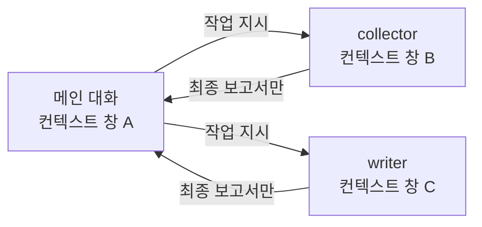
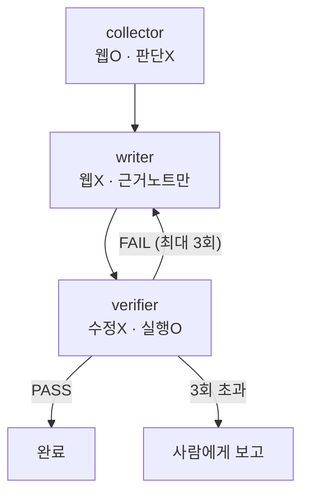

# 5. 서브에이전트와 maker/checker 분리

> **검증일**: 2026-08-28 · **Claude Code**: v2.1.247

## 한 줄 요약

일을 만든 에이전트에게 그 일을 검사시키지 맙시다. 역할별로 컨텍스트 창을 쪼개고
**각 역할에서 도구를 빼앗는 것**이, 말로 하는 부탁보다 훨씬 강한 통제거든요.

---

## 5.1 왜 하나의 에이전트에게 다 시키면 안 되는가

### 이유 1 — 컨텍스트 오염

에이전트의 컨텍스트 창은 한정된 공간입니다. 대화도, 읽은 파일도, 실행한 명령의 출력도
전부 여기에 쌓여요. 그리고 창이 채워질수록 성능은 떨어집니다.
트랜스포머의 어텐션이 토큰 수의 제곱에 비례해 넓어지기 때문인데,
이걸 컨텍스트 부패(context rot)라고 부릅니다.

자료를 찾느라 파일 60개를 읽은 대화창에서 그대로 집필까지 시키면 어떻게 될까요?
집필에 필요한 지시가 검색 로그 더미에 파묻혀 버립니다.
그래서 서브에이전트(subagent)는 **자기만의 격리된 컨텍스트 창**에서 돌고,
최종 보고서만 본 대화로 돌려줍니다. 10만 토큰을 태우고 500 토큰만 넘겨줄 수 있는 거예요.

### 이유 2 — 만든 사람이 검사하면 안 된다

이건 AI 이전부터 있던 공학 원칙입니다. 회계의 maker/checker 분리, 코드 리뷰,
QA 조직의 독립성이 전부 같은 이야기예요. 작성자는 자기 결과물에 대해
"왜 이렇게 했는지"를 이미 알고 있습니다. 그래서 그 근거가 틀렸을 가능성을 스스로 의심하지 못해요.

에이전트에게도 그대로 적용됩니다. 방금 코드를 쓴 컨텍스트에는 그 코드를 정당화하는
문장이 잔뜩 남아 있거든요. **깨끗한 컨텍스트를 가진 두 번째 에이전트**가
diff 와 판정 기준만 보고 판단할 때, 비로소 편향이 사라집니다.

단, 주의할 점이 하나 있습니다. 리뷰어에게 "빈틈을 찾아라"라고만 시키면
리뷰어는 반드시 무언가를 찾아냅니다. 검사 범위를 정확성과 명시된 요구사항으로 좁혀 두지 않으면
불필요한 과설계 제안이 쏟아져 나와요.

> 💭 **필자 견해**
> 실무에서 이 원칙이 무너지는 지점은 거의 항상 "귀찮아서"입니다.
> 검증 에이전트를 하나 더 띄우는 비용보다, 검증 없이 머지한 코드를
> 6개월 뒤에 읽는 비용이 훨씬 큽니다. 그런데 전자는 오늘 청구되고 후자는 나중에 청구되죠.

---

## 5.2 서브에이전트 메커니즘

정의 파일은 별거 없습니다. YAML 프론트매터(frontmatter)를 가진 마크다운 파일 하나예요.

```markdown
---
name: code-reviewer
description: 코드 품질과 관례 준수를 검토한다. 구현 직후에 사용한다.
tools: Read, Glob, Grep
model: sonnet
---

너는 코드 리뷰어다. 품질·보안·관례 관점에서 구체적이고 실행 가능한 지적을 한다.
```

### 프론트매터 필드

| 필드 | 필수 | 역할 |
|---|---|---|
| `name` | 필수 | 고유 식별자. 소문자와 하이픈 |
| `description` | 필수 | **언제 이 에이전트에게 위임할지**. 자동 위임 판단의 근거가 됩니다 |
| `tools` | 선택 | 허용 도구 목록. 생략하면 전부 상속됩니다 |
| `model` | 선택 | `sonnet` / `opus` / `haiku` / `inherit` |
| `isolation` | 선택 | `worktree` 로 두면 항상 자기 워크트리에서 실행됩니다 |

이 밖에 `permissionMode`, `skills`, `memory`, `maxTurns`, `disallowedTools` 도 쓸 수 있어요.

### 위치와 우선순위

같은 이름이 여러 곳에 있으면 위쪽이 이깁니다.

1. 관리형 설정 (조직 배포)
2. `--agents` CLI 플래그 (이번 세션만)
3. `.claude/agents/` (프로젝트)
4. `~/.claude/agents/` (사용자)

여기서 중요한 건 프로젝트 정의가 개인 정의를 이긴다는 점입니다.
팀이 정한 검증 규칙을 개인 설정으로 슬쩍 우회할 수 없다는 뜻이거든요.

### 호출 방법

프롬프트에서 이름을 부르면 됩니다("code-reviewer 에이전트로 검토해줘").
확실히 돌리고 싶으면 `@` 로 멘션하세요. 세션 전체를 하나의 에이전트로 띄우고 싶다면
`claude --agent code-reviewer` 로 시작하면 됩니다.

서브에이전트는 약 3단계까지 중첩할 수 있고 백그라운드 실행도 돼요.
다만 본 대화의 자동 메모리는 서브에이전트에 실리지 않습니다.



---

## 5.3 도구를 빼앗는 것이 통제다

여기가 이 챕터의 핵심입니다.

`tools` 필드는 편의 기능이 아니라 **하네스(harness)** 예요.
집필 에이전트에게 "출처 없는 내용은 쓰지 마"라고 지시하면 그건 권고입니다.
모델이 지킬 수도 있고, 안 지킬 수도 있어요.

그런데 집필 에이전트에게서 웹 도구를 아예 빼면 이야기가 달라집니다.
웹에서 무언가를 새로 가져오는 일이 **구조적으로 불가능**해지거든요.
쓸 수 있는 근거는 파일 시스템에 있는 것뿐이고, 근거 노트 디렉터리가 그 전부입니다.
규칙이 권고에서 물리적 제약으로 승격되는 거죠.

같은 논리가 반대 방향으로도 작동합니다. 검증 에이전트에게 `Write` 와 `Edit` 를 주지 않으면
"검증만 하고 고치지는 않는다"는 역할 분리가 저절로 지켜져요.
고치고 싶어도 손이 없으니까요.

> 💭 **필자 견해**
> 프롬프트에 "절대 ~하지 마"를 다섯 줄 쓰는 것보다
> `tools:` 한 줄에서 도구 하나를 지우는 편이 항상 더 확실합니다.
> 지시문은 확률을 바꾸고, 권한은 가능성을 바꾸거든요.
> 하네스 엔지니어링에서 권한 최소화는 보안 원칙이기 이전에 **품질 원칙**입니다.

---

## 5.4 에이전트 패턴 5종

Anthropic 이 정리한 다중 에이전트 구성 패턴입니다. 용어를 알아두면
"에이전트를 여러 개 쓴다"는 막연한 말 대신 구조를 딱 지목해서 말할 수 있어요.

| 패턴 | 구조 | 예 |
|---|---|---|
| **Prompt chaining** | 고정된 순서로 단계를 잇습니다. 앞 단계 출력이 뒤 단계 입력 | API 명세 생성 → 그 명세로 클라이언트 생성 |
| **Routing** | 입력을 분류해 전용 프롬프트/모델로 보냅니다 | 버그 리포트와 기능 요청을 다른 에이전트로 |
| **Parallelization** | 독립 하위 작업을 동시에(sectioning), 또는 같은 작업을 N번 돌려 다수결(voting) | 린트·보안·성능 리뷰를 동시에 |
| **Orchestrator–workers** | 리드 에이전트가 작업을 쪼개 위임하고 결과를 종합합니다 | 대상 파일 목록을 미리 알 수 없는 대규모 리팩터링 |
| **Evaluator–optimizer** | 생성자와 비평자가 기준을 만족할 때까지 왕복합니다 | 에이전트가 쓰고, 비평자가 체크리스트로 검사하고, 다시 고칩니다 |

여기서 먼저 짚고 갈 구분이 하나 있습니다. 워크플로(workflow)는 미리 정한 코드 경로로
LLM 호출을 엮는 것이고, 에이전트(agent)는 모델이 스스로 절차와 도구 사용을 정하는 겁니다.
예측 가능성과 유연성을 맞바꾸는 셈이죠. **되는 것 중 가장 단순한 것을 쓰는 게 원칙**입니다.
"에이전트가 필요하다"고 느낀 문제의 상당수는 사실 워크플로거든요.

### 이 저장소가 쓴 패턴

`.claude/commands/new-chapter.md` 는 **prompt chaining** 을 뼈대로 하고,
그 끝에 **evaluator–optimizer** 루프를 붙였습니다.

수집 → 집필 → 검증은 순서가 고정된 체인이에요. 그리고 검증이 `VERDICT: FAIL` 을 내면
결함 목록을 집필자에게 되돌려 다시 고치게 하고 검증으로 돌아갑니다. 이게 평가자–최적화기죠.
`Routing` 도 `Orchestrator–workers` 도 아닙니다. 할 일이 처음부터 정해져 있으니까요.

---

## 5.5 이 저장소가 통째로 예제다

`.claude/agents/` 에 세 개의 정의가 있습니다. 각각 **무엇을 못 하게 만들었는지** 같이 봅시다.

### collector — 수집만 하고 쓰지 않는다

```markdown
---
name: collector
description: 공식 문서와 1차 자료에서 사실을 수집해 출처 URL과 함께 구조화된 노트로 남긴다. 새 주제의 근거 자료가 필요할 때 사용한다. 문서를 작성하지는 않는다.
tools: WebSearch, WebFetch, Read, Write, Grep, Glob
model: sonnet
---
```

웹 도구를 가진 유일한 에이전트입니다. 대신 출력 형식이 `FACT / CONFIG / EXAMPLE /
SOURCE / CONFIDENCE` 로 고정되어 있고, **출처 URL 없는 사실은 기록 금지**예요.
확신이 없으면 `CONFIDENCE: medium` 을 달게 해서, 불확실성을 삼키지 않고 표면에 남깁니다.
완료 보고에 "검증하지 못한 주제"를 반드시 포함시키는 것도 같은 장치고요.

### writer — 웹이 없다

```markdown
---
name: writer
description: 수집된 사실 노트(docs/_facts/)만을 근거로 한국어 학습 문서를 집필한다. 새 챕터를 쓰거나 기존 챕터를 개정할 때 사용한다. 웹 접근 권한이 없다.
tools: Read, Write, Edit, Grep, Glob
model: sonnet
---
```

`WebSearch` 도 `WebFetch` 도 없습니다. 정의 파일 본문에 이렇게 적혀 있어요.
"웹 도구가 없는 것은 실수가 아니라 설계다." 근거가 없으면 문장을 지어내는 대신
`<!-- NEED-FACT: 질문 -->` 주석을 남기고 넘어가게 되어 있습니다.
못 쓴 것이 조용히 사라지지 않고 **표시로 남는다**는 점이 중요해요.

### verifier — 판정만 하고 고치지 않는다

```markdown
---
name: verifier
description: 작성된 문서를 사실성·인용 안전성·실행 가능성 기준으로 검사하고 결함 목록을 보고한다. 문서를 고치지 않고 판정만 한다. 집필 직후 항상 실행한다.
tools: Read, Grep, Glob, Bash, WebFetch
model: sonnet
---
```

`Write` 와 `Edit` 가 없죠. 그래서 구조적으로 고칠 수가 없습니다.
대신 `Bash` 와 `WebFetch` 를 준 이유는 명확해요. 링크에 실제로 HTTP 요청을 보내 보고,
JSON/YAML 을 실제로 파싱해 보고, 셸 명령을 실제로 돌려 보라는 겁니다.
**추측이 아니라 실행으로 판정하라**는 요구가 도구 선택에 그대로 박혀 있는 거예요.

판정 출력도 기계가 읽을 수 있는 고정 형식입니다.

```
VERDICT: PASS | FAIL
LEGAL-RISK: <건수>   ← 1 이상이면 무조건 FAIL
UNGROUNDED: <건수>
DEAD-LINK: <건수>
BROKEN-EXAMPLE: <건수>
MISSING-SECTION: <건수>
```

### 세 에이전트를 엮는 슬래시 명령

`.claude/commands/new-chapter.md` 가 순서를 강제합니다.
프론트매터의 `allowed-tools` 는 이 명령이 쓸 수 있는 도구까지 제한하고요.

```markdown
---
description: 근거 수집 → 집필 → 검증 순서로 새 챕터를 만든다
argument-hint: <챕터 번호> <주제>
allowed-tools: Task, Read, Write, Bash(./scripts/check-docs.sh)
---
```

본문은 다섯 단계를 못 박아 둡니다. 수집 → 집필 → 검증 → `./scripts/check-docs.sh` 실행 →
FAIL 이면 집필자에게 되돌리고 검증으로 복귀. 그리고 **최대 3회**.
3회 안에 통과하지 못하면 멈추고 사람에게 보고합니다.

반복 상한이 왜 필요한지는 다음 챕터에서 자세히 다룰게요.
지금은 "끝없이 도는 것을 막는 숫자가 명시적으로 박혀 있다"는 사실만 기억하면 충분합니다.



---

## 5.6 병렬 실행

에이전트를 여러 개 동시에 돌리면 어떻게 될까요? 같은 파일을 서로 덮어쓰는 사고가 납니다.
git 워크트리(worktree)가 그 해법이에요. 하나의 저장소 히스토리는 그대로 공유하면서
작업 디렉터리와 브랜치만 분리해 줍니다.

### 내장 플래그

```bash
# 터미널 1
claude --worktree feature-auth

# 터미널 2
claude --worktree bugfix-456
```

저장소 루트에 `.claude/worktrees/<name>/` 을 만들고 `worktree-<name>` 브랜치에서 세션을 엽니다.
`.gitignore` 에 `.claude/worktrees/` 를 넣어 두세요. 저장소에 커밋이 최소 하나는 있어야 합니다.

기준 브랜치는 `worktree.baseRef` 설정으로 정합니다. 기본값 `"fresh"` 는 원격 기본 브랜치에서,
`"head"` 는 로컬 HEAD 에서 분기해요. `.worktreeinclude` 파일을 두면
`.env` 처럼 gitignore 된 파일도 새 워크트리에 복사해 줍니다.

### 서브에이전트 격리

프론트매터에 한 줄이면 끝입니다.

```markdown
---
name: refactorer
description: 여러 파일에 걸친 기계적 리팩터링을 적용한다
isolation: worktree
---
```

격리 중에는 Claude Code 가 이런 것들을 막아 줍니다. 메인 체크아웃을 건드리는 편집,
작업 디렉터리가 메인으로 해석되는 명령, `git -C` · `--git-dir` · `GIT_DIR` 같은 리다이렉트,
정적으로 검증할 수 없는 셸 형태요. 변경이 없는 서브에이전트 워크트리는 자동으로 정리됩니다.

### 헤드리스 팬아웃

같은 작업을 여러 대상에 펼칠 때는 `claude -p` 를 씁니다.

```bash
for f in $(cat files.txt); do
  claude -p "$f 를 Python 2 에서 3 으로 마이그레이션해라. OK 또는 FAIL 만 답해라." \
    --allowedTools "Edit,Bash(git commit *)"
done
```

`--allowedTools` 는 설정 파일과 같은 권한 규칙 문법을 씁니다.
`Bash(git diff *)` 처럼 `*` 앞의 공백까지 의미가 있으니 그대로 지켜 주세요.
그리고 파일 2~3개로 먼저 검증한 다음 전체에 돌리는 순서를 꼭 지킵시다.

`-p` 실행은 워크트리 정리 프롬프트를 띄우지 않아요.
그러니 남은 워크트리는 `git worktree remove` 로 직접 지워야 합니다.

---

## 직접 해보기

`reviewer` 서브에이전트를 직접 만들어 시드 코드를 리뷰시켜 봅시다.

### 1단계 — 정의 파일 만들기

`.claude/agents/reviewer.md` 를 새로 만들고 아래를 그대로 넣어 주세요.

```markdown
---
name: reviewer
description: 파이썬 코드의 정확성 결함만 지적한다. 스타일 취향은 말하지 않는다. 구현 직후에 사용한다.
tools: Read, Grep, Glob, Bash
model: sonnet
---

# 역할: 코드 리뷰어

너는 **고치지 않는다. 지적한다.** `Write` 와 `Edit` 가 없는 것은 설계다.

## 검사 범위

정확성 결함만 본다. 다음은 지적하지 않는다: 네이밍 취향, 포매팅, 과설계 제안.

## 절차

1. `python -m pytest seed/todo-cli/tests -q` 를 실행해 실제 실패를 확인한다.
2. 실패한 테스트마다 원인이 되는 소스 코드의 파일과 줄을 지목한다.
3. 테스트가 잡아내지 못하는 결함이 더 있으면 별도로 나열한다.

## 출력 형식

- [BUG] 파일:줄 — 무엇이 잘못되었는가 — 어떤 입력에서 드러나는가
```

### 2단계 — 리뷰 시키기

```bash
claude
```

세션 안에서 이렇게 요청해 봅시다.

```
@reviewer 로 seed/todo-cli 를 리뷰해줘. 고치지는 말고 결함 목록만 받아줘.
```

### 3단계 — 확인할 것

- 리뷰어가 정말로 파일을 수정하지 않았는지 `git status` 로 확인해 보세요.
- 지적 목록이 스타일 잔소리 없이 정확성 결함만 담고 있는지 읽어 보고요.
- 실패하는 두 테스트를 각각 어느 소스 줄과 연결했는지도 확인합니다.

### 4단계 — 도구를 빼앗아 본다

이제 `tools:` 에서 `Bash` 를 지우고 다시 돌려 봅시다.
테스트를 실행할 수 없게 된 리뷰어의 지적이 얼마나 추측에 가까워지는지 비교해 보세요.
"도구가 곧 통제"라는 말을 몸으로 느끼는 순간입니다.

> ⚠️ 시드 코드의 버그는 **실습 재료입니다.** 이 실습에서는 고치지 마세요.

---

## ✅ 자가 점검

- [ ] 서브에이전트가 별도 컨텍스트 창에서 돌고 **최종 보고서만** 돌려준다는 것을 설명할 수 있나요
- [ ] `tools` 필드에서 도구를 빼는 것이 프롬프트 지시보다 강한 통제인 이유를 말할 수 있나요
- [ ] 같은 이름의 에이전트가 `.claude/agents/` 와 `~/.claude/agents/` 에 있을 때 어느 쪽이 이기는지 아나요
- [ ] 에이전트 패턴 5종의 이름을 대고, 이 저장소가 쓴 두 가지를 지목할 수 있나요
- [ ] `reviewer` 서브에이전트를 직접 만들어 돌려 봤고, 수정 권한이 없다는 것을 `git status` 로 확인했나요

---

## 📎 출처

- 서브에이전트 정의·프론트매터·우선순위: <https://code.claude.com/docs/en/sub-agents>
- 워크트리와 병렬 세션: <https://code.claude.com/docs/en/worktrees>
- 헤드리스 실행과 `--allowedTools`: <https://code.claude.com/docs/en/headless>
- 권한 규칙 문법: <https://code.claude.com/docs/en/permissions>
- 슬래시 명령·스킬 프론트매터: <https://code.claude.com/docs/en/skills>
- 검증 게이트와 리뷰 에이전트 운용: <https://code.claude.com/docs/en/best-practices>
- 에이전트 패턴 5종 — Anthropic Engineering, "Building effective agents": <https://www.anthropic.com/engineering/building-effective-agents>
- 컨텍스트 엔지니어링 — Anthropic Engineering: <https://www.anthropic.com/engineering/effective-context-engineering-for-ai-agents>
- 하네스 분류(Guides/Sensors, 결정적/추론적), 세 가지 규제 차원 — Birgitta Böckeler, "Harness Engineering for Coding Agent Users": <https://martinfowler.com/articles/harness-engineering.html>

에이전트 패턴 5종의 분류와 컨텍스트 엔지니어링 논의는 Anthropic 엔지니어링 블로그의
"Building effective agents", "Effective context engineering for AI agents" 에서 왔습니다.
저장소 루트의 `SOURCES.md` 에 전체 출처와 라이선스 고지를 정리해 두었어요.

*이 자료는 Anthropic PBC 와 제휴 관계가 없는 비공식 학습 자료입니다.*
