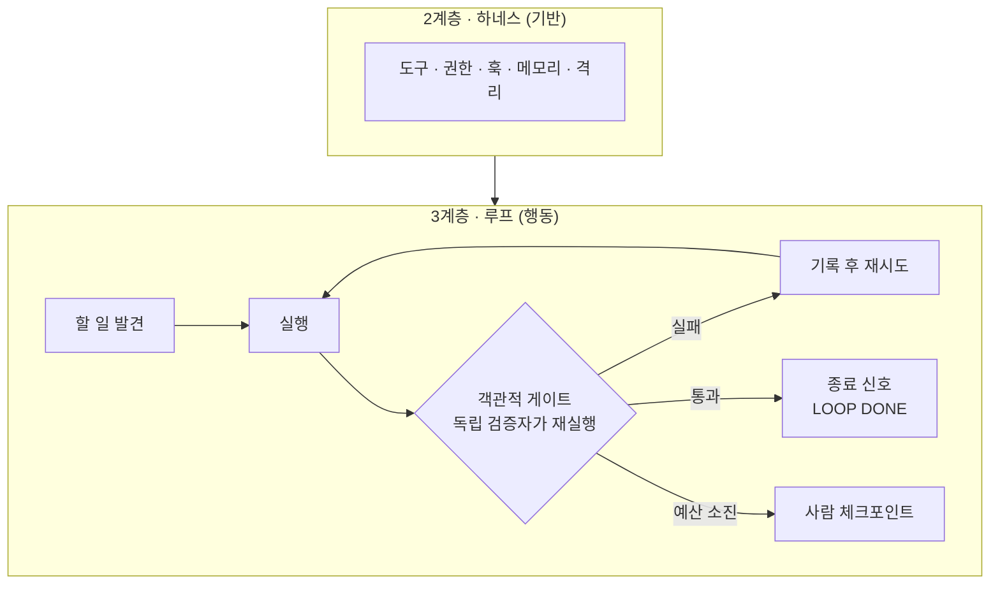

# 6. 루프 엔지니어링

> **검증일**: 2026-08-28 · **Claude Code**: v2.1.247

## 한 줄 요약

프롬프트를 직접 치는 대신, **프롬프트를 치는 시스템을 만듭니다.**
단 객관적 게이트·종료 신호·반복 상한·사람 체크포인트 네 가지가 없으면 루프를 돌리지 마세요.

---

## 1. 루프란 무엇인가

루프(loop)는 작고 자율적인 시스템입니다. 스스로 할 일을 찾아 → 실행하고 →
**객관적 게이트로 검증하고** → 결과를 기록하고 → 다음 행동을 결정하죠.
Addy Osmani 가 "루프 엔지니어링(loop engineering)"이라는 이름으로 정리한 개념입니다.

핵심 전환은 이렇습니다. 지금까지는 사람이 에이전트에게 말을 걸었어요.
이제는 **말을 거는 일 자체를 설계 대상으로 삼습니다.**
사람이 타이핑하는 속도가 처리량의 상한이었는데, 그 상한을 걷어내는 거예요.

구체적으로 비교해 볼까요. 매일 아침 에이전트를 열고
"어제 깨진 CI 있어?"라고 묻는 대신, 밤사이 실패를 분류해
후보 수정안을 받은편지함에 넣어 두는 자동화를 걸어 두는 겁니다.

> 💭 **필자 견해**
> "루프를 돌린다"는 말이 멋있게 들려서 자격 없는 작업에까지 붙는 경우가 많습니다.
> 루프의 본질은 자동화가 아니라 **자동 판정**이에요.
> 무엇이 성공인지 기계가 판정할 수 없다면, 그건 루프가 아니라 그냥 반복되는 도박입니다.

---

## 2. 하네스와 루프의 층위

앞 챕터들에서 다룬 하네스(harness)와 이번 챕터의 루프는 층이 다릅니다.

**에이전트 = 모델 + 하네스.** 이 정리는 Osmani 가 Viv Trivedy 에게 돌린 표현입니다.
하네스는 가중치 바깥의 모든 것이에요. 도구, 파일 시스템, 샌드박스, 메모리,
훅, 컨텍스트 관리가 전부 여기에 속합니다.

하네스는 **기반(substrate)** 이고, 루프는 **그 위에서 도는 행동**입니다.
모델이 추론하고, 도구로 행동하고, 결과를 관찰하고, 다시 반복하죠.
이 순환이 얼마나 안전하고 효과적으로 굴러갈지를 결정하는 게 하네스입니다.

그래서 루프 엔지니어링은 한 층 위의 일이에요.
잘 만들어진 하네스 위에서 **어떤 루프를 돌릴지** 고르는 작업이거든요.
거칠게 말하면 **루프는 타이머가 달린 하네스**입니다.



Osmani 의 핵심 주장은 이겁니다. 훌륭한 모델에 형편없는 하네스보다,
평범한 모델에 훌륭한 하네스가 낫다는 거예요. 모델이 **할 수 있는 일**과
**실제로 하는 일** 사이의 격차는 대부분 모델 격차가 아니라 하네스 격차입니다.

---

## 3. 6개 구성요소를 Claude Code 로 구현하기

Osmani 는 루프를 여섯 조각으로 나눕니다. 각각을 이 도구에서 무엇으로 만드는지 짚어 볼게요.

| 구성요소 | 역할 | Claude Code 구현 |
|---|---|---|
| Automations | 루프의 심장 박동 | 스케줄 실행, CI 워크플로, `/loop` |
| Worktrees | 병렬 격리 | `claude --worktree <name>`, `isolation: worktree` |
| Skills | 코드화된 지식 | `.claude/skills/<name>/SKILL.md` |
| Plugins · MCP | 바깥 시스템에 대한 손 | `claude mcp add`, `.mcp.json` |
| Sub-agents | maker/checker 분리 | `.claude/agents/*.md` |
| Memory | 실행 사이의 기억 | `CLAUDE.md`, `.claude/rules/*.md`, 노트 파일 |

### 1) Automations — 시간이나 사건이 방아쇠를 당긴다

사람이 물어보기를 기다리지 않고 스스로 돌아 결과를 받은편지함에 밀어 넣는 게 핵심입니다.
`schedule` 이벤트를 쓰는 CI 워크플로가 가장 손쉬운 출발점이고요.
Claude Code 자체에도 `/loop` 와 스케줄 실행 기능이 있습니다.

### 2) Worktrees — 팬아웃을 안전하게 만든다

세 개의 워크트리, 세 개의 에이전트, 세 개의 독립적인 수정, 세 개의 PR.
격리가 없으면 병렬 실행은 그냥 파일 충돌 사고예요.
자세한 사용법은 5장에서 다뤘습니다.

### 3) Skills — 매 실행마다 다시 읽히는 프로젝트 관례

스킬(skill)은 필요할 때만 로드되는 지침 파일입니다. 본문 전체가 아니라
`description` 만 컨텍스트에 상주하고, 호출될 때 비로소 펼쳐져요.
그래서 긴 참고 자료를 컨텍스트 비용 거의 없이 보관할 수 있습니다.

```markdown
---
name: seed-conventions
description: seed/todo-cli 의 코딩 관례와 테스트 실행법. 이 디렉터리를 수정할 때 사용한다.
allowed-tools: Read Grep
---

## 관례
- 테스트 파일(`tests/`)은 수정하지 않는다. 명세로 취급한다.
- 저장소 접근은 `storage.py` 를 통해서만 한다.

## 테스트
!`python3 -m pytest seed/todo-cli/tests -q`
```

본문의 `` !`명령` `` 줄은 실행된 뒤 그 출력으로 치환되어 모델에게 전달됩니다.
루프가 매 회차마다 최신 테스트 상태를 자동으로 물고 들어간다는 뜻이에요.

### 4) Plugins · MCP — 읽고 보고만 하던 루프에 손을 달아준다

MCP 커넥터를 붙이면 루프가 이슈 트래커를 읽고, PR 을 열고, 티켓에 코멘트를 남깁니다.
프로젝트 범위로 붙이면 `.mcp.json` 에 기록되어 git 으로 팀과 공유되고요.

```bash
claude mcp add --scope project --transport http notion https://mcp.notion.com/mcp
```

```json
{ "mcpServers": { "notion": { "type": "http", "url": "https://mcp.notion.com/mcp" } } }
```

프로젝트 범위 서버는 첫 사용 전에 워크스페이스 신뢰 승인을 요구합니다.
루프에 바깥세상을 건드릴 권한을 주는 일이니 당연한 절차죠.

### 5) Sub-agents — 만든 쪽이 채점하지 않는다

5장 전체가 이 이야기였습니다. 루프 관점에서 다시 강조하면,
**생산자의 자기 보고를 성공으로 인정하지 않는다**는 규칙이 루프의 안전을 지탱해요.

### 6) Memory — 컨텍스트는 실행 사이에 살아남지 않는다

모델 바깥의 지속 저장소가 필요합니다. `CLAUDE.md`, `.claude/rules/*.md`,
그리고 에이전트가 직접 갱신하는 진행 노트 파일이 그 역할을 해요.
이게 있어야 일회성 실행의 나열이 **누적되는 진척**이 됩니다.

`.claude/rules/` 의 규칙 파일은 `paths:` 프론트매터로 적용 범위를 좁힐 수 있어요.
해당 글롭에 맞는 파일을 건드릴 때만 로드되니 컨텍스트가 덜 붐빕니다.

```markdown
---
paths:
  - "seed/todo-cli/**/*.py"
---
테스트 파일은 명세다. 실패를 없애려고 테스트를 고치지 않는다.
```

---

## 4. 헤드리스 실행

루프의 각 회차는 대화형 세션이 아니라 **비대화형 실행**입니다.

```bash
claude -p "테스트를 돌리고 실패를 고쳐라" --allowedTools "Bash,Read,Edit"
```

`-p`(별칭 `--print`)는 비대화형으로 한 번 실행하고 끝납니다.
성공하면 종료 코드 0, 실패하면 0 이 아닌 값을 내요. SIGTERM 은 143 입니다.
셸 스크립트가 성공/실패를 판별할 수 있다는 뜻이고, 이게 곧 루프의 배선이 됩니다.

### 출력 형식

| 값 | 내용 |
|---|---|
| `text` | 기본값. 사람이 읽는 텍스트 |
| `json` | `result` 필드에 본문, 그 밖에 `session_id` 와 사용량·비용 메타데이터 |
| `stream-json` | 줄 단위 JSON 이벤트. 마지막 줄이 `result` 메시지 |

```bash
claude --bare -p "README.md 를 요약해라" --allowedTools "Read" \
  --output-format json | jq -r '.result'
```

`stream-json` 은 `--verbose` 및 `--include-partial-messages` 와 함께 쓰면
토큰 단위 스트리밍을 볼 수 있어요. `--json-schema` 를 `--output-format json` 과 같이 주면
스키마를 지키는 데이터가 `structured_output` 필드로 돌아옵니다.

### CI 권장 플래그

- `--bare` — 훅·스킬·명령·서브에이전트·플러그인·MCP·자동 메모리·`CLAUDE.md` 자동 탐색을 건너뜁니다.
  재현 가능한 CI 실행을 위해 권장돼요. 이때는 `ANTHROPIC_API_KEY` 를 설정해야 합니다.
- `--permission-mode dontAsk` — CI 를 위한 가장 잠긴 선택지입니다.
- `--allowedTools` — 무인 실행이 할 수 있는 일을 좁혀 줍니다.
- `--max-turns` — 한 번의 실행 안에서의 턴 수를 제한합니다.

> ⚠️ `--bare` 없이 `-p` 를 돌리면, 신뢰하지 않는 폴더에서도 그 프로젝트의 훅과
> MCP 서버가 신뢰 확인 없이 실행됩니다. CI 에서 남의 PR 브랜치를 체크아웃해 돌린다면
> 이 차이가 그대로 보안 사고가 됩니다.

`system/init` 스트림 이벤트는 모델, 도구, `plugins` / `plugin_errors`,
`mcp_servers` / `mcp_server_errors` 를 보고해 줍니다.
무언가 로드되지 않았을 때 CI 를 실패시키고 싶다면 이 배열을 검사하면 돼요.

### GitHub Actions 연동

저장소에서 `/install-github-app` 을 실행하면 GitHub App 설치, 시크릿 등록,
워크플로 PR 생성까지 해 줍니다. 물론 수동으로 붙일 수도 있어요.

```yaml
- uses: anthropics/claude-code-action@v1
  with:
    anthropic_api_key: ${{ secrets.ANTHROPIC_API_KEY }}
    prompt: "어제 커밋을 요약해라"
    claude_args: '--max-turns 5 --allowedTools "Read,Grep"'
```

`prompt` 입력이 있으면 자동화 모드입니다. `schedule` 을 포함한 어떤 이벤트로도 발화해요.
`prompt` 가 없으면 대화형 모드이고, 이슈나 PR 코멘트의 `@claude` 멘션에 반응합니다.

---

## 5. 안전한 루프의 4가지 조건

MIT 라이선스로 공개된 `breim/loop-harness` 프로젝트가 이 네 가지를 게이트로 못 박았습니다.
넷 중 하나라도 없으면 루프를 시작하지 마세요.

### 조건 1 — 객관적 자동 게이트, 그리고 그것을 다시 돌리는 독립 검증자

루프는 반드시 실행 가능한 합격/불합격 명령 하나를 지목해야 합니다.
`npm test`, 타입체크, 빌드 같은 것들이요. 그리고 여기서 한 걸음 더 나갑니다.
**생산자가 아닌 별도의 검증자 에이전트가 그 명령을 직접 다시 돌립니다.**

생산자가 스스로 선언한 성공은 성공으로 치지 않아요.
"테스트를 통과시켰습니다"라는 문장은 증거가 아닙니다. 명령과 그 출력이 증거예요.

### 조건 2 — 명시적 종료 신호

무엇이 끝인지 문자열로 정해 둡니다. `LOOP DONE: <이유>` 같은 마커를 내보내게 하고,
그 선언조차 독립 검증자가 확인하게 하세요. "다 된 것 같다"는 종료 조건이 아닙니다.

### 조건 3 — 반복 예산 상한

한 번의 실행당 하드 반복 제한을 둡니다. **10회 정도**가 기준선이에요.
그리고 각오해야 할 비용이 있습니다. 루프는 컨텍스트를 다시 읽고, 재시도하고, 탐색하기 때문에
**단일 실행 대비 대략 5~10배**의 비용이 듭니다.

### 조건 4 — 사람 체크포인트

독립 검사자를 띄우는 리뷰 단계를 두세요. 머지·배포·의존성 변경에 대한 승인 권한은
사람이 계속 쥐고 있어야 합니다. 만든 쪽은 자기 결과물을 채점하지 않습니다.

| 요소 | 시작 전에 답해야 할 질문 | 답이 없으면 |
|---|---|---|
| 객관적 게이트 | 성공을 증명하는 **단일 명령**은 무엇인가 | 루프 금지 |
| 독립 검증자 | 그 명령을 작성자가 아닌 누가 다시 돌리는가 | 검사자 에이전트 추가 |
| 종료 조건 | 루프를 끝내는 정확한 신호는 무엇인가 | 폭주 |
| 예산 상한 | 실행당 최대 반복/토큰은 얼마인가 | 비용 폭발 |
| 사람 체크포인트 | 여전히 내 승인이 필요한 것은 무엇인가 | 인지적 항복 |
| 기록된 메모리 | 배운 것이 실행 사이에 어디에 남는가 | 의도 부채 |
| 리뷰 규율 | 머지된 것을 내가 실제로 읽는가 | 이해 부채 |

---

## 6. NO-GO 기준 — 대부분의 작업은 루프를 받을 자격이 없다

이 절만큼은 꼭 짚고 넘어갔으면 합니다. 이 챕터에서 가장 중요한 부분이거든요.

### 자동 검증이 불가능하면 루프 금지

조건 1이 곧 자격 심사 질문입니다. "무엇이 성공인지 기계가 판정할 수 있는가?"
여기서 막히면 그 뒤는 볼 것도 없습니다. 사람이 눈으로 봐야 아는 작업에 루프를 걸면,
검증되지 않은 변경이 사람이 읽을 수 있는 속도보다 빠르게 쌓입니다. 이건 반드시 그렇게 돼요.

### 다음 영역은 자격 심사에서 거부된다

- **아키텍처 결정** — 되돌리는 비용이 가장 큰 결정을 자동화에 맡기지 않습니다
- **인증/인가** — 실패가 조용한데 결과는 치명적입니다
- **결제** — 같은 이유에 금전적 손해가 더해집니다
- **의존성 변경** — 공급망 위험이 저장소 바깥에서 들어옵니다

### 그 밖의 금지 신호

- 5~10배 비용을 감당할 토큰 예산이 없습니다
- **도메인을 잘 모릅니다.** 돌아온 결과를 검토할 수 없다면, 루프는 위험을 더 빨리 만들 뿐이에요
- 실시간 사람 판단이 필요합니다. 아키텍처·트레이드오프·판단이 걸린 결정이 여기에 속합니다
- 한 걸음씩 다 읽어 볼 작업입니다. 그럴 거면 대화형이 낫습니다

### 반대로 루프에 적합한 것

매일 손으로 하던 반복적 발견·분류 작업, 이미 잘 이해하고 있어서 속도만 필요한 일,
성공을 자동으로 확인할 수 있는 경계가 분명한 도메인,
그리고 비슷한 독립 작업으로 넓게 펼쳐지는 일입니다.

> 💭 **필자 견해**
> "이 작업에 루프를 걸까?"라는 질문은 사실 "이 작업의 성공을 명령어 하나로 쓸 수 있는가?"입니다.
> 답이 안 나온다면, 루프를 만들 게 아니라 **먼저 게이트를 만들어야 합니다.**
> 순서를 뒤집으면 자동화된 무근거 생산 라인이 완성됩니다. 이건 정말 조심하세요.

---

## 7. 3대 위험

Osmani 가 이름 붙인 세 가지입니다. 이름이 붙어 있으면 회의에서 지목할 수 있거든요.
셋 다 조용히 진행되는 종류라, 미리 알고 있어야 알아챌 수 있습니다.

### 인지적 항복 (cognitive surrender)

루프가 내놓은 것을 공학적 판단 없이 그대로 받아들이는 상태입니다.
Osmani 의 표현을 빌리면, 루프 설계는 **판단력을 가지고 할 때는 처방**이지만
**생각을 피하려고 할 때는 해악의 가속기**예요. 이 선은 생각보다 쉽게 넘어갑니다.

- **방어법**: 조건 4의 사람 체크포인트를 형식이 아니라 실제 관문으로 유지하세요.
  머지·배포·의존성 변경은 계속 사람의 승인 아래 둡니다.

### 이해 부채 (comprehension debt)

지금 저장소에 존재하는 코드와, 내가 실제로 이해하고 있는 코드 사이의 격차입니다.
빠른 루프가 읽지 않은 출력을 계속 머지하면 이 격차가 조용히 쌓여요.
일반적인 기술 부채와 다른 점이 하나 있습니다. **장부가 사람 머릿속에 있다**는 거예요.
어디에도 기록되지 않습니다. 그래서 터지기 전까지는 아무도 모릅니다.

- **방어법**: 루프 회차당 diff 크기를 제한하고, 머지 전에 사람이 실제로 읽으세요.
  읽을 수 없는 양이 나온다면, 그건 루프가 너무 크게 잡혔다는 신호입니다.

### 의도 부채 (intent debt)

지시에 뚫린 모든 빈칸을 에이전트가 자신 있는 추측으로 채웁니다.
문서화되지 않은 관례가 있으면, 루프는 매 회차마다 프로젝트의 의도를 새로 발명해요.
어제 고쳐 놓은 것이 오늘 다시 원래대로 돌아오는 현상이 바로 여기서 옵니다.

- **방어법**: 스킬과 메모리 파일이 상환 수단이에요.
  같은 지적을 두 번 했다면, 그건 문장이 아니라 **파일에 적어야 할 규칙**입니다.

---

## 8. 이 저장소의 CI 는 이미 작은 루프다

거창한 예제를 찾을 필요 없습니다. `.github/workflows/verify.yml` 이 바로 그 예제거든요.

```yaml
on:
  push:
    branches: [main]
  pull_request:
  schedule:
    - cron: "0 0 * * 1"   # 매주 월요일 00:00 UTC
  workflow_dispatch:
```

`schedule` 트리거가 바로 Automations 입니다. 아무도 요청하지 않아도 매주 월요일에 돌아요.
사람의 기억력에 의존하지 않는 심장 박동이 하나 생긴 셈이죠.

무엇을 검사할까요? 두 개의 잡이 있습니다.
`structure` 는 챕터 필수 섹션·외부 이미지 금지·구 URL·코드 블록 짝을 검사하고,
`.claude/settings.json` 을 포함한 모든 JSON 을 실제로 파싱해 봅니다.
`links` 는 문서의 모든 URL 에 실제로 요청을 보내 죽은 링크를 세고요.

```bash
dead=0
while read -r url; do
  code=$(curl -sL -o /dev/null -w '%{http_code}' --max-time 20 "$url" || echo 000)
  case "$code" in
    2*|3*) ;;
    *) echo "DEAD-LINK $code $url"; dead=$((dead+1)) ;;
  esac
done < /tmp/links.txt
[ "$dead" -eq 0 ]
```

이게 왜 루프일까요? 문서는 **아무도 건드리지 않아도 낡습니다.**
외부 문서가 이사를 가면 우리 링크는 조용히 죽고, 그 사실은 독자가 클릭하기 전까지 아무도 몰라요.
주간 스케줄이 그 침묵을 깨는 장치입니다. 변화가 저장소 바깥에서 오기 때문에,
저장소 안의 이벤트(push, PR)만으로는 절대 감지되지 않거든요.

한 가지 더 눈여겨볼 설계가 있습니다.

```yaml
  links:
    name: 링크 생존 검사
    runs-on: ubuntu-latest
    continue-on-error: true   # 외부 사이트 장애로 빌드를 깨뜨리지 않는다
```

`continue-on-error: true` 는 게이트의 세기를 조절한 겁니다.
링크 검사는 우리가 통제할 수 없는 외부 사이트에 의존하니 결정적이지 않아요.
그런데 결정적이지 않은 신호로 빌드를 깨뜨리면, 사람은 곧 그 신호를 무시하기 시작합니다.
**신뢰할 수 없는 게이트는 게이트가 아니라 소음**이 되는 거죠.

반면 `structure` 잡은 전부 우리 저장소 안에서 결정적으로 판정되니 빌드를 깹니다.
이 구분이 게이트 설계의 핵심이에요.

---

## 직접 해보기

시드 코드에 진짜 루프를 돌려 봅시다. 조건은 세 가지예요.
**테스트가 통과할 때까지, 최대 5회, 테스트 파일 수정 금지.**

> ⚠️ **비용 경고**: 이 실습은 실제로 API 를 호출합니다.
> 루프는 단일 실행 대비 5~10배의 비용이 든다는 점을 꼭 기억하세요.
> `MAX=5` 를 임의로 늘리지 마세요. 상한이 곧 비용 상한입니다.
>
> ⚠️ **안전 경고**: 반드시 자기 저장소의 복사본이나 브랜치에서 돌리세요.
> 루프는 승인 프롬프트 없이 파일을 고칩니다.

### 1단계 — 테스트 파일을 구조적으로 보호한다

프롬프트로 "테스트를 고치지 마"라고 부탁하는 건 권고입니다. 권한으로 막아야 통제예요.
`.claude/settings.local.json` 에 아래를 넣어 주세요. (git 에 커밋하지 않는 파일입니다.)

```json
{
  "permissions": {
    "deny": ["Edit(seed/todo-cli/tests/**)", "Write(seed/todo-cli/tests/**)"]
  }
}
```

권한 평가 순서는 deny → ask → allow 이고, 먼저 맞는 규칙이 이깁니다.
`deny` 는 뒤에 오는 어떤 `allow` 보다 강해요.

### 2단계 — 현재 상태를 확인한다

```bash
cd "$(git rev-parse --show-toplevel)"
git checkout -b loop-practice
python3 -m pytest seed/todo-cli/tests -q
```

세 개의 테스트 중 일부가 실패해야 정상입니다. **이 실패가 우리의 객관적 게이트예요.**

### 3단계 — 루프 스크립트

`scripts/loop-practice.sh` 로 저장하고 `chmod +x` 해 주세요.

```bash
#!/usr/bin/env bash
# 실습용 루프. 게이트는 pytest, 상한은 5회.
set -uo pipefail
cd "$(git rev-parse --show-toplevel)" || exit 1

MAX=5
GATE=(python3 -m pytest seed/todo-cli/tests -q)

for i in $(seq 1 "$MAX"); do
  echo "=== 반복 $i / $MAX ==="

  # 독립 검증: 에이전트의 보고가 아니라 셸이 직접 게이트를 돌린다
  if "${GATE[@]}"; then
    echo "LOOP DONE: 게이트 통과 (반복 ${i} 회차 시작 시점)"
    exit 0
  fi

  claude -p "seed/todo-cli 의 실패하는 테스트를 통과시켜라.
tests/ 아래 파일은 절대 수정하지 마라. 명세로 취급한다.
storage.py 와 todo.py 만 고친다.
수정 후, 근거로 삼은 실패 메시지를 한 줄로 보고해라." \
    --allowedTools "Read,Edit,Bash(python3 -m pytest *)" \
    --permission-mode acceptEdits \
    --max-turns 15 || echo "경고: 반복 ${i} 회차 실행이 0 이 아닌 코드로 끝났다"
done

# 마지막 회차 이후 한 번 더 판정한다
if "${GATE[@]}"; then
  echo "LOOP DONE: 게이트 통과 (마지막 회차)"
  exit 0
fi

echo "LOOP FAILED: ${MAX} 회 안에 통과하지 못했다. 사람이 확인할 차례다."
exit 1
```

이 스크립트에서 네 가지 조건이 각각 어디에 있는지 찾아봅시다.

| 조건 | 스크립트의 어디 |
|---|---|
| 객관적 게이트 + 독립 검증 | `"${GATE[@]}"` — 에이전트 밖의 셸이 직접 돌립니다 |
| 종료 신호 | `LOOP DONE:` 마커와 종료 코드 0 |
| 예산 상한 | `MAX=5`, 그리고 `--max-turns 15` |
| 사람 체크포인트 | `LOOP FAILED` 출력, 그리고 4단계 |

### 4단계 — 반드시 diff 를 읽는다

```bash
git diff
git diff --stat
python3 -m pytest seed/todo-cli/tests -q
```

체크할 것들입니다.

- 테스트 파일이 변경되지 않았나요? 1단계의 `deny` 가 실제로 작동했나요?
- 테스트를 통과시키려고 **기능을 지워 버리지는 않았나요?**
- 각 수정이 왜 필요한지 내 말로 설명할 수 있나요?

마지막 항목을 그냥 넘어가는 순간, 거기가 이해 부채가 시작되는 지점입니다.

### 5단계 — 규칙으로 승격시킨다

루프가 헤맨 부분이 있었다면, 같은 지적을 다음에 또 하지 않도록 파일에 남기세요.
3절에서 만든 `.claude/rules/` 규칙 파일이나 `CLAUDE.md` 가 그 자리입니다.
이게 의도 부채를 갚는 유일한 방법이에요.

### 정리

```bash
git checkout -- .        # 실습 변경 되돌리기
git checkout main && git branch -D loop-practice
```

시드 코드의 결함은 **실습 재료입니다.** 다음 사람을 위해 원래대로 돌려놓읍시다.

---

## ✅ 자가 점검

- [ ] 루프의 다섯 단계(발견 → 실행 → 게이트 검증 → 기록 → 다음 결정)를 말할 수 있나요
- [ ] "에이전트 = 모델 + 하네스"에서 루프가 어느 층에 있는지 설명할 수 있나요
- [ ] 안전한 루프의 4가지 조건을 대고, 그중 반복 상한의 기준선과 비용 배수를 아나요
- [ ] 아키텍처·인증·결제·의존성 변경에 루프를 걸지 않는 이유를 설명할 수 있나요
- [ ] 인지적 항복 · 이해 부채 · 의도 부채를 구분하고, 각각의 방어법을 하나씩 댈 수 있나요
- [ ] `--bare` 를 붙이지 않은 `-p` 실행이 CI 에서 왜 위험한지 아나요

---

## 마무리 — 루프를 돌린 뒤에

루프의 가치는 사람이 코드를 읽지 않아도 되게 만드는 데 있지 않습니다.
**사람이 읽어야 할 것의 양을 줄이고 질을 높이는 데** 있어요.

그러니 루프가 멈춘 뒤에는 반드시 `git diff` 를 읽읍시다.
읽지 않고 머지한 코드는 내 저장소에 있지만 내 것이 아닙니다.
그리고 그 격차가 쌓이는 속도는 루프의 속도와 정확히 같습니다.

한 줄로 줄이면 이렇습니다.
**루프는 타이핑을 대신해 주는 것이지, 이해를 대신해 주는 것이 아닙니다.**

---

## 📎 출처

- 헤드리스 실행, 출력 형식, CI 플래그: <https://code.claude.com/docs/en/headless>
- GitHub Actions 연동: <https://code.claude.com/docs/en/github-actions>
- 권한 규칙과 평가 순서: <https://code.claude.com/docs/en/permissions>
- 설정 파일 계층: <https://code.claude.com/docs/en/settings>
- 스킬 정의와 점진적 노출: <https://code.claude.com/docs/en/skills>
- 서브에이전트: <https://code.claude.com/docs/en/sub-agents>
- 훅(결정적 강제 지점): <https://code.claude.com/docs/en/hooks>
- 메모리와 규칙 파일: <https://code.claude.com/docs/en/memory>
- MCP 커넥터: <https://code.claude.com/docs/en/mcp>
- 워크트리: <https://code.claude.com/docs/en/worktrees>
- 검증 게이트 운용 지침: <https://code.claude.com/docs/en/best-practices>
- 루프 엔지니어링, 인지적 항복 · 이해 부채 · 의도 부채 — Addy Osmani: <https://addyosmani.com/blog/loop-engineering/>
- 에이전트 = 모델 + 하네스, 하네스와 루프의 층위 — Addy Osmani: <https://addyosmani.com/blog/agent-harness-engineering/>
- 안전한 루프의 조건과 NO-GO 기준 — `breim/loop-harness` (MIT): <https://github.com/breim/loop-harness>
- 하네스 분류(Guides/Sensors, 결정적/추론적), 세 가지 규제 차원 — Birgitta Böckeler, "Harness Engineering for Coding Agent Users": <https://martinfowler.com/articles/harness-engineering.html>

루프 엔지니어링의 정의, 6개 구성요소, 그리고 인지적 항복 · 이해 부채 · 의도 부채라는
세 용어는 Addy Osmani 의 글 "Loop Engineering" 과 "Agent Harness Engineering" 에서 왔습니다.
"에이전트 = 모델 + 하네스"라는 정리는 Osmani 가 Viv Trivedy 에게 돌린 표현입니다.
안전한 루프의 4가지 조건과 NO-GO 기준은 MIT 라이선스로 공개된 `breim/loop-harness` 를 근거로 했어요.
전체 URL 과 라이선스 고지는 저장소 루트의 `SOURCES.md` 에 정리되어 있습니다.

*이 자료는 Anthropic PBC 와 제휴 관계가 없는 비공식 학습 자료입니다.*
