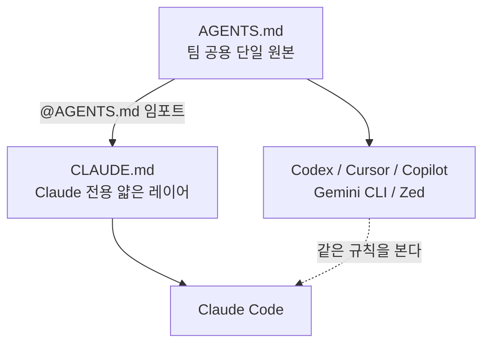
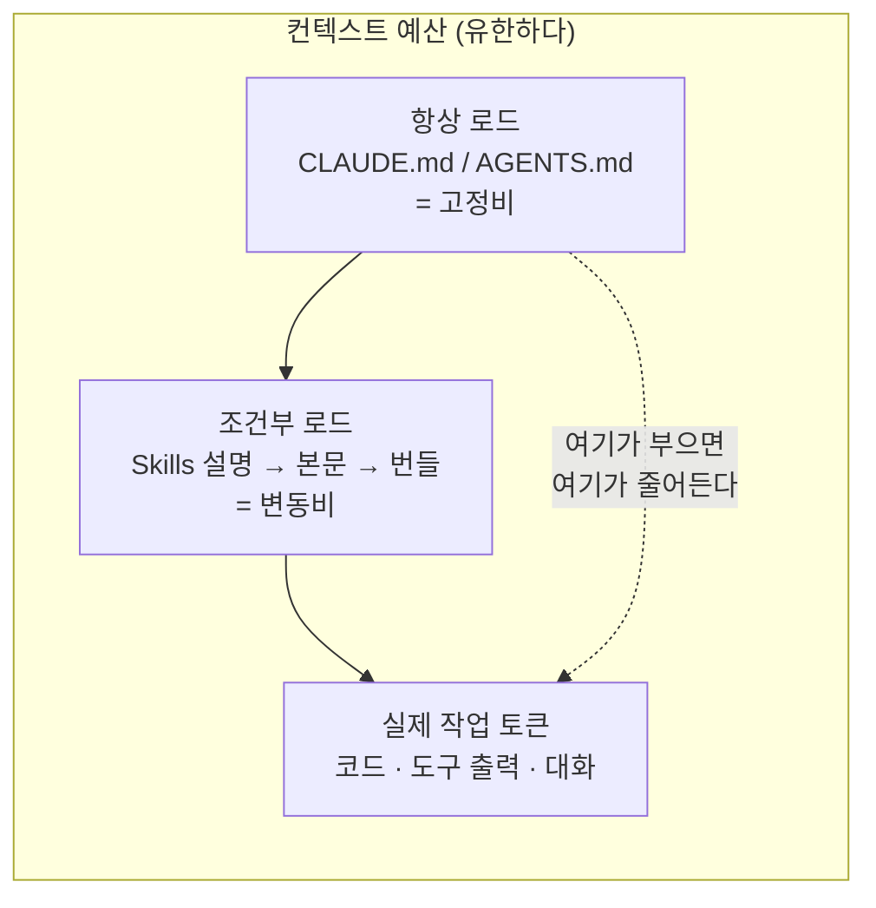
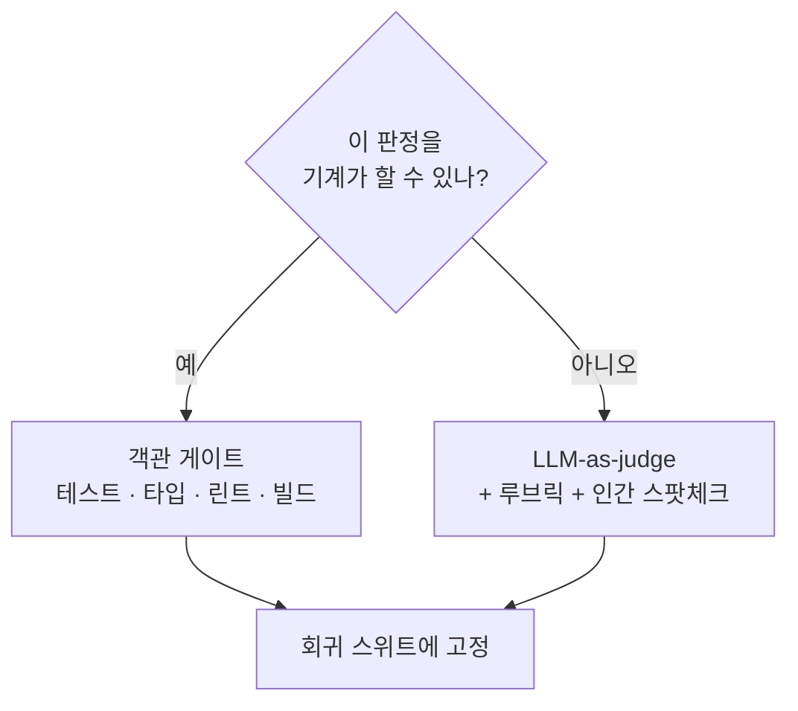

# 7. 최신 기법 지도

> **검증일**: 2026-08-28 · **Claude Code**: v2.1.247

## 한 줄 요약

2026년의 새 기법들 중 **지금 도입할 것은 네 가지**이고, 나머지는 지켜보거나 축소해서 취하면 된다.
이 장의 값어치는 소개가 아니라 **골라내기**에 있다.

---

## 이 장을 읽는 방법

새 기법 소개 글은 대체로 "이것도 좋고 저것도 좋다"로 끝난다.
전부 도입하면 하네스(harness)는 설정 더미가 되고, 유지 비용이 학습 이득을 넘어선다.
그래서 이 장은 각 기법을 네 질문으로만 정리한다.

| 질문 | 왜 묻는가 |
|---|---|
| 무엇인가 | 용어를 한 문장으로 고정한다 |
| 왜 지금인가 | 성숙도를 판정한다. 표준이 굳었는가, 아직 움직이는가 |
| 어떻게 시작하는가 | 오늘 실행 가능한 최소 단계 |
| 어디까지가 과장인가 | 마케팅과 실체를 분리한다 |

마지막 7.5절에 **지금 도입 / 지켜볼 것 / 아직 아닌 것** 표가 있다.
급하면 그 표만 봐도 된다.

---

## 7.1 AGENTS.md — 도구 중립 가이드

### 무엇인가

저장소 루트에 두는 마크다운 파일이다.
빌드·테스트 명령, 코드 컨벤션, 아키텍처 결정처럼 **에이전트가 이 저장소에서 알아야 할 것**을 적는다.
사람용 README 옆에 두는 에이전트용 README라고 생각하면 된다.

### 왜 지금인가

이미 표준으로 굳었다. Linux Foundation 산하 Agentic AI Foundation이 관리하고,
6만 개가 넘는 오픈소스 저장소가 채택했다.
Codex, Cursor, Copilot, Gemini CLI, Zed, Jules, Devin, Junie 등이 이 파일을 네이티브로 읽는다.

즉 **한 번 쓰면 여러 도구가 같은 지침을 본다.** 이식성이 이 파일의 존재 이유다.

### 핵심 함정: Claude Code 는 AGENTS.md 를 자동으로 읽지 않는다

가장 흔한 오해다. Claude Code 가 읽는 것은 `CLAUDE.md` 뿐이다.
"AGENTS.md 를 폴백으로 읽어 준다"는 주장은 사실이 아니다.
그래서 **다리를 놓아야 한다.** 방법은 두 가지다.

```markdown
# CLAUDE.md 맨 위 (권장)
@AGENTS.md
```

```bash
# 또는 심볼릭 링크
ln -s AGENTS.md CLAUDE.md
```

`@경로` 임포트는 최대 4단계까지 재귀로 따라간다.
권장 구조는 **AGENTS.md 를 팀 공용 단일 원본**으로 두고,
CLAUDE.md 는 임포트 한 줄 + Claude Code 전용 얇은 레이어만 담는 것이다.

### 이 저장소가 실제로 그렇게 되어 있다

이 학습 자료 저장소 자체가 예제다. 루트 `CLAUDE.md` 의 첫 두 줄은 이렇다.

```markdown
# 프로젝트 컨텍스트

@AGENTS.md
```

그리고 루트 `AGENTS.md` 는 도구 중립 규칙만 담는다.
저작권 규칙, 근거 없는 서술 금지, 역할 분리, 시드 코드 취급 — 어느 도구로 작업하든 똑같이 적용되는 것들이다.
반면 `CLAUDE.md` 의 나머지 부분에는 `.claude/agents/` 설명처럼 Claude Code 에만 의미 있는 내용이 들어간다.



### 어디까지가 과장인가

**파일을 놓는다고 동작이 바뀌지는 않는다.**
현장 보고에서 실제로 효과가 있는 것은 "이렇게 하지 마세요"류의 금지문이 아니라
`npm test 를 실행하라` 처럼 **검증 가능한 지시**다.

> 💭 **필자 견해**
> 도구를 Claude Code 하나만 쓴다면 굳이 두 파일로 나눌 필요가 없다.
> `CLAUDE.md` 한 장에 다 쓰는 편이 오히려 읽기 쉽다.
> AGENTS.md 가 값어치를 하는 순간은 **팀원마다 다른 도구를 쓸 때**다.
> 그때 두 파일 구조는 규칙 중복과 규칙 표류를 동시에 막아 준다.

---

## 7.2 Agent Skills — 필요할 때만 불러오는 컨텍스트

### 무엇인가

절차적 지식을 폴더 하나로 포장하는 형식이다.
중심에 `SKILL.md` 한 장(이름 + 설명 메타데이터 + 지침)이 있고,
옆에 스크립트·참조 자료·템플릿을 함께 둔다. 그리고 **필요할 때만** 컨텍스트에 로드된다.

### 왜 지금인가

크로스벤더 표준으로 정착했다. Anthropic 이 만들어 오픈 표준으로 공개했고(agentskills.io),
현재 40개가 넘는 클라이언트가 `SKILL.md` 를 지원한다.
Claude Code, Codex/ChatGPT, Cursor, GitHub Copilot, VS Code, Gemini CLI, Goose, OpenHands, Amp, Kiro, JetBrains Junie 등이다.

구도를 한 줄로 정리하면 이렇다.
**MCP 가 "도구 연결" 표준이라면, Skills 는 "노하우 배포" 표준이다.**

### 점진적 공개 3단계

스킬이 컨텍스트를 아끼는 방식은 정해져 있다. 세 단계로 나눠 연다.

| 단계 | 언제 | 무엇이 로드되나 | 비용 |
|---|---|---|---|
| ① 발견 | 세션 시작 시 | 이름 + 설명만 | 스킬당 수십~백 토큰 |
| ② 활성화 | 작업이 설명과 맞을 때 | SKILL.md 본문 전체 | 권장 5,000 토큰 미만 |
| ③ 실행 | 실제로 필요할 때 | 번들 파일 / 스크립트 | 필요한 만큼만 |

이것이 **컨텍스트 부패(context rot)** 에 대한 구조적 대답이다.
컨텍스트가 길어지면 그 안에 정보가 들어 있어도 정확히 꺼내 쓰는 능력이 떨어진다.
점진적 공개는 "안 쓸 토큰은 애초에 넣지 않는다"로 이 문제를 정면 회피한다.

### 컨텍스트 예산으로 보기

가이드를 두 종류로 나눠서 보는 습관이 중요하다.



`CLAUDE.md` 는 매 세션 무조건 들어가는 **고정비**다. 그래서 짧아야 한다.
스킬은 해당 작업에서만 들어가는 **변동비**다. 그래서 길어도 된다.
"이 지침이 모든 세션에 필요한가?"라는 질문 하나로 둘을 가른다. 아니라면 스킬로 내린다.

### 어떻게 시작하는가

프로젝트 스킬은 `.claude/skills/<이름>/SKILL.md` 에, 개인 스킬은 `~/.claude/skills/` 에 둔다.
가장 중요한 필드는 `description` 이다. 이것이 곧 **라우팅 신호**이기 때문이다.
"무엇을 하는가"만 쓰지 말고 **"언제 쓰는가"** 를 앞쪽에 명시한다.

```markdown
---
name: release-notes
description: 커밋 로그로 릴리스 노트 초안을 만든다. 태그를 자르기 직전이나 사용자가 릴리스 노트를 요청할 때 사용한다.
allowed-tools: Read Bash(git log *)
---

## 절차
1. 직전 태그 이후 커밋을 모은다
2. 사용자 영향 기준으로 분류한다
3. 3~7줄로 요약한다
```

### 어디까지가 과장인가

**스킬이 많을수록 좋다는 착각이 가장 흔한 실패 모드다.**
설명이 서로 겹치는 스킬이 쌓이면 모델이 무엇을 불러야 할지 헷갈린다.
이 "동일 역량 모호성" 문제는 연구 주제로 올라올 만큼 실재한다.

> 💭 **필자 견해**
> **5개를 잘 쓰는 편이 50개를 쌓는 것보다 낫다.**
> 새 스킬을 만들기 전에 기존 스킬 설명을 소리 내어 읽어 보고,
> 두 개가 비슷하게 들리면 새로 만들지 말고 하나로 합쳐라.
> 스킬 목록은 자산이 아니라 **유지보수 부채**로 취급하는 편이 정확하다.

---

## 7.3 샌드박싱과 권한 통제 — 자율성이 올라가면 반드시 따라와야 하는 것

### 순서가 중요하다

6장에서 루프를 돌려 자율성을 올리는 법을 배웠다.
그러면 다음 순서는 정해져 있다. **경계를 먼저 세우는 것이다.**
자율성을 올린 다음 경계를 세우는 게 아니라, 경계가 준비된 만큼만 자율성을 올린다.

이유는 단순하다. 자율성이 올라가면 "매 명령마다 승인" 방식이 붕괴한다.
승인 프롬프트는 루프의 정지점이므로, 자율 실행이 길어질수록 사람이 병목이 된다.
그래서 **사전에 경계를 선언하고 그 안에서는 묻지 않는** 쪽으로 옮겨 간다.

### 무엇인가

샌드박스는 에이전트가 실행하는 셸 명령의 **파일 접근 범위와 네트워크 도착지를 OS 수준에서 미리 못 박는 것**이다.
설정이 아니라 운영체제가 강제하므로, 모델이 지침을 무시해도 뚫리지 않는다.

### 어떻게 시작하는가

`/sandbox` 슬래시 명령으로 상태를 확인한다. Mode / Overrides / Config 탭이 나온다.
플랫폼 조건은 알아 둬야 한다.

| 플랫폼 | 조건 |
|---|---|
| macOS | Seatbelt 내장, 추가 설치 불필요 |
| Linux / WSL2 | `bubblewrap` + `socat` 필요 (선택적 seccomp 필터는 `npm i -g @anthropic-ai/sandbox-runtime`) |
| 네이티브 Windows | 미지원 |

기본값은 이미 합리적이다. **작업 디렉터리와 세션 임시 디렉터리에만 쓰기가 가능**하고,
네트워크는 프록시를 경유하는 도메인 승인제다.
아래는 여기서 한 단계 더 조이는 실제 동작 설정이다.

```json
{
  "sandbox": {
    "enabled": true,
    "failIfUnavailable": true,
    "allowUnsandboxedCommands": false,
    "filesystem": {
      "allowWrite": ["./src", "./tests", "./docs"],
      "denyRead": ["./.env", "./secrets"]
    }
  },
  "permissions": {
    "ask": ["Bash(dangerouslyDisableSandbox:true)"],
    "deny": ["Read(./.env)"]
  }
}
```

읽는 법은 이렇다.

- `enabled: true` — 샌드박스를 켠다.
- `failIfUnavailable: true` — 샌드박스를 쓸 수 없는 환경이면 조용히 넘어가지 말고 실패하라.
- `allowUnsandboxedCommands: false` — 이것이 **strict 모드**다. 샌드박스 밖 실행 자체를 막는다.
- `filesystem.allowWrite` / `denyRead` — 쓰기 가능한 경로와 읽지 말아야 할 경로를 명시한다.
- `ask` 규칙 — 뒤에서 설명할 탈출구를 **항상 묻게** 만든다.

### 탈출구를 알고 있어야 한다

샌드박스에서 실패한 명령은 `dangerouslyDisableSandbox` 로 재시도할 수 있다.
그러면 일반 권한 흐름으로 되돌아간다. 이건 버그가 아니라 설계된 탈출구다.
문제는 **이 탈출구가 조용히 쓰이면 경계가 무의미해진다**는 점이다.

그래서 위 예제에 `Bash(dangerouslyDisableSandbox:true)` 를 `ask` 에 넣었다.
탈출구를 막지는 않되, 쓸 때마다 사람 눈에 보이게 만든다.
참고로 **`deny` 규칙은 샌드박스 안에서도 항상 우선한다.** 조직 차원 강제는 managed settings 로 한다.

### 어디까지가 과장인가 — 여기서는 반대 방향이다

이 주제는 과장보다 **과소평가**가 문제다.
2026년에 에이전트 이그레스(egress, 네트워크 유출)는 실제 데이터 유출 경로가 된 사례와 CVE가 보고됐다(CVE-2026-25725).
즉 "켜면 끝"인 체크박스가 아니라 **실제 공격면**이다.

> 💭 **필자 견해**
> 신입에게 주는 규칙은 하나로 충분하다.
> **남의 저장소를 에이전트에게 처음 물릴 때는 샌드박스부터 켠다.**
> 내 코드가 아닌 곳에는 내가 읽어 보지 않은 스크립트, 설정, 후크가 들어 있다.
> 그리고 이건 안전 장치이면서 동시에 속도 장치다. 승인 프롬프트가 줄어드니 루프 처리량이 같이 올라간다.
> 안전과 속도가 같은 방향을 가리키는 드문 경우이므로, 망설일 이유가 없다.

---

## 7.4 Evals — 게이트를 어떻게 신뢰할 것인가

### 무엇인가

에이전트의 산출물과 궤적을 **반복 측정 가능한 기준으로 채점**하는 체계다.
목적은 하나다. 프롬프트·스킬·설정을 바꿨을 때 그게 개선인지 회귀인지 판정하는 것.

4장에서 배운 센서(Sensors)의 확장이다.
센서가 "한 턴의 피드백"이라면 eval 은 **"하네스 전체의 피드백"**이다.
하네스를 고쳤는데 나아졌는지 알 방법이 없으면, 하네스 엔지니어링은 미신이 된다.

### 원칙: 객관적 게이트 > LLM-as-judge

이 절에서 딱 하나만 가져간다면 이것이다.

| 방식 | 무엇인가 | 언제 쓰나 |
|---|---|---|
| **객관 게이트** | 테스트 통과, 타입체크, 린트, 빌드, 정확한 파일 diff | **가능하면 무조건 이쪽.** 싸고 결정적이다 |
| LLM-as-judge | 모델이 결과를 채점 | 객관 검사가 불가능한 주관 기준(설명 품질 등)에만 |
| 궤적 평가 | 결과뿐 아니라 도구 호출 순서를 채점 | 같은 답에 도달해도 경로가 문제일 때 |

LLM 심판은 만능이 아니라 **차선책**이다.
판정자 자체가 편향되고, 비용이 들고, 무엇보다 컴파일러가 이미 답을 아는 문제에 쓰는 건 낭비다.
꼭 써야 한다면 루브릭 + 기준 예시 + 사람의 스팟체크를 반드시 함께 붙인다.



### 회귀 케이스는 실제 실패에서 자란다

합성 케이스를 미리 잔뜩 만드는 것보다, **실제 트레이스에서 키우는 편이 낫다**는 게 공통 조언이다.
실무 규칙으로 옮기면 이렇다.

**에이전트가 틀린 순간을 테스트로 고정하라.**
오늘 에이전트가 엉뚱한 파일을 고쳤다면, 그 상황을 재현하는 케이스를 스위트에 한 줄 추가한다.
이렇게 자란 스위트는 이 저장소의 실제 실패 분포를 닮아 간다. 합성 케이스는 절대 그렇게 못 한다.

### 도구는 추천하지 않는다

개념은 확립됐지만 **도구 시장에는 아직 승자가 없다.**
DeepEval, Braintrust, Galileo, LangSmith 등이 경쟁 중이다.
초심자 가이드에서 특정 벤더를 가르치면 그 장의 수명이 벤더의 수명과 같아진다. 그래서 원칙만 가르친다.

Claude Code 안에서 쓸 수 있는 것으로는 `claude plugin eval`(플러그인/스킬 eval 스위트 실행, JSON 리포트, CI 연동)과 `/skill-doctor` 리포트가 있다.
가장 이식성 높은 자작 버전은 시나리오 프롬프트 N개를 `claude -p "..."` 헤드리스로 돌리고
종료 코드와 테스트 결과를 스코어로 집계하는 셸 스크립트다.

### 가벼운 자기개선 하네스 — 수동 회고 루프

여기까지 왔으면 마지막 조각이 남는다. **측정한 다음 무엇을 하는가.**
답은 규칙 승격이다. 세션이 끝날 때 이 질문 하나를 던진다.

> 이번 세션에서 내가 **두 번 이상 똑같이 설명한 것**이 무엇인가?

두 번 설명했다면 그건 지침이 빠진 것이다. 세 번이면 확실하다.
그 한 줄을 `CLAUDE.md` 규칙이나 스킬로 올린다. 이 반복이 하네스 엔지니어링을 **설정이 아니라 습관**으로 만든다.

이미 동작하는 예도 있다. `/fewer-permission-prompts` 는 트랜스크립트를 훑어
자주 쓰는 읽기 전용 명령을 뽑아내고, 그것을 `.claude/settings.json` 의 허용 규칙으로 제안한다.
**관찰 → 반성 → 승격**이라는 자기개선 순환이 실제로 돌아가는 최소 사례다.

> 💭 **필자 견해**
> 자동 승격은 아직 하지 않는 편이 좋다.
> 자동화의 실패 모드가 명확하기 때문이다. **한 번의 노이즈를 영구 규칙으로 굳혀 버린다.**
> 잘못 굳은 규칙은 이후 모든 세션의 고정비가 되고, 아무도 지운 이유를 기억하지 못한다.
> 사람이 세션 끝에 3개 이하로 후보를 받아 고르는 정도가 지금의 적정선이다.

---

## 7.5 과장 경보

여기까지가 "지금 도입할 것" 네 가지였다.
이제 자주 추천되지만 **그대로 삼키면 안 되는 것들**을 정리한다.

### 판정표

| 기법 | 판정 | 이유 |
|---|---|---|
| AGENTS.md | **지금 도입** | 6만+ 저장소, 다수 도구 네이티브 지원. 표준 확정 |
| Agent Skills | **지금 도입** | 40+ 클라이언트 지원. 점진적 공개는 컨텍스트 부패의 구조적 답 |
| 샌드박싱 / 권한 통제 | **지금 도입** | 자율성의 전제 조건. 실수 비용이 가장 큰 영역 |
| Evals (객관 게이트 우선) | **지금 도입** (원칙만) | 하네스 개선 여부를 아는 유일한 수단. 단 벤더는 고르지 않는다 |
| Spec-driven development | **축소해서 도입** | 습관은 유효, 툴체인은 과잉 |
| maker/checker + worktree | **축소해서 도입** | 기법은 안정, 제품은 불안정 |
| 궤적 평가 (trajectory eval) | **지켜볼 것** | 관점은 표준화됐으나 초심자에겐 객관 게이트가 먼저다 |
| GUI 오케스트레이터 제품군 | **지켜볼 것** | 이탈률이 높다 |
| 자동 자기개선 하네스 | **아직 아님** | 논문 단계. 프로덕션 검증 사례 부족 |
| 클라우드 Routines 등 프리뷰 | **아직 아님** | 리서치 프리뷰. 이름과 API가 아직 움직인다 |
| 런타임 eval 가드레일 | **아직 아님** | 엔터프라이즈 문맥. 신입 단계에서 이르다 |

### Spec-driven development — 축소해서 취하라

명세를 1차 산출물로 두고 코드를 2차 산출물로 취급하는 방식이다.
전형적 파이프라인은 constitution → spec → plan → tasks → implement.
확산 중인 건 사실이다. GitHub Spec Kit(파이썬 CLI `specify`)은 28개 이상 플랫폼을 지원하고 stars 8만대이며,
AWS Kiro, OpenSpec, BMAD, Tessl, Google Antigravity 등 벤더마다 자기 버전을 냈다.

문제는 두 가지다.
첫째, **"재작업 60~80% 감소" 같은 수치는 커뮤니티 자가보고이며 통제된 실험이 아니다.** 그대로 인용하면 안 된다.
둘째, 작은 변경에 4단계 파이프라인을 강제하면 순수 오버헤드다.

**가져갈 실질은 도구가 아니라 습관이다: 코드를 쓰기 전에 계획 문서를 만들고 사람이 승인한다.**
Claude Code 에서는 이미 다 있다. Plan Mode 로 계획을 받고(1장),
그 계획을 `docs/plan-xxx.md` 로 커밋해 두고 매 세션 `@` 로 다시 로드한다.
계획 문서는 컨텍스트 밖 메모 역할도 하므로 긴 작업에서 컨텍스트 부패 방어에도 기여한다.

### GUI 오케스트레이터 제품군 — 제품 의존을 피하라

여러 에이전트를 격리된 작업 트리에서 동시에 돌리는 기법 자체는 실전에서 쓰인다.
문제는 그걸 감싸는 GUI 제품들의 수명이다.
Conductor, Emdash, Vibe Kanban, Claude Squad, Nimbalyst 등이 명멸했고, **Crystal 은 2026년 2월 종료됐다.**

또한 "에이전트 3개 = 3배 처리량"은 과장이다.
worktree 는 파일 격리만 해결한다. 두 트리가 같은 파일을 고칠 때 경고해 주는 장치는 없고,
병합 충돌과 통합 비용은 사람에게 그대로 넘어온다. 신입이 6개를 병렬로 돌리면 리뷰 부하로 손해다.

**남기고 갈 것은 두 가지다.** `git worktree` 기반 격리(안정적이고 무료)와 maker/checker 분리.
후자는 병렬성 장치가 아니라 품질 장치다.
구현한 세션이 자기 코드를 리뷰하면 확증 편향이 생기므로, 깨끗한 컨텍스트의 서브에이전트나 새 세션에 검증만 맡긴다.

> 💭 **필자 견해**
> 이 저장소가 그 원칙으로 만들어졌다.
> 수집은 collector, 집필은 writer, 검증은 verifier 가 맡고 **집필한 주체는 검증하지 않는다.**
> writer 에게 웹 도구를 주지 않은 것도 같은 이유다. 실수가 아니라 경계다.
> GUI 제품 없이도 이 정도 구조는 마크다운 파일 세 장이면 만들 수 있다.

### 자기개선 하네스 — 논문은 뜨겁고 실무는 아직이다

2026년 가장 뜨거운 연구 주제이자 가장 과열된 마케팅 용어다.
Lilian Weng 의 harness 포스트, Prime Intellect 의 Prime Agent(2026-08-05, 자기수정 하네스 + Continual Harness),
SkillForge, MetaSkill-Evolve 등 논문이 다수 나왔다.

반면 신입이 프로덕션에서 쓸 수 있게 검증된 실무는 거의 없다.
**실무는 7.4에서 말한 수동 회고 루프 수준까지만 가져간다.** 그 이상은 지켜보는 영역이다.

### 클라우드 Routines — "다음 단계" 안내로만

터미널을 붙잡지 않고 클라우드에서 스케줄·이벤트·API 트리거로 도는 에이전트가 나오고 있다.
Claude Code Routines 는 2026년 4월 출시된 **리서치 프리뷰**다.
Managed Agents 쪽에는 cron + IANA 타임존 스케줄 배포가 있다.

방향은 확실하지만 API 와 이름이 아직 움직인다.
더 중요한 건 순서다. **이 주제의 전제 조건은 샌드박스(7.3)와 eval 게이트(7.4)다.**
감독 없는 야간 자율 실행을 이 둘 없이 켜는 것은 위험하다. 순서를 뒤집지 않는다.

가장 이식성 높은 저비용 버전은 `claude -p "prompt"` 헤드리스를 cron 이나 GitHub Actions 에 거는 것이다.
프리뷰 기능을 기다리지 않고 오늘 할 수 있다.

---

## 직접 해보기

### 실습 1 — AGENTS.md 다리 놓기 (5분)

```bash
cd /path/to/my-project   # 자기 프로젝트 경로로 바꿀 것

cat > AGENTS.md <<'EOF'
# AGENTS.md

## 검증
- 테스트: npm test
- 린트: npm run lint

## 규칙
- 커밋 전에 위 두 명령을 실행한다.
- 생성한 파일은 src/ 아래에만 둔다.
EOF

# CLAUDE.md 맨 위에 임포트 한 줄을 넣는다
printf '@AGENTS.md\n\n' | cat - CLAUDE.md > CLAUDE.md.tmp && mv CLAUDE.md.tmp CLAUDE.md
```

확인은 세션 안에서 한다. `/context` 로 어떤 메모리 파일이 실제로 로드됐는지 본다.
`AGENTS.md` 가 보이면 다리가 놓인 것이다.

### 실습 2 — 샌드박스 켜고 경계 확인하기 (10분)

`.claude/settings.json` 에 7.3의 예제를 넣는다. 경로는 내 프로젝트에 맞게 바꾼다.
그다음 세션에서 확인한다.

```
/sandbox
/permissions
```

`/sandbox` 로 모드가 켜졌는지, `/permissions` 로 규칙이 어느 설정 파일에서 왔는지 본다.
그리고 일부러 경계 밖 쓰기를 시켜 본다. 예를 들어 `allowWrite` 에 없는 디렉터리에 파일을 만들게 한다.
막히는 것을 눈으로 확인해야 경계를 신뢰할 수 있다.

### 실습 3 — 회고 루프 한 번 돌리기 (5분)

오늘 작업하던 세션 끝에 이 프롬프트를 그대로 던진다.

```
이번 세션에서 내가 두 번 이상 반복해서 교정한 지시를 찾아,
CLAUDE.md 규칙 후보로 3개 이하만 제안해줘. 각각 한 줄로.
```

제안이 마음에 들면 `CLAUDE.md` 에 붙인다. 아니면 버린다. **고르는 건 사람이 한다.**
이어서 `/fewer-permission-prompts` 를 한 번 실행해 보면 자동 승격이 어떤 모양인지 감이 온다.

---

## ✅ 자가 점검

- [ ] Claude Code 가 `AGENTS.md` 를 자동으로 읽지 않는다는 것을 알고, 다리를 놓는 두 가지 방법을 말할 수 있다
- [ ] "항상 로드(CLAUDE.md)"와 "조건부 로드(Skills)"를 컨텍스트 예산 관점으로 설명할 수 있다
- [ ] `allowUnsandboxedCommands: false` 가 무엇을 막는지, `dangerouslyDisableSandbox` 가 왜 `ask` 대상인지 설명할 수 있다
- [ ] 객관 게이트를 LLM-as-judge 보다 우선하는 이유를 한 문장으로 말할 수 있다
- [ ] "재작업 60~80% 감소" 같은 수치를 왜 그대로 인용하면 안 되는지 설명할 수 있다

---

## 다음 단계

이 가이드는 여기서 끝나지만, 배울 것은 남아 있다.
아래 세 곳이 다음 목적지다. **각각 라이선스가 다르므로 무엇을 할 수 있는지도 함께 적는다.**

| 자료 | 링크 | 라이선스 | 무엇을 할 수 있나 |
|---|---|---|---|
| Anthropic Academy | <https://anthropic.skilljar.com/> | 명시된 오픈 라이선스 없음 (사실상 저작권 보유) | **링크와 이름 언급, 커리큘럼을 내 말로 설명하는 것까지.** 슬라이드·스크린샷·자막·연습문제·퀴즈를 옮겨 오면 안 된다 |
| anthropics/courses | <https://github.com/anthropics/courses> | CC BY-NC 4.0 | **비상업 목적에 한해** 재사용·번역·재배포 가능. 출처 표시 + 원본 링크 + 변경 사실 명시 + 라이선스 표기가 조건. 유료 강의나 판매용 사내 교육은 범위 밖 |
| anthropic-cookbook | <https://github.com/anthropics/anthropic-cookbook> | MIT (© 2023 Anthropic) | 셋 중 가장 자유롭다. 복사·수정·번역·재배포가 **상업적으로도** 가능. 조건은 저작권 표시와 허가 문구를 함께 남기는 것뿐 |

실무 규칙 하나로 줄이면 이렇다.
**재사용할 코드가 필요하면 cookbook(MIT) 을 먼저 본다.**
Academy 내용이 필요하면, 겹치는 부분이 있는 `anthropics/courses` 저장소 쪽을 인용한다. 그쪽에는 라이선스가 있다.

> 💭 **필자 견해**
> 이 표를 마지막에 넣은 이유가 있다.
> 에이전트로 만든 산출물을 팀이나 외부에 배포하는 순간, 기술 문제가 아니라 라이선스 문제가 먼저 온다.
> 그리고 에이전트는 라이선스를 알아서 지켜 주지 않는다. 그건 **하네스에 넣어야 할 규칙**이다.
> 이 저장소의 `AGENTS.md` 첫 규칙이 저작권 안전인 것도 그래서다.

---

## 📎 출처

**Claude Code 공식 문서**

- 메모리 / CLAUDE.md 임포트 — <https://code.claude.com/docs/en/memory>
- Agent Skills — <https://code.claude.com/docs/en/skills>
- 샌드박싱 — <https://code.claude.com/docs/en/sandboxing>
- 권한 — <https://code.claude.com/docs/en/permissions>
- 설정 — <https://code.claude.com/docs/en/settings>
- 서브에이전트 — <https://code.claude.com/docs/en/sub-agents>
- 워크트리 — <https://code.claude.com/docs/en/worktrees>
- 헤드리스 모드 — <https://code.claude.com/docs/en/headless>

**표준 / 생태계**

- AGENTS.md — <https://agents.md/>
- Agent Skills 표준 — <https://agentskills.io/>
- GitHub Spec Kit — <https://github.com/github/spec-kit>

**컨텍스트 엔지니어링 · 평가 · 자기개선**

- <https://www.anthropic.com/engineering/effective-context-engineering-for-ai-agents>
- <https://www.confident-ai.com/blog/llm-agent-evaluation-complete-guide>
- <https://deepeval.com/blog/llm-as-a-judge>
- <https://lilianweng.github.io/posts/2026-07-04-harness/>
- <https://addyosmani.com/blog/code-agent-orchestra/>

**라이선스 확인**

- <https://github.com/anthropics/courses/blob/master/LICENSE> (CC BY-NC 4.0)
- <https://github.com/anthropics/anthropic-cookbook/blob/main/LICENSE> (MIT)
- <https://anthropic.skilljar.com/>
