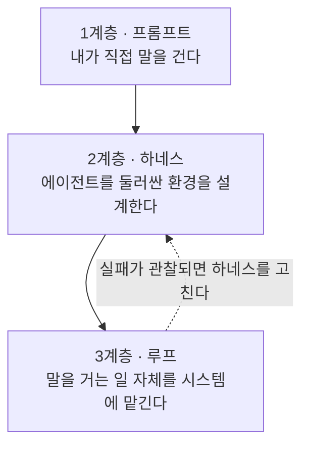

# 바이브 코딩, 프롬프트에서 멈추지 않기

대부분의 사람은 1계층에서 멈춘다. 에이전트에게 말을 걸고, 나온 코드를 눈으로 훑고,
마음에 안 들면 다시 말을 건다. 이 방식으로 하루를 보내면 코드는 쌓이지만
그 코드를 믿을 근거는 하나도 쌓이지 않는다.

"바이브 코딩"이 조롱받는 이유가 정확히 여기에 있다. 문제는 모델이 아니라,
모델 주변에 아무것도 만들어 두지 않은 채로 쓰는 방식이다.
실제 가치는 2계층과 3계층에 있다.

---

## 3계층 지도

**1계층 — 프롬프트.** 요구사항을 문장으로 잘 전달하는 기술이다.
필요하지만, 사람이 매번 타이핑해야 하므로 처리량의 상한이 사람에게 걸린다.

**2계층 — 하네스.** 규칙 문서, 도구, 권한, 자동 검사처럼 에이전트를 둘러싼 환경을 만든다.
같은 실수를 두 번 지적하는 대신, 그 실수가 구조적으로 불가능해지도록 환경을 바꾼다.

**3계층 — 루프.** 잘 만든 하네스 위에서 무엇을 반복 실행할지 설계한다.
사람은 조작자에서 설계자로 올라가고, 검토와 판단에만 개입한다.

---

## 하네스(harness)란 무엇인가

Birgitta Böckeler는 하네스를 **모델 자체를 뺀 에이전트의 나머지 전부**로 본다.
파일시스템, 실행 환경, 규칙 문서, 도구, 자동 검사가 전부 여기 들어간다.
그리고 그 안의 통제 장치를 두 축으로 나눈다.

- **Guides(피드포워드)** — 에이전트가 **행동하기 전에** 거는 통제. 첫 시도가 맞을 확률을 올린다.
- **Sensors(피드백)** — 결과를 관찰해 에이전트가 읽을 수 있는 신호로 되돌려 준다. 스스로 고치게 만든다.
- **Computational** — CPU가 실행하는 결정적 검사. 같은 입력이면 같은 판정이 나오고 빠르다.
- **Inferential** — 언어 모델의 판단에 기대는 통제. 느리고 흔들리지만, 규칙으로 못 쓰는 것을 본다.

| | Computational (결정적) | Inferential (추론적) |
|---|---|---|
| **Guides (피드포워드)** | 타입 시스템, 언어 서버, 코드 생성기 | CLAUDE.md, 스킬, 계획 문서 |
| **Sensors (피드백)** | 테스트, 린터, 타입 검사, CI | 리뷰 서브에이전트, 모델이 읽도록 쓴 오류 메시지 |

Böckeler의 핵심 지적은 둘 중 하나만으로는 안 된다는 것이다.
Guides만 있으면 규칙이 지켜졌는지 아무도 확인하지 않고,
Sensors만 있으면 매번 같은 실수를 다시 고치게 된다.
([출처](https://martinfowler.com/articles/harness-engineering.html))

---

## 루프 엔지니어링이란 무엇인가

Addy Osmani가 말하는 루프 엔지니어링은, 내가 프롬프트를 치는 대신
**프롬프트를 치는 시스템을 설계하는 일**로 작업의 층위를 옮기는 것이다.
매일 아침 에이전트를 열어 "실패한 CI 있어?"라고 묻는 대신,
밤사이 실패를 분류하고 수정 후보를 만들어 두는 자동화를 설계한다.
다만 이것이 성립하려면 "다 됐다"를 기계가 판정할 수 있어야 한다.
판정할 방법이 없는 일에는 루프를 걸지 않는다.
([출처](https://addyosmani.com/blog/loop-engineering/))

---

## 이 저장소 자체가 예제다

> 💭 **필자 견해**
> 하네스는 설명으로 이해되지 않는다. 돌아가는 물건을 봐야 이해된다.
> 그래서 이 자료는 자기 자신을 교보재로 삼는다.

이 저장소의 문서는 사람이 혼자 쓴 것이 아니라, `.claude/agents/` 에 정의된
세 에이전트가 역할을 나눠 만들었다.

- [`.claude/agents/collector.md`](https://github.com/Hyeokjinoh/vibecoding-study/blob/main/.claude/agents/collector.md) — 사실만 모은다. 문서를 쓰지 않는다.
- [`.claude/agents/writer.md`](https://github.com/Hyeokjinoh/vibecoding-study/blob/main/.claude/agents/writer.md) — 모인 사실만으로 집필한다. **웹 도구가 없다.**
- [`.claude/agents/verifier.md`](https://github.com/Hyeokjinoh/vibecoding-study/blob/main/.claude/agents/verifier.md) — 판정만 한다. 고치지 않는다.

집필 에이전트에게 웹 도구를 주지 않은 것은 기능 누락이 아니라 설계다.
근거 없는 문장이 섞일 경로를 아예 없애는 **Guide**다.
그리고 이 저장소의 CI —
[`.github/workflows/verify.yml`](https://github.com/Hyeokjinoh/vibecoding-study/blob/main/.github/workflows/verify.yml) —
는 살아 있는 **Sensor**다. 필수 섹션 누락, 외부 이미지, 낡은 문서 URL,
짝이 안 맞는 코드 블록을 매번 잡아내고, 실습용 시드 코드의 결함이 사라졌는지까지 검사한다.

읽기 전에 저 네 파일을 먼저 열어 보길 권한다. 뒤의 챕터는 전부 저 구조의 해설이다.

---

## 학습 대상과 선수 지식

- **대상**: 컴퓨터공학 전공 신입 개발자. 프로그래밍은 알지만 코딩 에이전트는 처음인 사람.
- **선수 지식**: Python 기본 문법, `git` 기본 명령(clone, status, diff, commit), 터미널 사용.
- **필요 없는 것**: 머신러닝 지식, 모델 내부 이해. 이 자료는 모델이 아니라 모델 **주변**을 다룬다.

---

## 목차

| 장 | 제목 | 무엇을 배우나 |
|---|---|---|
| 0 | [준비](00-setup.md) | 설치, 권한 모드, 설정 파일 우선순위 |
| 1 | [스티어링과 계획 모드](01-steering.md) | 실행 전에 방향을 잡는 법 |
| 2 | [컨텍스트 엔지니어링](02-context.md) | 컨텍스트를 자원으로 다루는 법 |
| 3 | [Guides](03-guides.md) | 행동 전에 거는 통제 설계 |
| 4 | [Sensors](04-sensors.md) | 결과를 되돌려 주는 신호 설계 |
| 5 | [서브에이전트와 maker/checker](05-subagents.md) | 만든 사람이 검사하지 않게 만들기 |
| 6 | [루프 엔지니어링](06-loops.md) | 반복을 시스템에 넘기는 기준 |
| 7 | [최신 기법 지도](07-frontier.md) | 그다음에 볼 것들 |

> 7장은 가장 나중에 추가될 수 있다. 링크가 아직 비어 있어도 정상이다.

---

## 라이선스와 비제휴 고지

이 자료는 외부 자료를 참조하되 복제하지 않는다. 참고 자료 목록과 각 자료의 라이선스,
그리고 이 저장소가 무엇을 하고 무엇을 하지 않았는지는
[SOURCES.md](https://github.com/Hyeokjinoh/vibecoding-study/blob/main/SOURCES.md) 에 정리해 두었다.
이 자료는 독립적으로 만든 비공식 학습 자료이며 Anthropic PBC 와 제휴하거나 승인받은 관계가 아니다.
Claude 와 Anthropic 은 Anthropic PBC 의 상표다.
