```mermaid
flowchart LR
    L1["1계층<br/>프롬프트"] --> L2["2계층<br/>하네스"] --> L3["3계층<br/>루프"]
    L3 -. "실패가 관찰되면<br/>하네스를 고친다" .-> L2
    style L2 fill:#16202b,stroke:#5eead4,stroke-width:2px
    style L3 fill:#16202b,stroke:#a78bfa,stroke-width:2px
```
  

    
harness &amp; loop engineering

    <h1 class="hero__title">
      바이브 코딩, 프롬프트에서 멈추지 않기
    </h1>
    

      AI 코딩 에이전트를 <strong>잘 쓰는 법</strong>이 아닙니다.
      에이전트가 <strong>일할 환경을 설계하는 법</strong>입니다.
      코드는 읽을 줄 알지만 AI 에이전트는 처음인 분들을 위해,
      혼자서도 끝까지 따라올 수 있게 만들었습니다.
    

    

      <a class="btn-vibe btn-vibe--primary" href="00-setup.html">0장부터 시작 →</a>
      <a class="btn-vibe btn-vibe--ghost" href="https://github.com/Hyeokjinoh/vibecoding-study">GitHub 저장소</a>
    

  

  

    <svg width="196" height="196" viewBox="0 0 200 200" fill="none" xmlns="http://www.w3.org/2000/svg">
      <!-- 하네스(harness) = 로봇을 감싼 구조물. 로봇이 아니라 로봇을 '둘러싼 것'이 주인공이다 -->
      <circle cx="100" cy="100" r="76" stroke="#1f2c39" stroke-width="1.5" stroke-dasharray="4 6"/>
      <circle cx="100" cy="100" r="58" stroke="#243545" stroke-width="1.5"/>

      <!-- 궤도 위의 세 에이전트: 수집 · 집필 · 검증 -->
      <circle cx="100" cy="24" r="7" fill="#5eead4"/>
      <circle cx="166" cy="138" r="7" fill="#a78bfa"/>
      <circle cx="34" cy="138" r="7" fill="#7dd3fc"/>

      <!-- 몸통 -->
      <rect x="62" y="74" width="76" height="62" rx="15" fill="#16202b" stroke="#2b3946" stroke-width="2"/>
      <!-- 하네스 벨트 -->
      <path d="M62 112h76" stroke="#5eead4" stroke-width="2.5" opacity="0.55"/>
      <path d="M84 74v62M116 74v62" stroke="#5eead4" stroke-width="2" opacity="0.32"/>

      <!-- 눈 -->
      <circle cx="86" cy="97" r="7.5" fill="#0b1016"/>
      <circle cx="114" cy="97" r="7.5" fill="#0b1016"/>
      <circle cx="87.5" cy="95.5" r="3.4" fill="#5eead4"/>
      <circle cx="115.5" cy="95.5" r="3.4" fill="#5eead4"/>

      <!-- 안테나 -->
      <path d="M100 74V58" stroke="#2b3946" stroke-width="3" stroke-linecap="round"/>
      <circle cx="100" cy="53" r="5" fill="#5eead4"/>

      <!-- 팔 -->
      <path d="M62 104H46a6 6 0 0 0-6 6v14" stroke="#2b3946" stroke-width="3" stroke-linecap="round"/>
      <path d="M138 104h16a6 6 0 0 1 6 6v14" stroke="#2b3946" stroke-width="3" stroke-linecap="round"/>

      <!-- 입 = 통과 신호 -->
      <path d="M90 122c4 4 16 4 20 0" stroke="#5eead4" stroke-width="2.5" stroke-linecap="round"/>
    </svg>
  

에이전트에게 말을 걸고, 나온 코드를 눈으로 훑고, 마음에 안 들면 다시 말을 겁니다.
대부분은 여기, **1계층**에서 멈춥니다. 그렇게 하루를 보내면 어떻게 될까요?

코드는 쌓입니다. 그런데 **그 코드를 믿을 근거는 하나도 쌓이지 않습니다.**

"바이브 코딩"이 조롱받는 이유가 정확히 여기 있습니다. 문제는 모델이 아니에요.
모델 주변에 아무것도 만들어 두지 않은 채로 쓰는 방식이 문제입니다.

---

## 3계층 지도

  

    
1

    

      
프롬프트대부분 여기서 멈춘다

      
내가 직접 말을 겁니다. 꼭 필요하지만, 처리량의 상한이 사람에게 걸립니다.

    

  

  

    
2

    

      
하네스이 자료의 심장

      
규칙·도구·권한·자동 검사로 에이전트를 둘러싼 환경을 만듭니다. 같은 실수를 두 번 지적하는 대신, 그 실수가 구조적으로 불가능해지게 합니다.

    

  

  

    
3

    

      
루프시스템이 일한다

      
말을 거는 일 자체를 시스템에 맡깁니다. 사람은 조작자에서 설계자로 올라가고, 검토와 판단에만 개입합니다.

    

  

---

## 하네스(harness)란 무엇인가

Birgitta Böckeler는 하네스를 **모델 자체를 뺀 에이전트의 나머지 전부**로 봅니다.
그럼 뭐가 들어갈까요? 파일시스템, 실행 환경, 규칙 문서, 도구, 자동 검사가 전부 여기 들어갑니다.
그 안의 통제 장치는 두 축으로 나뉘고요.

|  | ⚙️ Computational · 결정적 | 🧠 Inferential · 추론적 |
|---|---|---|
| **▶ Guides**  행동 **전에** 방향을 줍니다 | 타입 시스템, 언어 서버, 코드 생성기 | `CLAUDE.md`, 스킬, 계획 문서 |
| **◀ Sensors**  행동 **후에** 되돌립니다 | 테스트, 린터, 타입 검사, CI | 리뷰 서브에이전트, 모델이 읽도록 쓴 오류 메시지 |

Böckeler의 핵심 지적은 **둘 중 하나만으로는 안 된다**는 것입니다.
Guides만 있으면 규칙이 지켜졌는지 아무도 확인하지 않습니다.
Sensors만 있으면 매번 같은 실수를 다시 고치게 되고요.
([출처](https://martinfowler.com/articles/harness-engineering.html))

---

## 루프 엔지니어링이란 무엇인가

Addy Osmani가 말하는 루프 엔지니어링은 작업의 층위를 옮기는 일입니다.
내가 프롬프트를 치는 대신, **프롬프트를 치는 시스템을 설계하는 쪽**으로요.

매일 아침 에이전트를 열어 "실패한 CI 있어?"라고 묻지 않습니다.
대신 밤사이 실패를 분류하고 수정 후보를 만들어 두는 자동화를 설계합니다.
다만 이게 성립하려면 조건이 하나 있어요. **"다 됐다"를 기계가 판정할 수 있어야** 합니다.
판정할 방법이 없는 일에는 루프를 걸지 않습니다.
([출처](https://addyosmani.com/blog/loop-engineering/))

---

  
meta

  
이 저장소 자체가 교보재입니다

  

    이 문서는 사람이 혼자 쓴 게 아니에요. <code>.claude/agents/</code> 에 정의된
    세 에이전트가 역할을 나눠 만들었습니다. 그 정의 파일은 저장소에 그대로 남아 있고,
    5장의 실습 재료가 됩니다.
  

  

    

      
01 · 수집

      
collector

      
사실만 모읍니다. 출처 URL 없는 사실은 버립니다. 문서는 쓰지 않습니다.

    

    
→

    

      
02 · 집필

      
writer

      
<strong>웹 도구가 없습니다.</strong> 모인 사실만으로 씁니다. 근거가 없으면 빈칸을 남깁니다.

    

    
→

    

      
03 · 검증

      
verifier

      
판정만 합니다. 고치지 않습니다. 만든 주체가 검사하지 않습니다.

    

  

  

    

8

챕터

    

1,083

줄의 근거 노트

    

0

외부 이미지

    

매주

CI 링크 검사

  

> 💭 **필자 견해**
> 하네스는 설명만으로는 잘 안 와닿습니다. 돌아가는 물건을 봐야 이해되거든요.
> 그래서 이 자료는 자기 자신을 교보재로 삼았습니다.

집필 에이전트에게 웹 도구를 주지 않은 건 기능 누락이 아니라 설계입니다.
근거 없는 문장이 섞일 경로를 아예 없앤 **Guide**예요.
그리고 이 저장소의 CI —
[`verify.yml`](https://github.com/Hyeokjinoh/vibecoding-study/blob/main/.github/workflows/verify.yml) —
는 살아 있는 **Sensor**입니다. 필수 섹션 누락, 외부 이미지, 낡은 문서 URL,
짝이 안 맞는 코드 블록을 매번 잡아냅니다. 실습용 시드 코드의 결함이 사라졌는지까지 검사하고요.

본격적으로 읽기 전에 이 네 파일을 먼저 열어 보시길 권합니다. 뒤의 챕터는 전부 이 구조의 해설이거든요.

- [`collector.md`](https://github.com/Hyeokjinoh/vibecoding-study/blob/main/.claude/agents/collector.md) · [`writer.md`](https://github.com/Hyeokjinoh/vibecoding-study/blob/main/.claude/agents/writer.md) · [`verifier.md`](https://github.com/Hyeokjinoh/vibecoding-study/blob/main/.claude/agents/verifier.md) · [`verify.yml`](https://github.com/Hyeokjinoh/vibecoding-study/blob/main/.github/workflows/verify.yml)

---

## 목차

  <a class="card" href="00-setup.html">
    
CHAPTER 0

    
준비

    
설치, 권한 모드, 설정 파일 우선순위. 첫 센서를 만나 봅니다.

  </a>
  <a class="card" href="01-steering.html">
    
CHAPTER 1

    
스티어링과 계획 모드

    
한 방에 되는 프롬프트를 좇지 않고, 조종하는 법.

  </a>
  <a class="card" href="02-context.html">
    
CHAPTER 2

    
컨텍스트 엔지니어링

    
에이전트가 헛짓하는 진짜 이유. 컨텍스트를 자원으로 다룹니다.

  </a>
  <a class="card" href="03-guides.html">
    
CHAPTER 3

    
Guides

    
CLAUDE.md, 규칙, 스킬. 행동하기 전에 방향을 줍니다.

  </a>
  <a class="card" href="04-sensors.html">
    
CHAPTER 4

    
Sensors

    
테스트·훅·CI. 행동한 뒤에 되돌립니다. 고장 난 센서의 위험까지.

  </a>
  <a class="card" href="05-subagents.html">
    
CHAPTER 5

    
서브에이전트

    
만든 사람이 검사하지 않게 만들기. 도구를 빼앗는 것이 통제입니다.

  </a>
  <a class="card" href="06-loops.html">
    
CHAPTER 6

    
루프 엔지니어링

    
반복을 시스템에 넘기는 기준. 그리고 넘기면 안 되는 때.

  </a>
  <a class="card" href="07-frontier.html">
    
CHAPTER 7

    
최신 기법 지도

    
AGENTS.md, Skills, 샌드박싱, Evals. 과장 경보 포함.

  </a>

---

## 학습 대상과 선수 지식

| | |
|---|---|
| **대상** | 코드는 읽을 줄 알지만 코딩 에이전트는 처음인 분. 전공이나 연차는 상관없습니다 |
| **선수 지식** | Python 기본 문법, `git` 기본 명령(clone, status, diff, commit), 터미널 사용 |
| **필요 없는 것** | 머신러닝 지식, 모델 내부 이해. 이 자료는 모델이 아니라 모델 **주변**을 다룹니다 |

---

## 라이선스와 비제휴 고지

이 자료는 외부 자료를 참조하되 복제하지 않습니다. 참고 자료 목록과 각 자료의 라이선스,
그리고 이 저장소가 무엇을 하고 무엇을 하지 않았는지는
[SOURCES.md](https://github.com/Hyeokjinoh/vibecoding-study/blob/main/SOURCES.md) 에 정리해 두었으니 살펴봐 주세요.

이 자료는 독립적으로 만든 비공식 학습 자료이며 Anthropic PBC 와 제휴하거나 승인받은 관계가 아닙니다.
Claude 와 Anthropic 은 Anthropic PBC 의 상표입니다.
